# Lianxin User Service API Flowcharts

## 1. User Registration Flow

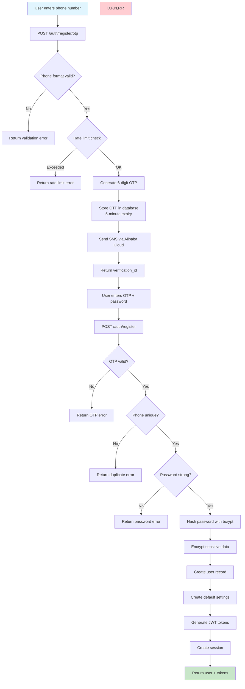

## 2. User Login Flow

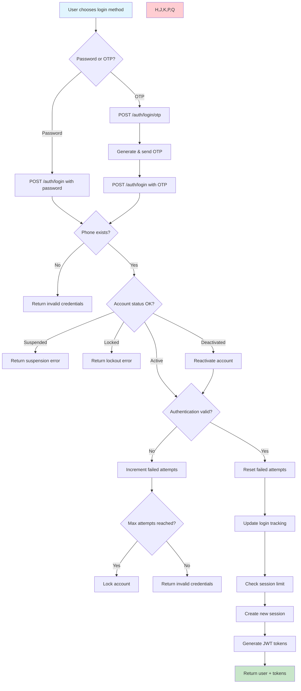

## 3. Profile Update Flow

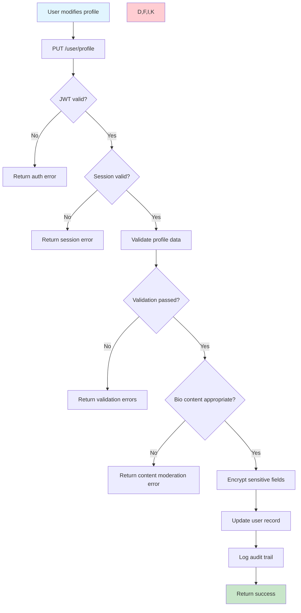

## 4. Password Change Flow

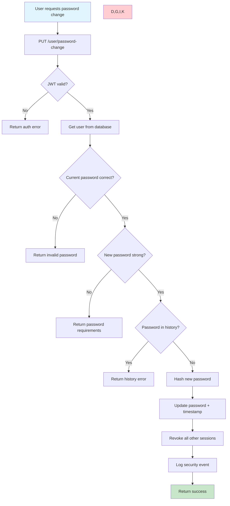

## 5. Phone Number Change Flow

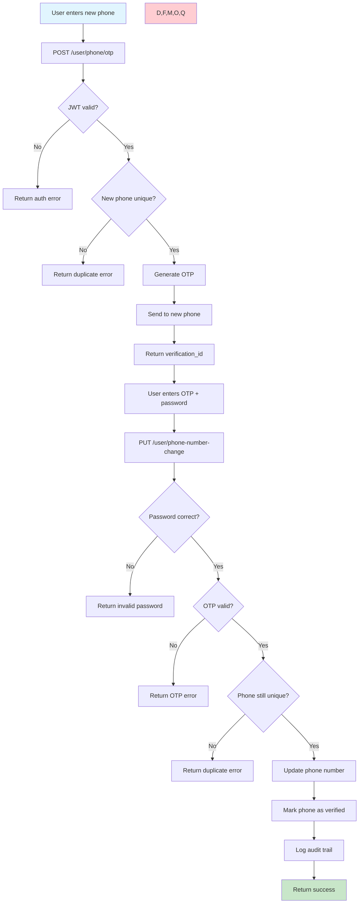

## 6. Session Management Flow

```mermaid
flowchart TD
    A[User views sessions] --> B[GET /user/sessions]
    B --> C{JWT valid?}
    C -->|No| D[Return auth error]
    C -->|Yes| E[Get active sessions]
    E --> F[Filter expired sessions]
    F --> G[Mark current session]
    G --> H[Return session list]
    
    H --> I[User selects session to revoke]
    I --> J[DELETE /user/sessions/:id<br/>(with password)]
    J --> K{Password correct?}
    K -->|No| L[Return invalid password]
    K -->|Yes| M{User owns session?}
    M -->|No| N[Return invalid password]
    M -->|Yes| O{User owns session?}
    O -->|No| P[Return forbidden error]
    O -->|Yes| Q[Revoke session]
    Q --> R[Log security event]
    R --> S[Return success]
    
    style A fill:#e1f5fe;
    style H,S fill:#c8e6c9;
    style D,L,N,P fill:#ffcdd2;
```

## 7. Account Deletion Flow

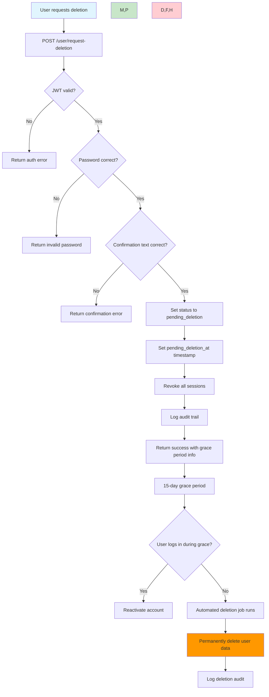

## 8. Admin User Management Flow

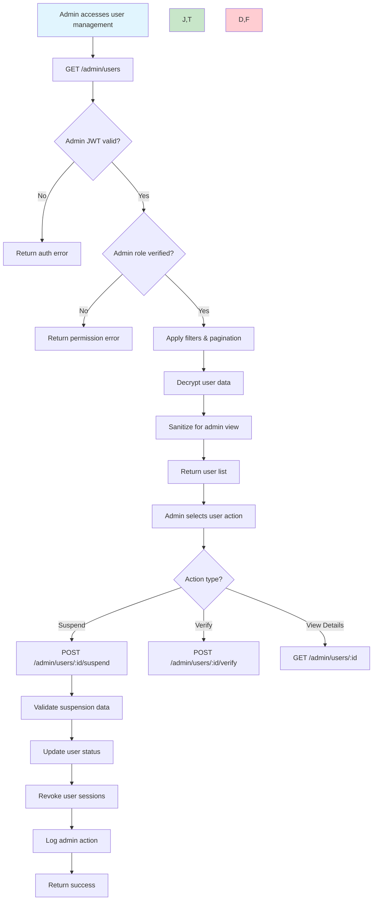

## 9. File Upload Flow

```mermaid
flowchart TD
    A[User selects image] --> B[Validate file locally]
    B --> C{File valid?}
    C -->|No| D[Show validation error]
    C -->|Yes| E[POST /user/avatar or /user/cover-photo]
    E --> F{JWT valid?}
    F -->|No| G[Return auth error]
    F -->|Yes| H[Validate file server-side]
    H --> I{File valid?}
    I -->|No| J[Return file error]
    I -->|Yes| K[Generate unique filename]
    K --> L[Upload to cloud storage<br/>(Alibaba OSS)]
    L --> M{Upload successful?}
    M -->|No| N[Return upload error]
    M -->|Yes| O[Update user record with URL]
    O --> P[Log audit trail]
    P --> Q[Return image URL]
    
    style A fill:#e1f5fe
    style Q fill:#c8e6c9
    style D,G,J,N fill:#ffcdd2
```

## 10. Settings Update Flow

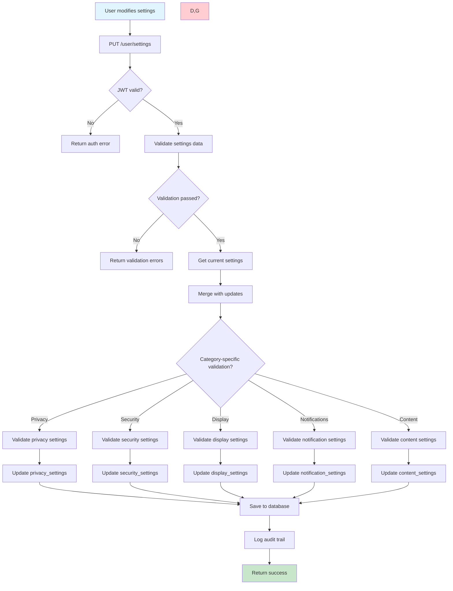

## 11. Token Refresh Flow

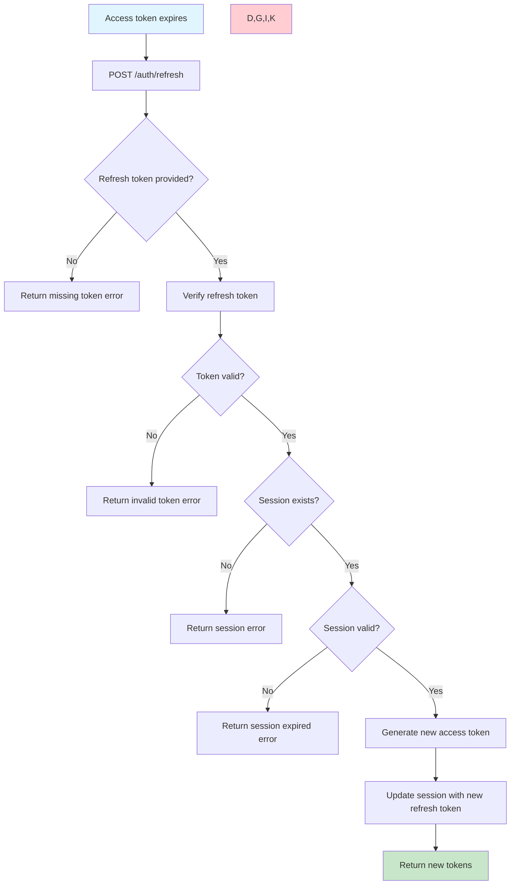

## 12. OTP Verification Flow

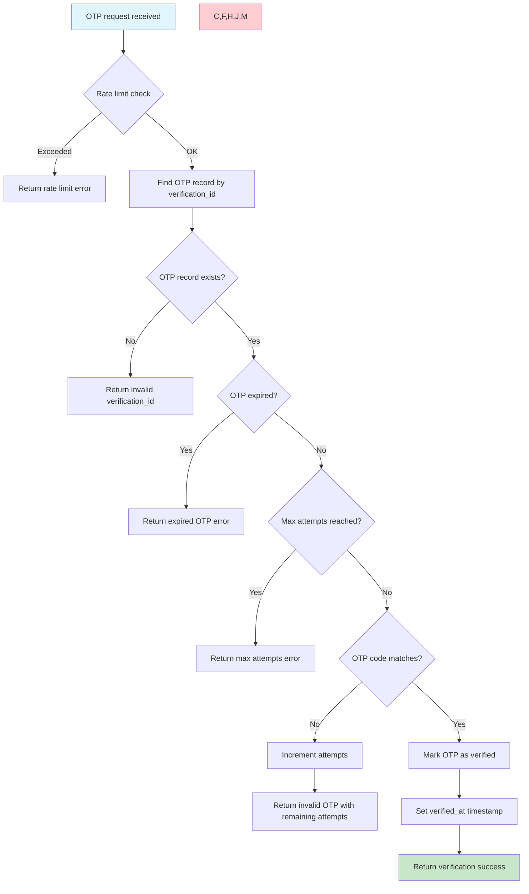
## 13. Public User Profile Viewing Flow

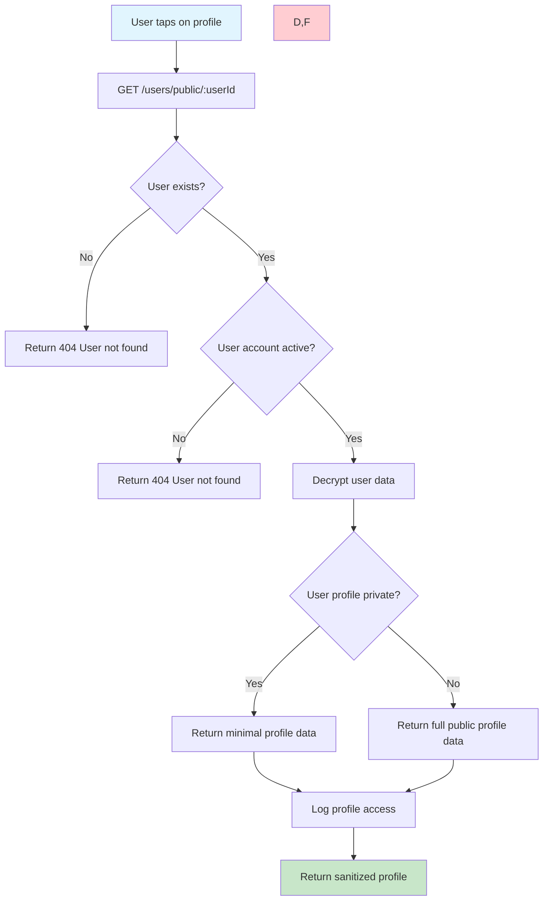

## 14. Admin Audit Log Flow

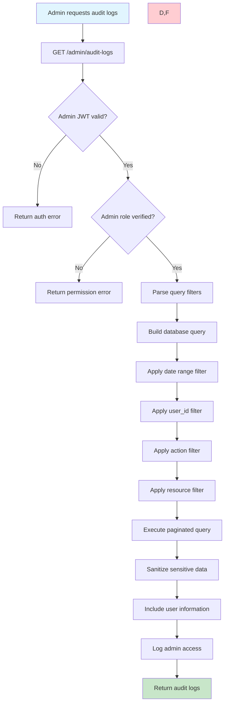

## 15. Compliance Report Generation Flow

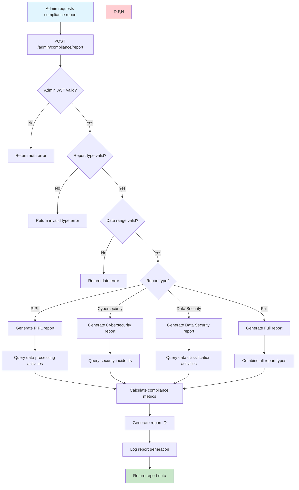

## 16. Data Export Flow

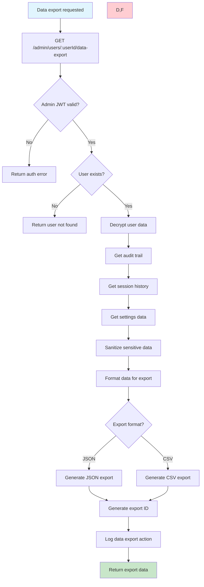


## 17. Rate Limiting Flow

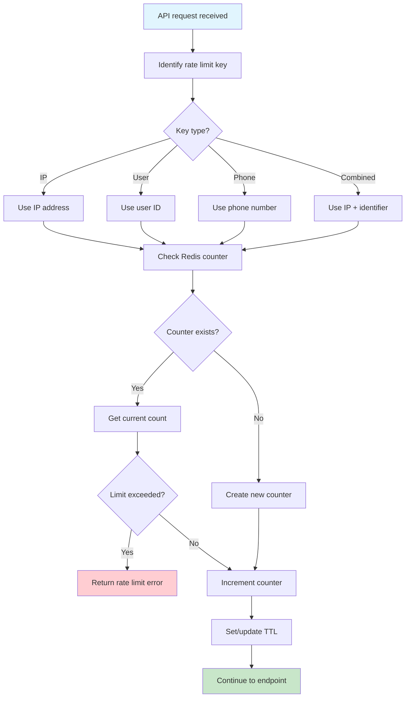

## 18. Encryption/Decryption Flow

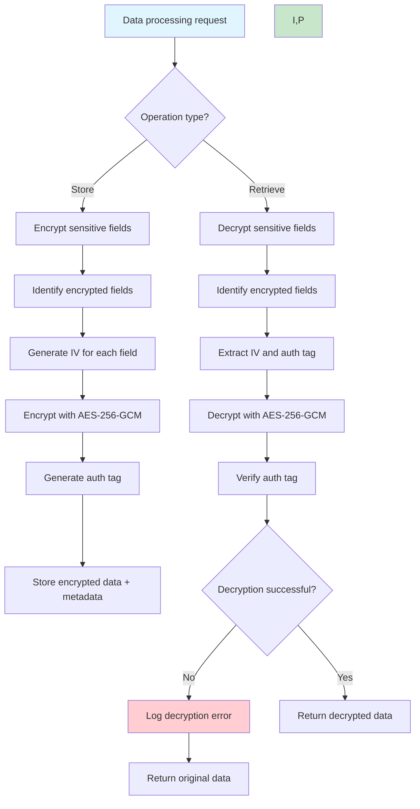

## 19. Session Cleanup Job Flow

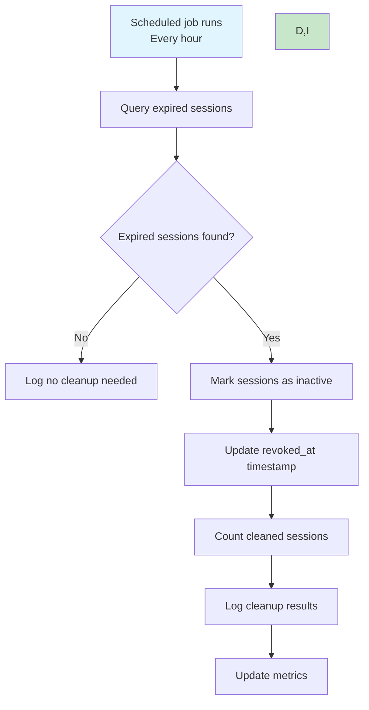

## 20. Account Deletion Job Flow

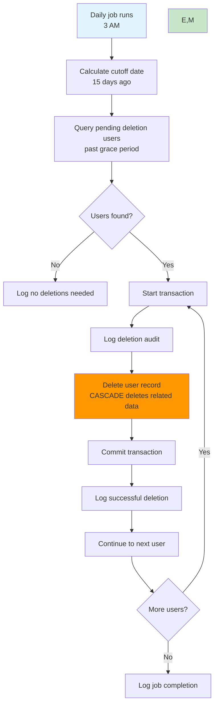

## 21. Security Event Detection Flow

```mermaid
flowchart TD
    A[User action occurs] --> B[Audit middleware intercepts]
    B --> C{Security-relevant action?}
    C -->|No| D[Log normal audit]
    C -->|Yes| E{Action type?}
    E -->|Failed login| F[Check failed attempt count]
    E -->|Suspicious pattern| G[Analyze request pattern]
    E -->|Admin action| H[Log admin security event]
    
    F --> I{Max attempts reached?}
    I -->|Yes| J[Lock account]
    I -->|No| K[Log failed attempt]
    
    G --> L{Pattern suspicious?}
    L -->|Yes| M[Log security alert]
    L -->|No| N[Log normal event]
    
    J --> O[Send security notification]
    K --> P[Continue processing]
    M --> O
    H --> P
    N --> P
    
    O --> Q[Update security metrics]
    P --> R[Complete request]
    
    style A fill:#e1f5fe
    style R fill:#c8e6c9
    style J,O fill:#ff9800
```

These flowcharts provide visual representations of the key processes in the Lianxin User Service, showing decision points, error handling, and the flow of data through the system. Each flowchart corresponds to major API workflows and can be used for understanding system behavior, debugging, and onboarding new developers.