# Lianxin User Service API Workflow Diagrams

## Complete API Workflow Documentation

This document provides detailed workflow diagrams for each API endpoint, showing the complete flow from client request to server response, including all validation steps, database operations, and error handling.

---

## 1. User Registration Complete Workflow

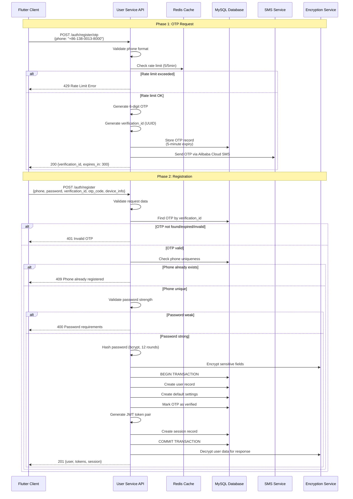
```mermaid
sequenceDiagram
    participant Client as Flutter Client
    participant API as User Service API
    participant Redis as Redis Cache
    participant DB as MySQL Database
    participant SMS as SMS Service
    participant Encrypt as Encryption Service

    Note over Client,Encrypt: Phase 1: OTP Request
    Client->>API: POST /auth/register/otp<br/>{phone: "+86-138-0013-8000"}
    API->>API: Validate phone format
    API->>Redis: Check rate limit (5/5min)
    alt Rate limit exceeded
        API-->>Client: 429 Rate Limit Error
    else Rate limit OK
        API->>API: Generate 6-digit OTP
        API->>API: Generate verification_id (UUID)
        API->>DB: Store OTP record<br/>(5-minute expiry)
        API->>SMS: Send OTP via Alibaba Cloud SMS
        API-->>Client: 200 {verification_id, expires_in: 300}
    end

    Note over Client,Encrypt: Phase 2: Registration
    Client->>API: POST /auth/register<br/>{phone, password, verification_id, otp_code, device_info}
    API->>API: Validate request data
    API->>DB: Find OTP by verification_id
    alt OTP not found/expired/invalid
        API-->>Client: 401 Invalid OTP
    else OTP valid
        API->>DB: Check phone uniqueness
        alt Phone already exists
            API-->>Client: 409 Phone already registered
        else Phone unique
            API->>API: Validate password strength
            alt Password weak
                API-->>Client: 400 Password requirements
            else Password strong
                API->>API: Hash password (bcrypt, 12 rounds)
                API->>Encrypt: Encrypt sensitive fields
                API->>DB: BEGIN TRANSACTION
                API->>DB: Create user record
                API->>DB: Create default settings
                API->>DB: Mark OTP as verified
                API->>API: Generate JWT token pair
                API->>DB: Create session record
                API->>DB: COMMIT TRANSACTION
                API->>Encrypt: Decrypt user data for response
                API-->>Client: 201 {user, tokens, session}
            end
        end
    end
```

---

## 2. User Login Workflow (Password & OTP)

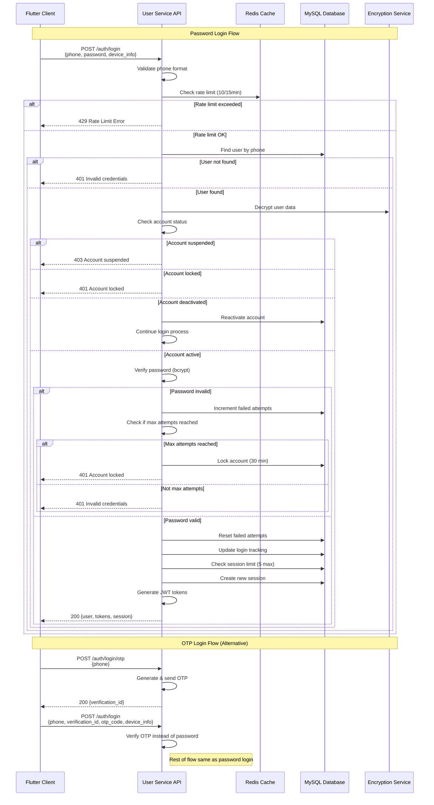
```mermaid
sequenceDiagram
    participant Client as Flutter Client
    participant API as User Service API
    participant Redis as Redis Cache
    participant DB as MySQL Database
    participant Encrypt as Encryption Service

    Note over Client,Encrypt: Password Login Flow
    Client->>API: POST /auth/login<br/>{phone, password, device_info}
    API->>API: Validate phone format
    API->>Redis: Check rate limit (10/15min)
    alt Rate limit exceeded
        API-->>Client: 429 Rate Limit Error
    else Rate limit OK
        API->>DB: Find user by phone
        alt User not found
            API-->>Client: 401 Invalid credentials
        else User found
            API->>Encrypt: Decrypt user data
            API->>API: Check account status
            alt Account suspended
                API-->>Client: 403 Account suspended
            else Account locked
                API-->>Client: 401 Account locked
            else Account deactivated
                API->>DB: Reactivate account
                API->>API: Continue login process
            else Account active
                API->>API: Verify password (bcrypt)
                alt Password invalid
                    API->>DB: Increment failed attempts
                    API->>API: Check if max attempts reached
                    alt Max attempts reached
                        API->>DB: Lock account (30 min)
                        API-->>Client: 401 Account locked
                    else Not max attempts
                        API-->>Client: 401 Invalid credentials
                    end
                else Password valid
                    API->>DB: Reset failed attempts
                    API->>DB: Update login tracking
                    API->>DB: Check session limit (5 max)
                    API->>DB: Create new session
                    API->>API: Generate JWT tokens
                    API-->>Client: 200 {user, tokens, session}
                end
            end
        end
    end

    Note over Client,Encrypt: OTP Login Flow (Alternative)
    Client->>API: POST /auth/login/otp<br/>{phone}
    API->>API: Generate & send OTP
    API-->>Client: 200 {verification_id}
    Client->>API: POST /auth/login<br/>{phone, verification_id, otp_code, device_info}
    API->>API: Verify OTP instead of password
    Note right of API: Rest of flow same as password login
```

---

## 3. Profile Management Workflow

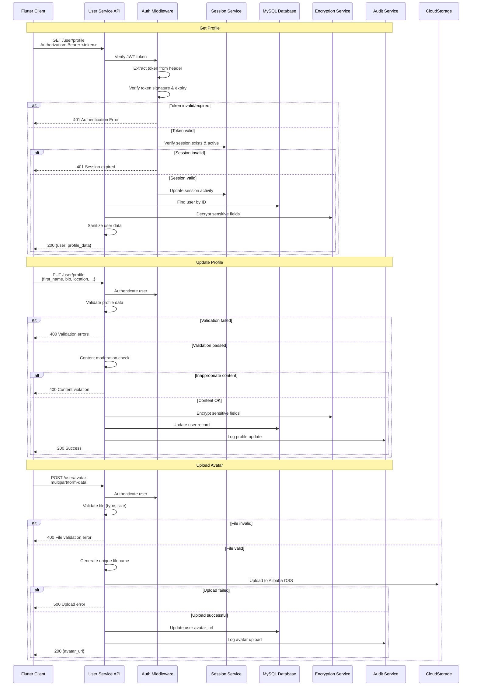
```mermaid
sequenceDiagram
    participant Client as Flutter Client
    participant API as User Service API
    participant Auth as Auth Middleware
    participant Session as Session Service
    participant DB as MySQL Database
    participant Encrypt as Encryption Service
    participant Audit as Audit Service

    Note over Client,Audit: Get Profile
    Client->>API: GET /user/profile<br/>Authorization: Bearer <token>
    API->>Auth: Verify JWT token
    Auth->>Auth: Extract token from header
    Auth->>Auth: Verify token signature & expiry
    alt Token invalid/expired
        Auth-->>Client: 401 Authentication Error
    else Token valid
        Auth->>Session: Verify session exists & active
        alt Session invalid
            Auth-->>Client: 401 Session expired
        else Session valid
            Auth->>Session: Update session activity
            API->>DB: Find user by ID
            API->>Encrypt: Decrypt sensitive fields
            API->>API: Sanitize user data
            API-->>Client: 200 {user: profile_data}
        end
    end

    Note over Client,Audit: Update Profile
    Client->>API: PUT /user/profile<br/>{first_name, bio, location, ...}
    API->>Auth: Authenticate user
    API->>API: Validate profile data
    alt Validation failed
        API-->>Client: 400 Validation errors
    else Validation passed
        API->>API: Content moderation check
        alt Inappropriate content
            API-->>Client: 400 Content violation
        else Content OK
            API->>Encrypt: Encrypt sensitive fields
            API->>DB: Update user record
            API->>Audit: Log profile update
            API-->>Client: 200 Success
        end
    end

    Note over Client,Audit: Upload Avatar
    Client->>API: POST /user/avatar<br/>multipart/form-data
    API->>Auth: Authenticate user
    API->>API: Validate file (type, size)
    alt File invalid
        API-->>Client: 400 File validation error
    else File valid
        API->>API: Generate unique filename
        API->>CloudStorage: Upload to Alibaba OSS
        alt Upload failed
            API-->>Client: 500 Upload error
        else Upload successful
            API->>DB: Update user avatar_url
            API->>Audit: Log avatar upload
            API-->>Client: 200 {avatar_url}
        end
    end
```

---

## 4. Settings Management Workflow

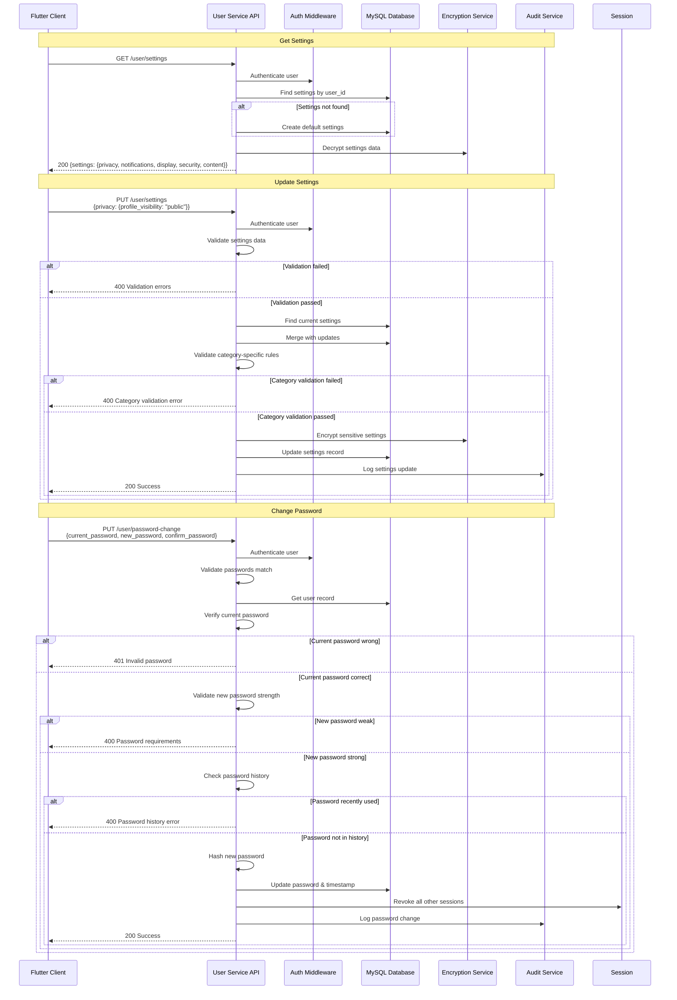
```mermaid
sequenceDiagram
    participant Client as Flutter Client
    participant API as User Service API
    participant Auth as Auth Middleware
    participant DB as MySQL Database
    participant Encrypt as Encryption Service
    participant Audit as Audit Service

    Note over Client,Audit: Get Settings
    Client->>API: GET /user/settings
    API->>Auth: Authenticate user
    API->>DB: Find settings by user_id
    alt Settings not found
        API->>DB: Create default settings
    end
    API->>Encrypt: Decrypt settings data
    API-->>Client: 200 {settings: {privacy, notifications, display, security, content}}

    Note over Client,Audit: Update Settings
    Client->>API: PUT /user/settings<br/>{privacy: {profile_visibility: "public"}}
    API->>Auth: Authenticate user
    API->>API: Validate settings data
    alt Validation failed
        API-->>Client: 400 Validation errors
    else Validation passed
        API->>DB: Find current settings
        API->>DB: Merge with updates
        API->>API: Validate category-specific rules
        alt Category validation failed
            API-->>Client: 400 Category validation error
        else Category validation passed
            API->>Encrypt: Encrypt sensitive settings
            API->>DB: Update settings record
            API->>Audit: Log settings update
            API-->>Client: 200 Success
        end
    end

    Note over Client,Audit: Change Password
    Client->>API: PUT /user/password-change<br/>{current_password, new_password, confirm_password}
    API->>Auth: Authenticate user
    API->>API: Validate passwords match
    API->>DB: Get user record
    API->>API: Verify current password
    alt Current password wrong
        API-->>Client: 401 Invalid password
    else Current password correct
        API->>API: Validate new password strength
        alt New password weak
            API-->>Client: 400 Password requirements
        else New password strong
            API->>API: Check password history
            alt Password recently used
                API-->>Client: 400 Password history error
            else Password not in history
                API->>API: Hash new password
                API->>DB: Update password & timestamp
                API->>Session: Revoke all other sessions
                API->>Audit: Log password change
                API-->>Client: 200 Success
            end
        end
    end
```

---

## 5. Phone Number Change Workflow

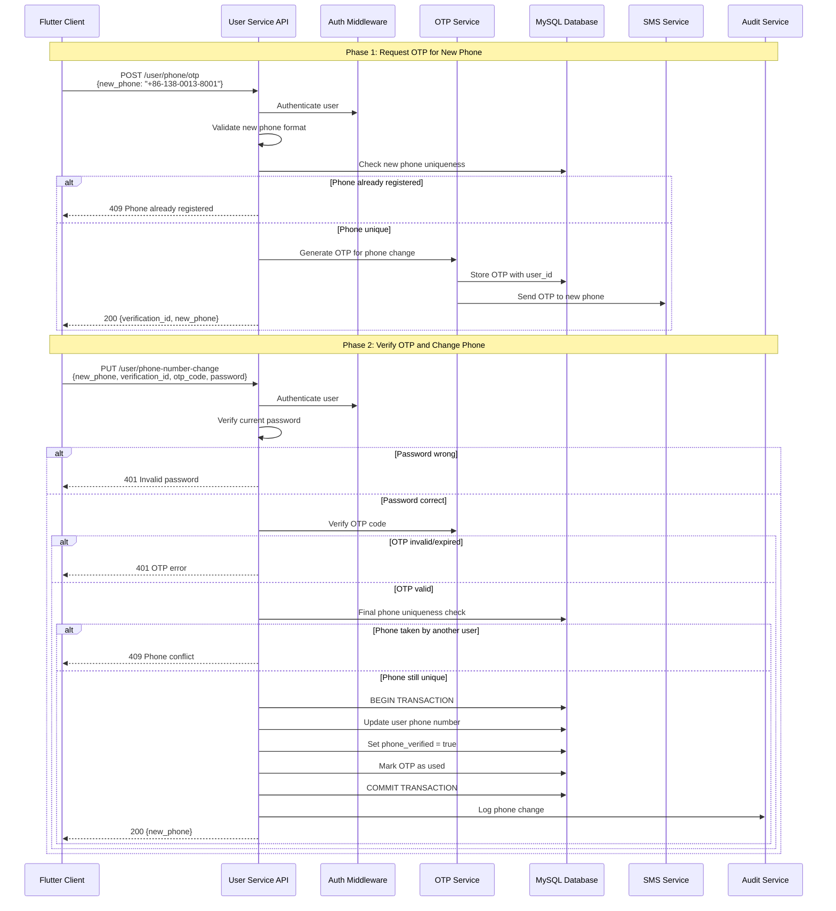
```mermaid
sequenceDiagram
    participant Client as Flutter Client
    participant API as User Service API
    participant Auth as Auth Middleware
    participant OTP as OTP Service
    participant DB as MySQL Database
    participant SMS as SMS Service
    participant Audit as Audit Service

    Note over Client,Audit: Phase 1: Request OTP for New Phone
    Client->>API: POST /user/phone/otp<br/>{new_phone: "+86-138-0013-8001"}
    API->>Auth: Authenticate user
    API->>API: Validate new phone format
    API->>DB: Check new phone uniqueness
    alt Phone already registered
        API-->>Client: 409 Phone already registered
    else Phone unique
        API->>OTP: Generate OTP for phone change
        OTP->>DB: Store OTP with user_id
        OTP->>SMS: Send OTP to new phone
        API-->>Client: 200 {verification_id, new_phone}
    end

    Note over Client,Audit: Phase 2: Verify OTP and Change Phone
    Client->>API: PUT /user/phone-number-change<br/>{new_phone, verification_id, otp_code, password}
    API->>Auth: Authenticate user
    API->>API: Verify current password
    alt Password wrong
        API-->>Client: 401 Invalid password
    else Password correct
        API->>OTP: Verify OTP code
        alt OTP invalid/expired
            API-->>Client: 401 OTP error
        else OTP valid
            API->>DB: Final phone uniqueness check
            alt Phone taken by another user
                API-->>Client: 409 Phone conflict
            else Phone still unique
                API->>DB: BEGIN TRANSACTION
                API->>DB: Update user phone number
                API->>DB: Set phone_verified = true
                API->>DB: Mark OTP as used
                API->>DB: COMMIT TRANSACTION
                API->>Audit: Log phone change
                API-->>Client: 200 {new_phone}
            end
        end
    end
```

---

## 6. Session Management Workflow

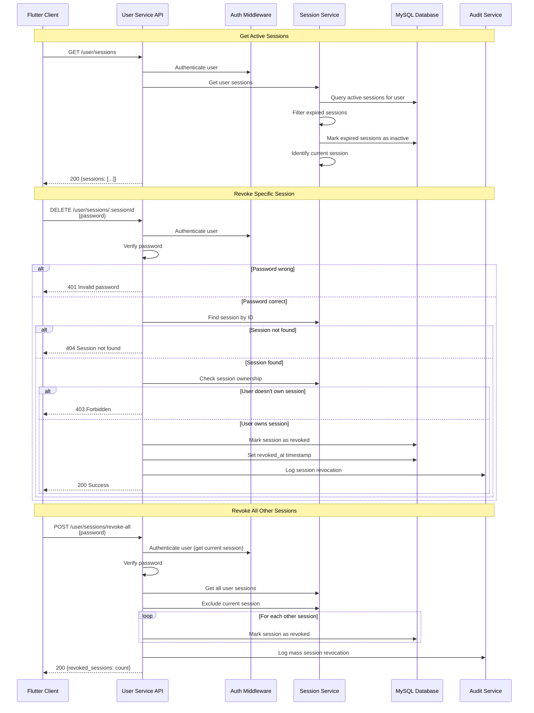
```mermaid
sequenceDiagram
    participant Client as Flutter Client
    participant API as User Service API
    participant Auth as Auth Middleware
    participant Session as Session Service
    participant DB as MySQL Database
    participant Audit as Audit Service

    Note over Client,Audit: Get Active Sessions
    Client->>API: GET /user/sessions
    API->>Auth: Authenticate user
    API->>Session: Get user sessions
    Session->>DB: Query active sessions for user
    Session->>Session: Filter expired sessions
    Session->>DB: Mark expired sessions as inactive
    Session->>Session: Identify current session
    API-->>Client: 200 {sessions: [...]}

    Note over Client,Audit: Revoke Specific Session
    Client->>API: DELETE /user/sessions/:sessionId<br/>{password}
    API->>Auth: Authenticate user
    API->>API: Verify password
    alt Password wrong
        API-->>Client: 401 Invalid password
    else Password correct
        API->>Session: Find session by ID
        alt Session not found
            API-->>Client: 404 Session not found
        else Session found
            API->>Session: Check session ownership
            alt User doesn't own session
                API-->>Client: 403 Forbidden
            else User owns session
                API->>DB: Mark session as revoked
                API->>DB: Set revoked_at timestamp
                API->>Audit: Log session revocation
                API-->>Client: 200 Success
            end
        end
    end

    Note over Client,Audit: Revoke All Other Sessions
    Client->>API: POST /user/sessions/revoke-all<br/>{password}
    API->>Auth: Authenticate user (get current session)
    API->>API: Verify password
    API->>Session: Get all user sessions
    API->>Session: Exclude current session
    loop For each other session
        API->>DB: Mark session as revoked
    end
    API->>Audit: Log mass session revocation
    API-->>Client: 200 {revoked_sessions: count}
```

---

## 7. Account Deletion Workflow

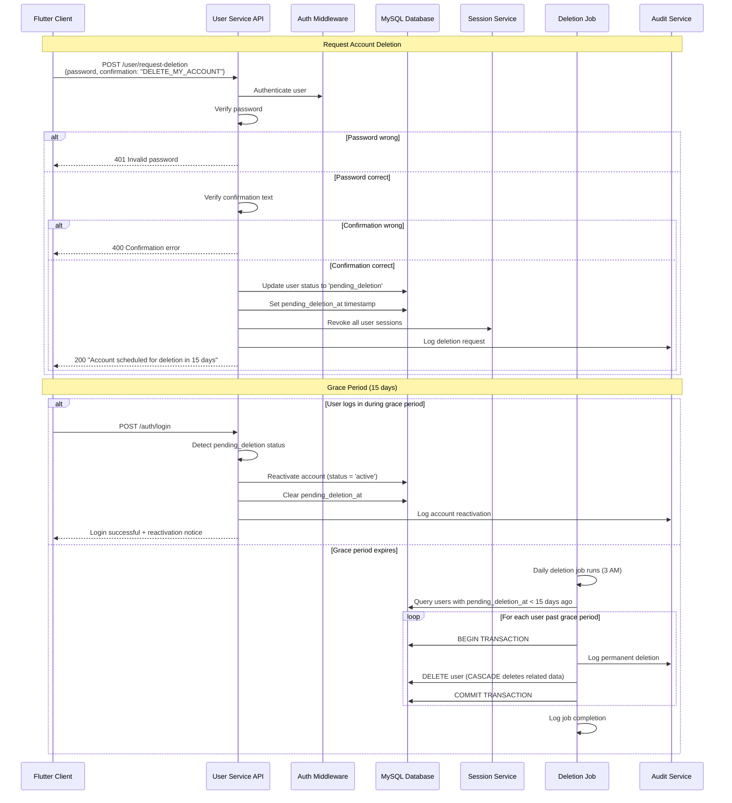
```mermaid
sequenceDiagram
    participant Client as Flutter Client
    participant API as User Service API
    participant Auth as Auth Middleware
    participant DB as MySQL Database
    participant Session as Session Service
    participant Job as Deletion Job
    participant Audit as Audit Service

    Note over Client,Audit: Request Account Deletion
    Client->>API: POST /user/request-deletion<br/>{password, confirmation: "DELETE_MY_ACCOUNT"}
    API->>Auth: Authenticate user
    API->>API: Verify password
    alt Password wrong
        API-->>Client: 401 Invalid password
    else Password correct
        API->>API: Verify confirmation text
        alt Confirmation wrong
            API-->>Client: 400 Confirmation error
        else Confirmation correct
            API->>DB: Update user status to 'pending_deletion'
            API->>DB: Set pending_deletion_at timestamp
            API->>Session: Revoke all user sessions
            API->>Audit: Log deletion request
            API-->>Client: 200 "Account scheduled for deletion in 15 days"
        end
    end

    Note over Client,Audit: Grace Period (15 days)
    alt User logs in during grace period
        Client->>API: POST /auth/login
        API->>API: Detect pending_deletion status
        API->>DB: Reactivate account (status = 'active')
        API->>DB: Clear pending_deletion_at
        API->>Audit: Log account reactivation
        API-->>Client: Login successful + reactivation notice
    else Grace period expires
        Job->>Job: Daily deletion job runs (3 AM)
        Job->>DB: Query users with pending_deletion_at < 15 days ago
        loop For each user past grace period
            Job->>DB: BEGIN TRANSACTION
            Job->>Audit: Log permanent deletion
            Job->>DB: DELETE user (CASCADE deletes related data)
            Job->>DB: COMMIT TRANSACTION
        end
        Job->>Job: Log job completion
    end
```

---

## 8. Admin User Management Workflow

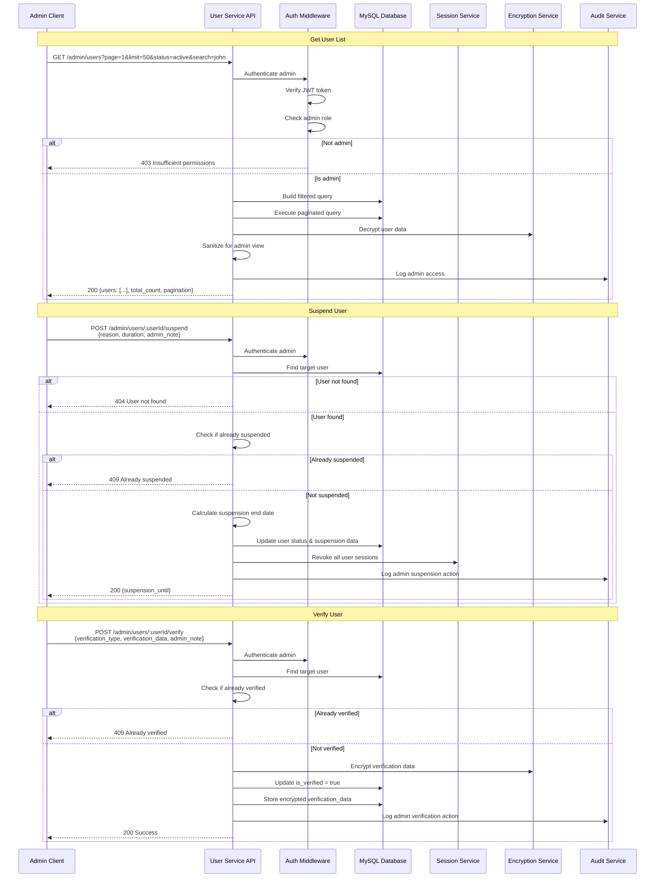
```mermaid
sequenceDiagram
    participant Admin as Admin Client
    participant API as User Service API
    participant Auth as Auth Middleware
    participant DB as MySQL Database
    participant Session as Session Service
    participant Encrypt as Encryption Service
    participant Audit as Audit Service

    Note over Admin,Audit: Get User List
    Admin->>API: GET /admin/users?page=1&limit=50&status=active&search=john
    API->>Auth: Authenticate admin
    Auth->>Auth: Verify JWT token
    Auth->>Auth: Check admin role
    alt Not admin
        Auth-->>Admin: 403 Insufficient permissions
    else Is admin
        API->>DB: Build filtered query
        API->>DB: Execute paginated query
        API->>Encrypt: Decrypt user data
        API->>API: Sanitize for admin view
        API->>Audit: Log admin access
        API-->>Admin: 200 {users: [...], total_count, pagination}
    end

    Note over Admin,Audit: Suspend User
    Admin->>API: POST /admin/users/:userId/suspend<br/>{reason, duration, admin_note}
    API->>Auth: Authenticate admin
    API->>DB: Find target user
    alt User not found
        API-->>Admin: 404 User not found
    else User found
        API->>API: Check if already suspended
        alt Already suspended
            API-->>Admin: 409 Already suspended
        else Not suspended
            API->>API: Calculate suspension end date
            API->>DB: Update user status & suspension data
            API->>Session: Revoke all user sessions
            API->>Audit: Log admin suspension action
            API-->>Admin: 200 {suspension_until}
        end
    end

    Note over Admin,Audit: Verify User
    Admin->>API: POST /admin/users/:userId/verify<br/>{verification_type, verification_data, admin_note}
    API->>Auth: Authenticate admin
    API->>DB: Find target user
    API->>API: Check if already verified
    alt Already verified
        API-->>Admin: 409 Already verified
    else Not verified
        API->>Encrypt: Encrypt verification data
        API->>DB: Update is_verified = true
        API->>DB: Store encrypted verification_data
        API->>Audit: Log admin verification action
        API-->>Admin: 200 Success
    end
```

---

## 9. Token Refresh Workflow

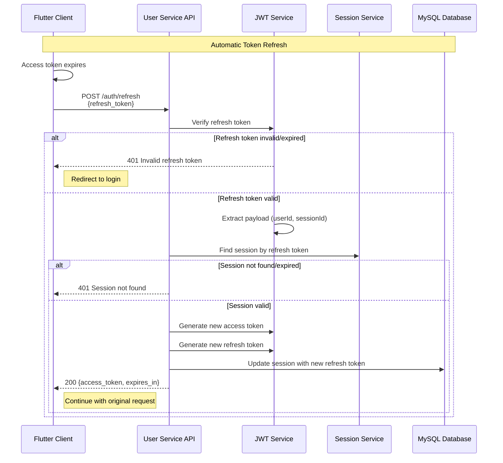
```mermaid
sequenceDiagram
    participant Client as Flutter Client
    participant API as User Service API
    participant JWT as JWT Service
    participant Session as Session Service
    participant DB as MySQL Database

    Note over Client,DB: Automatic Token Refresh
    Client->>Client: Access token expires
    Client->>API: POST /auth/refresh<br/>{refresh_token}
    API->>JWT: Verify refresh token
    alt Refresh token invalid/expired
        JWT-->>Client: 401 Invalid refresh token
        Note right of Client: Redirect to login
    else Refresh token valid
        JWT->>JWT: Extract payload (userId, sessionId)
        API->>Session: Find session by refresh token
        alt Session not found/expired
            API-->>Client: 401 Session not found
        else Session valid
            API->>JWT: Generate new access token
            API->>JWT: Generate new refresh token
            API->>DB: Update session with new refresh token
            API-->>Client: 200 {access_token, expires_in}
            Note right of Client: Continue with original request
        end
    end
```

---

## 10. Public User Profile Viewing Workflow

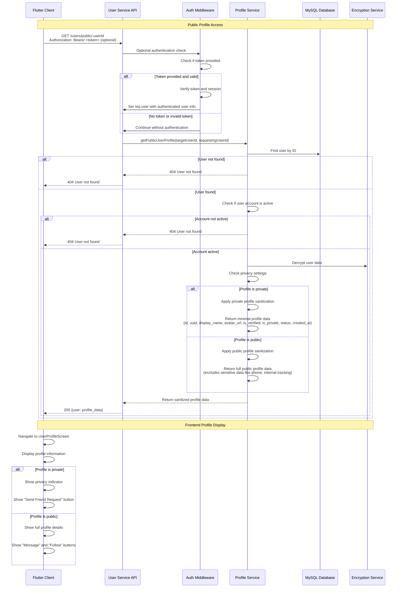
```mermaid
sequenceDiagram
    participant Client as Flutter Client
    participant API as User Service API
    participant Auth as Auth Middleware
    participant Profile as Profile Service
    participant DB as MySQL Database
    participant Encrypt as Encryption Service

    Note over Client,Encrypt: Public Profile Access
    Client->>API: GET /users/public/:userId<br/>Authorization: Bearer <token> (optional)
    API->>Auth: Optional authentication check
    Auth->>Auth: Check if token provided
    alt Token provided and valid
        Auth->>Auth: Verify token and session
        Auth->>API: Set req.user with authenticated user info
    else No token or invalid token
        Auth->>API: Continue without authentication
    end
    
    API->>Profile: getPublicUserProfile(targetUserId, requestingUserId)
    Profile->>DB: Find user by ID
    alt User not found
        Profile-->>API: 404 User not found
        API-->>Client: 404 User not found
    else User found
        Profile->>Profile: Check if user account is active
        alt Account not active
            Profile-->>API: 404 User not found
            API-->>Client: 404 User not found
        else Account active
            Profile->>Encrypt: Decrypt user data
            Profile->>Profile: Check privacy settings
            alt Profile is private
                Profile->>Profile: Apply private profile sanitization
                Profile->>Profile: Return minimal profile data<br/>(id, uuid, display_name, avatar_url, is_verified, is_private, status, created_at)
            else Profile is public
                Profile->>Profile: Apply public profile sanitization
                Profile->>Profile: Return full public profile data<br/>(excludes sensitive data like phone, internal tracking)
            end
            Profile-->>API: Return sanitized profile data
            API-->>Client: 200 {user: profile_data}
        end
    end

    Note over Client,Encrypt: Frontend Profile Display
    Client->>Client: Navigate to UserProfileScreen
    Client->>Client: Display profile information
    alt Profile is private
        Client->>Client: Show privacy indicator
        Client->>Client: Show "Send Friend Request" button
    else Profile is public
        Client->>Client: Show full profile details
        Client->>Client: Show "Message" and "Follow" buttons
    end
```

---

## 11. File Upload Workflow

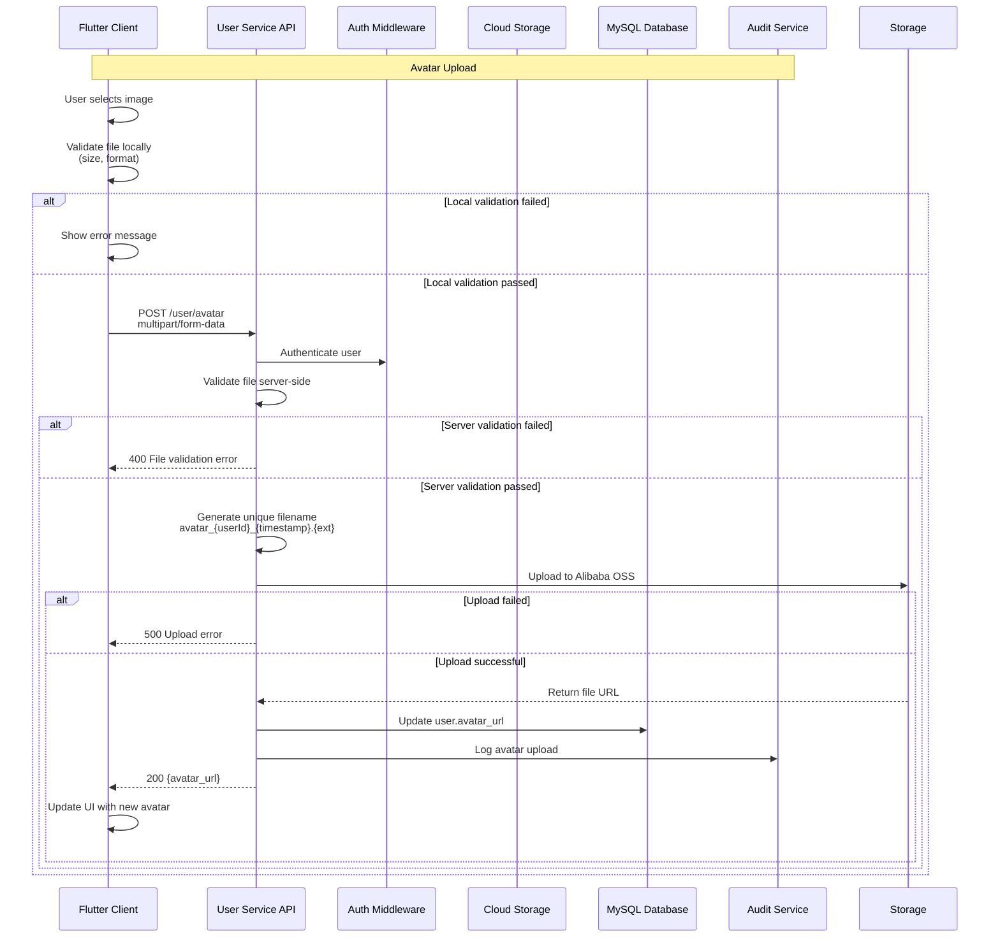
```mermaid
sequenceDiagram
    participant Client as Flutter Client
    participant API as User Service API
    participant Auth as Auth Middleware
    participant CloudStorage as Cloud Storage
    participant DB as MySQL Database
    participant Audit as Audit Service
    
    Note over Client,Audit: Avatar Upload
    Client->>Client: User selects image
    Client->>Client: Validate file locally<br/>(size, format)
    alt Local validation failed
        Client->>Client: Show error message
    else Local validation passed
        Client->>API: POST /user/avatar<br/>multipart/form-data
        API->>Auth: Authenticate user
        API->>API: Validate file server-side
        alt Server validation failed
            API-->>Client: 400 File validation error
        else Server validation passed
            API->>API: Generate unique filename<br/>avatar_{userId}_{timestamp}.{ext}
            API->>Storage: Upload to Alibaba OSS
            alt Upload failed
                API-->>Client: 500 Upload error
            else Upload successful
                Storage-->>API: Return file URL
                API->>DB: Update user.avatar_url
                API->>Audit: Log avatar upload
                API-->>Client: 200 {avatar_url}
                Client->>Client: Update UI with new avatar
            end
        end
    end
```

---

## 12. OTP Verification Workflow

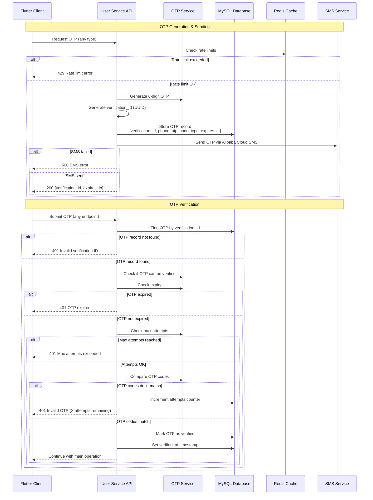
```mermaid
sequenceDiagram
    participant Client as Flutter Client
    participant API as User Service API
    participant OTP as OTP Service
    participant DB as MySQL Database
    participant Redis as Redis Cache
    participant SMS as SMS Service

    Note over Client,SMS: OTP Generation & Sending
    Client->>API: Request OTP (any type)
    API->>Redis: Check rate limits
    alt Rate limit exceeded
        API-->>Client: 429 Rate limit error
    else Rate limit OK
        API->>OTP: Generate 6-digit OTP
        API->>API: Generate verification_id (UUID)
        API->>DB: Store OTP record<br/>{verification_id, phone, otp_code, type, expires_at}
        API->>SMS: Send OTP via Alibaba Cloud SMS
        alt SMS failed
            API-->>Client: 500 SMS error
        else SMS sent
            API-->>Client: 200 {verification_id, expires_in}
        end
    end

    Note over Client,SMS: OTP Verification
    Client->>API: Submit OTP (any endpoint)
    API->>DB: Find OTP by verification_id
    alt OTP record not found
        API-->>Client: 401 Invalid verification ID
    else OTP record found
        API->>OTP: Check if OTP can be verified
        API->>OTP: Check expiry
        alt OTP expired
            API-->>Client: 401 OTP expired
        else OTP not expired
            API->>OTP: Check max attempts
            alt Max attempts reached
                API-->>Client: 401 Max attempts exceeded
            else Attempts OK
                API->>OTP: Compare OTP codes
                alt OTP codes don't match
                    API->>DB: Increment attempts counter
                    API-->>Client: 401 Invalid OTP (X attempts remaining)
                else OTP codes match
                    API->>DB: Mark OTP as verified
                    API->>DB: Set verified_at timestamp
                    API-->>Client: Continue with main operation
                end
            end
        end
    end
```

---

## 13. Rate Limiting Workflow

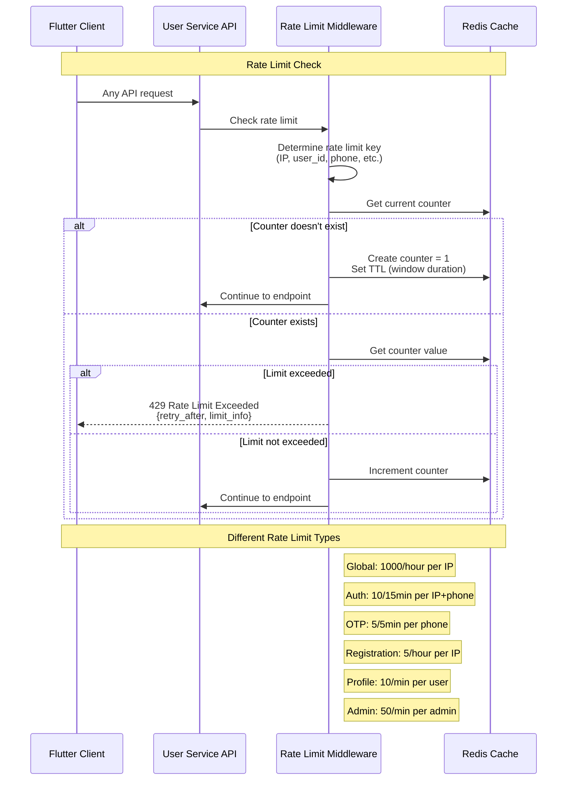
```mermaid
sequenceDiagram
    participant Client as Flutter Client
    participant API as User Service API
    participant RateLimit as Rate Limit Middleware
    participant Redis as Redis Cache

    Note over Client,Redis: Rate Limit Check
    Client->>API: Any API request
    API->>RateLimit: Check rate limit
    RateLimit->>RateLimit: Determine rate limit key<br/>(IP, user_id, phone, etc.)
    RateLimit->>Redis: Get current counter
    alt Counter doesn't exist
        RateLimit->>Redis: Create counter = 1<br/>Set TTL (window duration)
        RateLimit->>API: Continue to endpoint
    else Counter exists
        RateLimit->>Redis: Get counter value
        alt Limit exceeded
            RateLimit-->>Client: 429 Rate Limit Exceeded<br/>{retry_after, limit_info}
        else Limit not exceeded
            RateLimit->>Redis: Increment counter
            RateLimit->>API: Continue to endpoint
        end
    end

    Note over Client,Redis: Different Rate Limit Types
    Note right of RateLimit: Global: 1000/hour per IP
    Note right of RateLimit: Auth: 10/15min per IP+phone
    Note right of RateLimit: OTP: 5/5min per phone
    Note right of RateLimit: Registration: 5/hour per IP
    Note right of RateLimit: Profile: 10/min per user
    Note right of RateLimit: Admin: 50/min per admin
```

---

## 14. Audit Logging Workflow

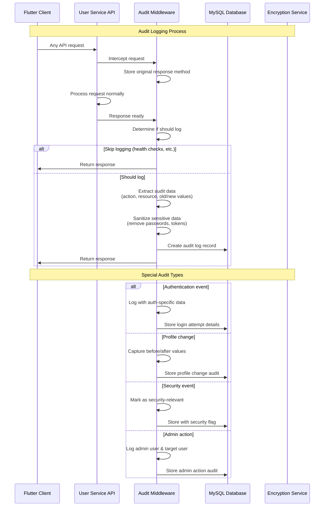
```mermaid
sequenceDiagram
    participant Client as Flutter Client
    participant API as User Service API
    participant Audit as Audit Middleware
    participant DB as MySQL Database
    participant Encrypt as Encryption Service

    Note over Client,Encrypt: Audit Logging Process
    Client->>API: Any API request
    API->>Audit: Intercept request
    Audit->>Audit: Store original response method
    API->>API: Process request normally
    API->>Audit: Response ready
    Audit->>Audit: Determine if should log
    alt Skip logging (health checks, etc.)
        Audit->>Client: Return response
    else Should log
        Audit->>Audit: Extract audit data<br/>(action, resource, old/new values)
        Audit->>Audit: Sanitize sensitive data<br/>(remove passwords, tokens)
        Audit->>DB: Create audit log record
        Audit->>Client: Return response
    end

    Note over Client,Encrypt: Special Audit Types
    alt Authentication event
        Audit->>Audit: Log with auth-specific data
        Audit->>DB: Store login attempt details
    else Profile change
        Audit->>Audit: Capture before/after values
        Audit->>DB: Store profile change audit
    else Security event
        Audit->>Audit: Mark as security-relevant
        Audit->>DB: Store with security flag
    else Admin action
        Audit->>Audit: Log admin user & target user
        Audit->>DB: Store admin action audit
    end
```

---

## 15. Compliance Report Generation Workflow

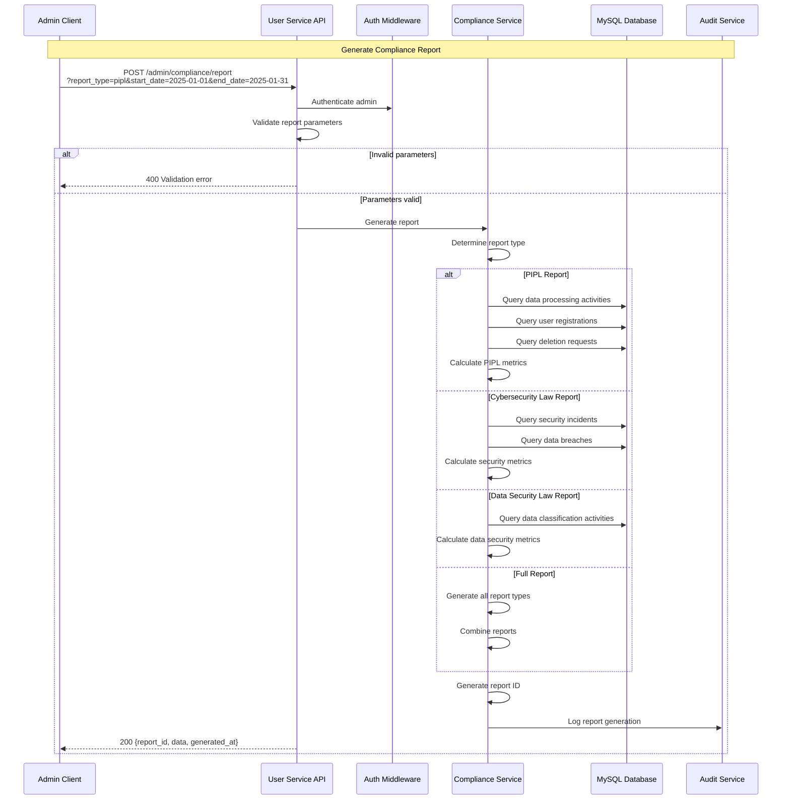
```mermaid
sequenceDiagram
    participant Admin as Admin Client
    participant API as User Service API
    participant Auth as Auth Middleware
    participant Compliance as Compliance Service
    participant DB as MySQL Database
    participant Audit as Audit Service

    Note over Admin,Audit: Generate Compliance Report
    Admin->>API: POST /admin/compliance/report<br/>?report_type=pipl&start_date=2025-01-01&end_date=2025-01-31
    API->>Auth: Authenticate admin
    API->>API: Validate report parameters
    alt Invalid parameters
        API-->>Admin: 400 Validation error
    else Parameters valid
        API->>Compliance: Generate report
        Compliance->>Compliance: Determine report type
        alt PIPL Report
            Compliance->>DB: Query data processing activities
            Compliance->>DB: Query user registrations
            Compliance->>DB: Query deletion requests
            Compliance->>Compliance: Calculate PIPL metrics
        else Cybersecurity Law Report
            Compliance->>DB: Query security incidents
            Compliance->>DB: Query data breaches
            Compliance->>Compliance: Calculate security metrics
        else Data Security Law Report
            Compliance->>DB: Query data classification activities
            Compliance->>Compliance: Calculate data security metrics
        else Full Report
            Compliance->>Compliance: Generate all report types
            Compliance->>Compliance: Combine reports
        end
        Compliance->>Compliance: Generate report ID
        Compliance->>Audit: Log report generation
        API-->>Admin: 200 {report_id, data, generated_at}
    end
```

---

## 16. Data Export Workflow

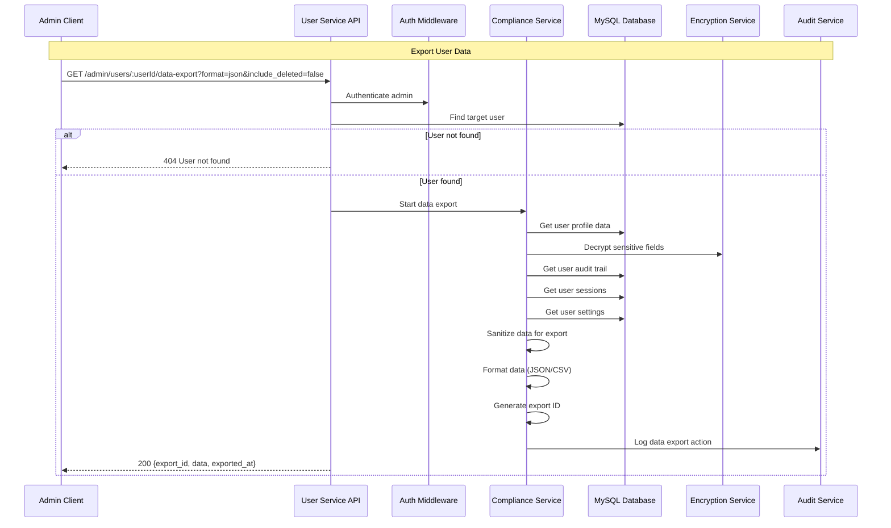
```mermaid
sequenceDiagram
    participant Admin as Admin Client
    participant API as User Service API
    participant Auth as Auth Middleware
    participant Compliance as Compliance Service
    participant DB as MySQL Database
    participant Encrypt as Encryption Service
    participant Audit as Audit Service

    Note over Admin,Audit: Export User Data
    Admin->>API: GET /admin/users/:userId/data-export?format=json&include_deleted=false
    API->>Auth: Authenticate admin
    API->>DB: Find target user
    alt User not found
        API-->>Admin: 404 User not found
    else User found
        API->>Compliance: Start data export
        Compliance->>DB: Get user profile data
        Compliance->>Encrypt: Decrypt sensitive fields
        Compliance->>DB: Get user audit trail
        Compliance->>DB: Get user sessions
        Compliance->>DB: Get user settings
        Compliance->>Compliance: Sanitize data for export
        Compliance->>Compliance: Format data (JSON/CSV)
        Compliance->>Compliance: Generate export ID
        Compliance->>Audit: Log data export action
        API-->>Admin: 200 {export_id, data, exported_at}
    end
```

---

## 17. Background Jobs Workflow

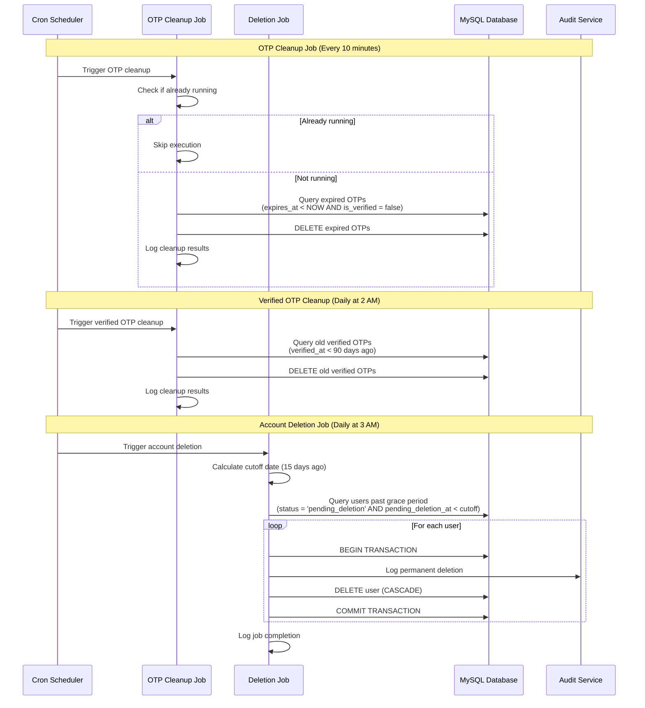
```mermaid
sequenceDiagram
    participant Scheduler as Cron Scheduler
    participant OTPJob as OTP Cleanup Job
    participant DelJob as Deletion Job
    participant DB as MySQL Database
    participant Audit as Audit Service

    Note over Scheduler,Audit: OTP Cleanup Job (Every 10 minutes)
    Scheduler->>OTPJob: Trigger OTP cleanup
    OTPJob->>OTPJob: Check if already running
    alt Already running
        OTPJob->>OTPJob: Skip execution
    else Not running
        OTPJob->>DB: Query expired OTPs<br/>(expires_at < NOW AND is_verified = false)
        OTPJob->>DB: DELETE expired OTPs
        OTPJob->>OTPJob: Log cleanup results
    end

    Note over Scheduler,Audit: Verified OTP Cleanup (Daily at 2 AM)
    Scheduler->>OTPJob: Trigger verified OTP cleanup
    OTPJob->>DB: Query old verified OTPs<br/>(verified_at < 90 days ago)
    OTPJob->>DB: DELETE old verified OTPs
    OTPJob->>OTPJob: Log cleanup results

    Note over Scheduler,Audit: Account Deletion Job (Daily at 3 AM)
    Scheduler->>DelJob: Trigger account deletion
    DelJob->>DelJob: Calculate cutoff date (15 days ago)
    DelJob->>DB: Query users past grace period<br/>(status = 'pending_deletion' AND pending_deletion_at < cutoff)
    loop For each user
        DelJob->>DB: BEGIN TRANSACTION
        DelJob->>Audit: Log permanent deletion
        DelJob->>DB: DELETE user (CASCADE)
        DelJob->>DB: COMMIT TRANSACTION
    end
    DelJob->>DelJob: Log job completion
```

---

## 18. Security Event Detection Workflow

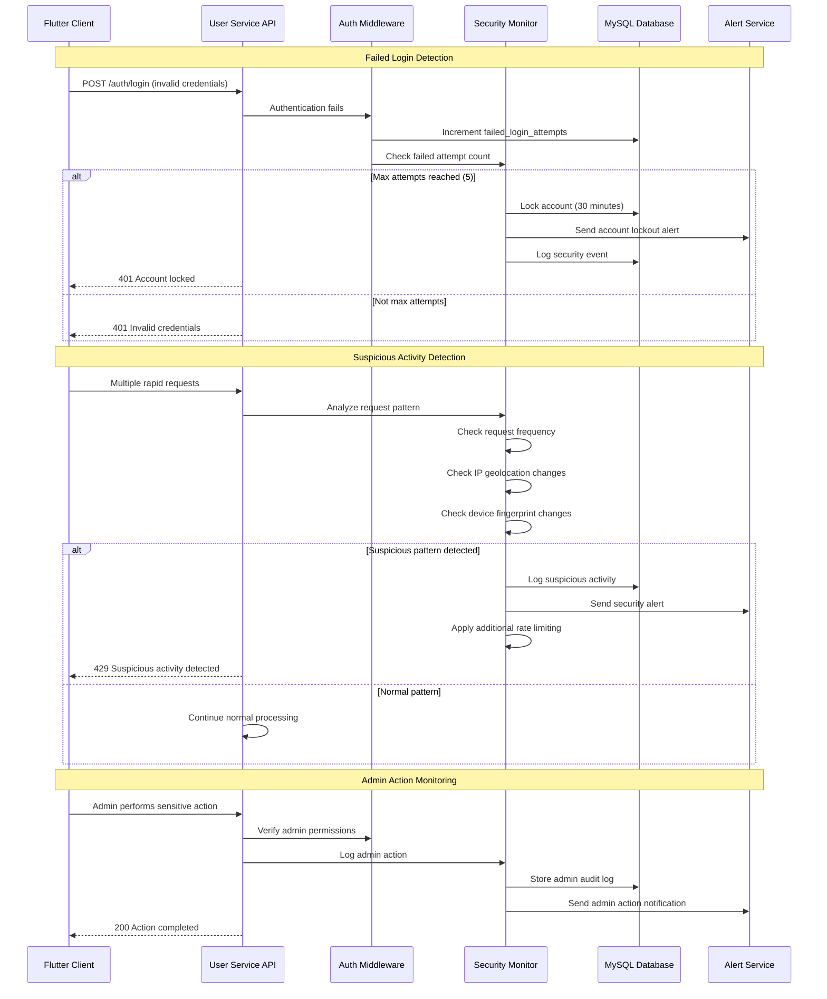
```mermaid
sequenceDiagram
    participant Client as Flutter Client
    participant API as User Service API
    participant Auth as Auth Middleware
    participant Security as Security Monitor
    participant DB as MySQL Database
    participant Alert as Alert Service

    Note over Client,Alert: Failed Login Detection
    Client->>API: POST /auth/login (invalid credentials)
    API->>Auth: Authentication fails
    Auth->>DB: Increment failed_login_attempts
    Auth->>Security: Check failed attempt count
    alt Max attempts reached (5)
        Security->>DB: Lock account (30 minutes)
        Security->>Alert: Send account lockout alert
        Security->>DB: Log security event
        API-->>Client: 401 Account locked
    else Not max attempts
        API-->>Client: 401 Invalid credentials
    end

    Note over Client,Alert: Suspicious Activity Detection
    Client->>API: Multiple rapid requests
    API->>Security: Analyze request pattern
    Security->>Security: Check request frequency
    Security->>Security: Check IP geolocation changes
    Security->>Security: Check device fingerprint changes
    alt Suspicious pattern detected
        Security->>DB: Log suspicious activity
        Security->>Alert: Send security alert
        Security->>Security: Apply additional rate limiting
        API-->>Client: 429 Suspicious activity detected
    else Normal pattern
        API->>API: Continue normal processing
    end

    Note over Client,Alert: Admin Action Monitoring
    Client->>API: Admin performs sensitive action
    API->>Auth: Verify admin permissions
    API->>Security: Log admin action
    Security->>DB: Store admin audit log
    Security->>Alert: Send admin action notification
    API-->>Client: 200 Action completed
```

---

## 19. Data Encryption/Decryption Workflow

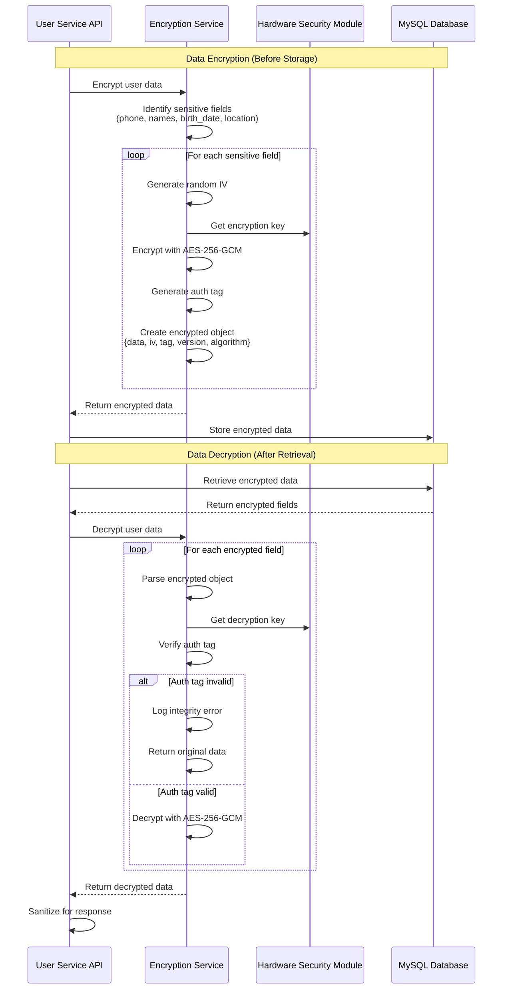
```mermaid
sequenceDiagram
    participant API as User Service API
    participant Encrypt as Encryption Service
    participant HSM as Hardware Security Module
    participant DB as MySQL Database

    Note over API,DB: Data Encryption (Before Storage)
    API->>Encrypt: Encrypt user data
    Encrypt->>Encrypt: Identify sensitive fields<br/>(phone, names, birth_date, location)
    loop For each sensitive field
        Encrypt->>Encrypt: Generate random IV
        Encrypt->>HSM: Get encryption key
        Encrypt->>Encrypt: Encrypt with AES-256-GCM
        Encrypt->>Encrypt: Generate auth tag
        Encrypt->>Encrypt: Create encrypted object<br/>{data, iv, tag, version, algorithm}
    end
    Encrypt-->>API: Return encrypted data
    API->>DB: Store encrypted data

    Note over API,DB: Data Decryption (After Retrieval)
    API->>DB: Retrieve encrypted data
    DB-->>API: Return encrypted fields
    API->>Encrypt: Decrypt user data
    loop For each encrypted field
        Encrypt->>Encrypt: Parse encrypted object
        Encrypt->>HSM: Get decryption key
        Encrypt->>Encrypt: Verify auth tag
        alt Auth tag invalid
            Encrypt->>Encrypt: Log integrity error
            Encrypt->>Encrypt: Return original data
        else Auth tag valid
            Encrypt->>Encrypt: Decrypt with AES-256-GCM
        end
    end
    Encrypt-->>API: Return decrypted data
    API->>API: Sanitize for response
```

---

## 20. Session Lifecycle Workflow

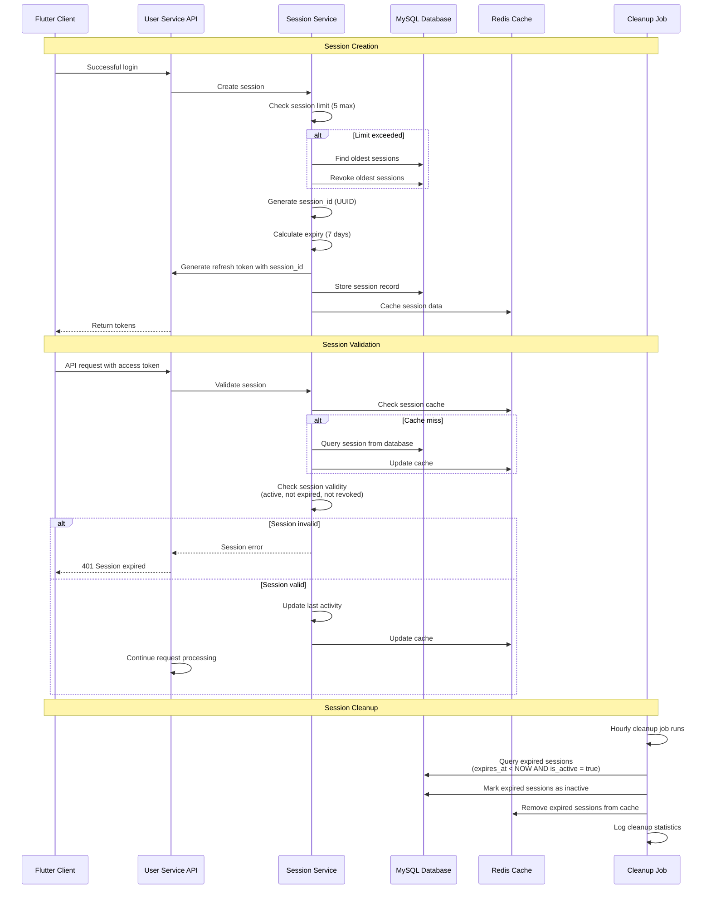
```mermaid
sequenceDiagram
    participant Client as Flutter Client
    participant API as User Service API
    participant Session as Session Service
    participant DB as MySQL Database
    participant Redis as Redis Cache
    participant Job as Cleanup Job

    Note over Client,Job: Session Creation
    Client->>API: Successful login
    API->>Session: Create session
    Session->>Session: Check session limit (5 max)
    alt Limit exceeded
        Session->>DB: Find oldest sessions
        Session->>DB: Revoke oldest sessions
    end
    Session->>Session: Generate session_id (UUID)
    Session->>Session: Calculate expiry (7 days)
    Session->>API: Generate refresh token with session_id
    Session->>DB: Store session record
    Session->>Redis: Cache session data
    API-->>Client: Return tokens

    Note over Client,Job: Session Validation
    Client->>API: API request with access token
    API->>Session: Validate session
    Session->>Redis: Check session cache
    alt Cache miss
        Session->>DB: Query session from database
        Session->>Redis: Update cache
    end
    Session->>Session: Check session validity<br/>(active, not expired, not revoked)
    alt Session invalid
        Session-->>API: Session error
        API-->>Client: 401 Session expired
    else Session valid
        Session->>Session: Update last activity
        Session->>Redis: Update cache
        API->>API: Continue request processing
    end

    Note over Client,Job: Session Cleanup
    Job->>Job: Hourly cleanup job runs
    Job->>DB: Query expired sessions<br/>(expires_at < NOW AND is_active = true)
    Job->>DB: Mark expired sessions as inactive
    Job->>Redis: Remove expired sessions from cache
    Job->>Job: Log cleanup statistics
```

---

## 21. Complete User Journey Workflow

```mermaid
sequenceDiagram
    participant User as User
    participant App as Flutter App
    participant API as User Service API
    participant DB as MySQL Database

    Note over User,DB: Complete User Journey
    User->>App: Opens app
    App->>App: Check stored tokens
    alt No tokens
        App->>User: Show login/register screen
        User->>App: Choose registration
        App->>API: Request registration OTP
        API-->>App: Return verification_id
        App->>User: Show OTP input
        User->>App: Enter OTP + password
        App->>API: Complete registration
        API-->>App: Return user + tokens
        App->>App: Store tokens securely
        App->>User: Show home screen
    else Has tokens
        App->>API: Validate token (background)
        alt Token valid
            App->>User: Show home screen
        else Token expired
            App->>API: Refresh token
            alt Refresh successful
                App->>App: Update stored token
                App->>User: Show home screen
            else Refresh failed
                App->>User: Show login screen
            end
        end
    end

    Note over User,DB: User Activities
    User->>App: Edit profile
    App->>API: Update profile
    API-->>App: Success
    App->>User: Show success message

    User->>App: Upload avatar
    App->>API: Upload image
    API-->>App: Return image URL
    App->>User: Update UI with new avatar

    User->>App: Change settings
    App->>API: Update settings
    API-->>App: Success
    App->>User: Update local settings

    User->>App: Logout
    App->>API: Logout request
    App->>App: Clear stored data
    App->>User: Show login screen
```

---

These workflow diagrams provide comprehensive visual documentation of how each API endpoint functions, including all the validation steps, database operations, error handling, and security measures. They serve as both technical documentation and debugging aids for developers working with the Lianxin User Service API.