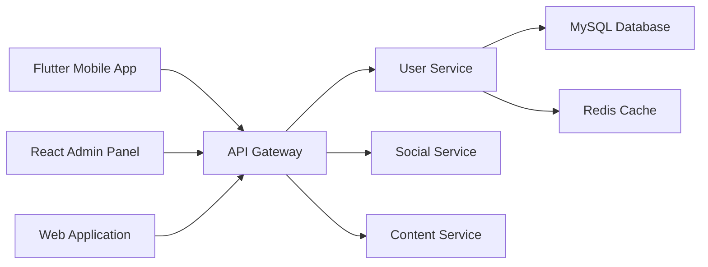

# Frontend Integration Guide for Lianxin User Service

## Overview

This guide provides comprehensive Frontend integration patterns for the Lianxin User Service API, including state management, error handling, security best practices, and UI components.

The frontend applications (Flutter mobile app, React admin panel) will communicate with the User Service through RESTful APIs. The integration follows a client-server architecture with JWT-based authentication.



## Table of Contents

1. [Project Setup ](#project-setup)
2. [Flutter Directory Structure](#flutter-directory-structure)
3. [App Configuration](#app-configuration)
4. [Authentication Feature](#authentication-feature)
5. [Profile Feature](#profile-feature)
6. [Settings Feature](#settings-feature)
7. [Security](security)
8. [Core Services](#core-services)
9. [Performance Optimization](#performance-optimization)
10. [App Localization](#app-localization)
11. [Shared Models](#shared-models)
12. [Shared Components](#shared-components)
13. [Theme Configuration](#theme-configuration)
14. [Error Handling](#error-handling)
15. [Dependency Injection](#dependency-injection)
16. [Utilities](#utilities)
17. [Platform Configuration](#platform-configuration)
18. [Testing Strategy](#testing-strategy)
19. [Best Practices and Guidelines](#best-practices-and-guidelines)

---

## Project Setup 

### Dependencies

Mandatory dependencies in `pubspec.yaml`:

```yaml
name: lianxin
description: Lianxin social media platform Flutter app
version: 1.0.0+1

environment:
  sdk: '>=3.0.0 <4.0.0'
  flutter: ">=3.10.0"

dependencies:
  flutter:
    sdk: flutter
  
  # State management
  provider: ^6.1.1
  
  # Network - Using Dio exclusively
  dio: ^5.3.2
  dio_certificate_pinning: ^6.0.0
  dio_cache_interceptor: ^3.4.2
  dio_cache_interceptor_hive_store: ^3.2.2
  
  # Storage
  shared_preferences: ^2.2.2
  flutter_secure_storage: ^9.0.0
  hive: ^2.2.3
  hive_flutter: ^1.1.0
  
  # UI
  cached_network_image: ^3.3.0
  image_picker: ^1.0.4
  photo_view: ^0.14.0
  
  # Device info
  device_info_plus: ^9.1.0
  connectivity_plus: ^5.0.1
  
  # Utils
  uuid: ^4.1.0
  intl: ^0.18.1
  path_provider: ^2.1.1
  
  # Security
  crypto: ^3.0.3
  
  # Dependency injection
  get_it: ^7.6.4
  
  # Localization
  flutter_localizations:
    sdk: flutter

dev_dependencies:
  flutter_test:
    sdk: flutter
  flutter_lints: ^3.0.0
  hive_generator: ^2.0.1
  build_runner: ^2.4.7
  mockito: ^5.4.2

flutter:
  uses-material-design: true
  
  assets:
    - assets/images/
    - assets/icons/
  
  fonts:
    - family: Roboto
      fonts:
        - asset: assets/fonts/Roboto-Regular.ttf
        - asset: assets/fonts/Roboto-Medium.ttf
          weight: 500
        - asset: assets/fonts/Roboto-Bold.ttf
          weight: 700
```

## Flutter Directory Structure

```
lianxin/
├── lib/
│   ├── main.dart
│   ├── app/
│   │   ├── app.dart
│   │   ├── app_config.dart
│   │   └── router.dart
│   ├── features/
│   │   ├── splash/
│   │   │   └── screens/
│   │   │       └── splash_screen.dart
│   │   ├── auth/
│   │   │   ├── screens/
│   │   │   │   ├── login_screen.dart
│   │   │   │   ├── register_screen.dart
│   │   │   │   ├── password_reset_screen.dart
│   │   │   │   ├── forgot_password_screen.dart
│   │   │   │   └── otp_verification_screen.dart
│   │   │   ├── widgets/
│   │   │   │   ├── phone_input_widget.dart
│   │   │   │   ├── otp_input_widget.dart
│   │   │   │   ├── otp_timer_widget.dart
│   │   │   │   └── password_strength_widget.dart
│   │   │   ├── services/
│   │   │   │   ├── auth_service.dart          # POST /auth/login, /auth/register, /auth/refresh, /auth/logout
│   │   │   │   └── otp_service.dart           # POST /auth/*/otp
│   │   │   ├── providers/
│   │   │   │   └── auth_provider.dart
│   │   │   └── utils/
│   │   │       └── auth_validator.dart
│   │   ├── profile/
│   │   │   ├── screens/
│   │   │   │   ├── my_profile_screen.dart     # GET /user/profile (current user)
│   │   │   │   ├── edit_profile_screen.dart   # PUT /user/profile
│   │   │   │   ├── avatar_upload.dart         # POST /user/avatar
│   │   │   │   ├── cover_upload.dart          # POST /user/cover-photo
│   │   │   │   └── user_profile_screen.dart     # GET /user/public/:userId (other user)
│   │   │   ├── widgets/
│   │   │   │   └── image_picker_widget.dart
│   │   │   ├── services/
│   │   │   │   └── profile_service.dart
│   │   │   ├── providers/
│   │   │   │   └── profile_provider.dart
│   │   │   └── utils/
│   │   │       └── image_util.dart
│   │   └── settings/
│   │       ├── screens/
│   │       │   ├── settings_screen.dart
│   │       │   ├── security_settings.dart
│   │       │   ├── account_settings.dart
│   │       │   ├── password_change.dart
│   │       │   ├── phone_number_change.dart
│   │       │   ├── account_deactivate.dart
│   │       │   ├── account_deletion.dart
│   │       │   └── session_management_screen.dart
│   │       ├── widgets/
│   │       │   ├── settings_tile_widget.dart
│   │       │   ├── toggle_setting_widget.dart
│   │       │   └── session_item_widget.dart
│   │       ├── services/
│   │       │   ├── settings_service.dart
│   │       │   ├── security_service.dart      # Password/phone change
│   │       │   ├── account_service.dart      # Handles deactivation/deletion
│   │       │   └── session_service.dart
│   │       ├── providers/
│   │       │   └── settings_provider.dart
│   │       └── utils/
│   │           └── settings_validator.dart
│   ├── shared/
│   │   ├── widgets/
│   │   │   ├── primary_button.dart
│   │   │   ├── text_field.dart
│   │   │   ├── loading_overlay.dart
│   │   │   ├── error_dialog.dart
│   │   │   ├── success_dialog.dart
│   │   │   └── confirmation_dialog.dart
│   │   ├── models/
│   │   │   ├── user_model.dart
│   │   │   ├── settings_model.dart
│   │   │   ├── session_model.dart
│   │   │   └── avatar_model.dart
│   │   ├── services/
│   │   │   └── device_info_service.dart
│   │   └── utils/
│   │       ├── auth_guard.dart
│   │       ├── validators.dart
│   │       ├── constants.dart
│   │       └── formatters.dart
│   └── core/
│       ├── di/
│       │   └── injector.dart
│       ├── network/
│       │   ├── api_client.dart
│       │   ├── api_endpoints.dart
│       │   └── interceptors/
│       │       ├── auth_interceptor.dart
│       │       ├── error_interceptor.dart
│       │       └── logging_interceptor.dart
│       ├── security/
│       │   ├── secure_storage.dart
│       │   └── encryption.dart
│       ├── storage/
│       │   ├── token_storage.dart
│       │   ├── user_storage.dart
│       │   └── offline_storage.dart
│       ├── caching/
│       │   ├── api_cache.dart
│       │   └── image_cache_manager.dart
│       ├── errors/
│       │   ├── api_exception.dart
│       │   ├── app_exception.dart
│       │   └── error_handler.dart
│       ├── utils/
│       │   ├── logger.dart
│       │   ├── connectivity_service.dart
│       │   └── platform_info.dart
│       ├── themes/
│       │   ├── app_theme.dart
│       │   ├── colors.dart
│       │   └── text_styles.dart
│       └── localization/
│           ├── app_zh.arb
│           └── app_en.arb
├── pubspec.yaml
├── android/
│   └── app/
│       └── src/
│           └── main/
│               └── AndroidManifest.xml
└── ios/
    └── Runner/
        └── Info.plist
```
---
## App Configuration

### main.dart
```dart
import 'package:flutter/material.dart';
import 'package:provider/provider.dart';
import 'package:flutter_localizations/flutter_localizations.dart';
import 'app/app.dart';
import 'core/di/injector.dart';
import 'core/utils/logger.dart';

void main() async {
  WidgetsFlutterBinding.ensureInitialized();
  
  try {
    // Initialize dependency injection
    await setupDependencyInjection();
    Logger.info('Starting Lianxin app');
    runApp(const LianxinApp());
  } catch (e) {
    Logger.error('Initialization failed', {'error': e.toString()});
    // Handle initialization failure (e.g., show error screen)
  }
}
```

### app/app.dart
```dart
import 'package:flutter/material.dart';
import 'package:provider/provider.dart';
import 'package:flutter_localizations/flutter_localizations.dart';
import '../features/auth/providers/auth_provider.dart';
import '../features/profile/providers/profile_provider.dart';
import '../features/settings/providers/settings_provider.dart';
import '../core/themes/app_theme.dart';
import 'router.dart';
import 'app_config.dart';

class LianxinApp extends StatelessWidget {
  const LianxinApp({Key? key}) : super(key: key);

  @override
  Widget build(BuildContext context) {
    return MultiProvider(
      providers: [
        ChangeNotifierProvider(create: (_) => AuthProvider()),
        ChangeNotifierProvider(create: (_) => ProfileProvider()),
        ChangeNotifierProvider(create: (_) => SettingsProvider()),
      ],
      child: Consumer<AuthProvider>(
        builder: (context, authProvider, _) {
          return MaterialApp(
            title: AppConfig.appName,
            theme: AppTheme.lightTheme,
            darkTheme: AppTheme.darkTheme,
            themeMode: ThemeMode.system,
            localizationsDelegates: const [
              GlobalMaterialLocalizations.delegate,
              GlobalWidgetsLocalizations.delegate,
              GlobalCupertinoLocalizations.delegate,
            ],
            supportedLocales: const [
              Locale('zh', 'CN'),
              Locale('en', 'US'),
            ],
            onGenerateRoute: AppRouter.generateRoute,
            initialRoute: authProvider.isAuthenticated ? '/home' : '/splash',
            debugShowCheckedModeBanner: false,
          );
        },
      ),
    );
  }
}
```

### app/app_config.dart
```dart
class AppConfig {
  static const String appName = 'Lianxin';
  static const String appVersion = '1.0.0';
  static const String baseUrl = 'http://localhost:3001/api/v1';
  
  // Feature flags
  static const bool enableAdvancedAnalytics = true;
  
  // Cache settings
  static const Duration cacheExpiry = Duration(hours: 1);
  static const int maxCacheSize = 100 * 1024 * 1024; // 100MB
  
  // Network settings
  static const Duration connectTimeout = Duration(seconds: 30);
  static const Duration receiveTimeout = Duration(seconds: 30);
  
  // Security settings
  static const Duration tokenRefreshThreshold = Duration(minutes: 5);
  static const int maxRetryAttempts = 3;
}
```

### app/router.dart
```dart
import 'package:flutter/material.dart';
import '../shared/utils/auth_guart.dart';
import '../features/splash/screens/splash_screen.dart';
import '../features/auth/screens/login_screen.dart';
import '../features/auth/screens/register_screen.dart';
import '../features/auth/screens/otp_verification_screen.dart';
import '../features/auth/screens/password_reset_screen.dart';
import '../features/auth/screens/forgot_password_screen.dart';
import '../features/profile/screens/my_profile_screen.dart';
import '../features/profile/screens/edit_profile_screen.dart';
import '../features/profile/screens/user_profile_screen.dart';
import '../features/settings/screens/settings_screen.dart';
import '../features/settings/screens/security_settings.dart';
import '../features/settings/screens/session_management_screen.dart';

class AppRouter {
  static Route<dynamic> generateRoute(RouteSettings settings) {
    switch (settings.name) {
      case '/':
      case '/splash':
        return MaterialPageRoute(builder: (_) => const SplashScreen());
      
      case '/login':
        return MaterialPageRoute(builder: (_) => const LoginScreen());
      
      case '/register':
        return MaterialPageRoute(builder: (_) => const RegisterScreen());
      
      case '/otp-verification':
        final args = settings.arguments as Map<String, dynamic>;
        return MaterialPageRoute(
          builder: (_) => OtpVerificationScreen(
            phone: args['phone'],
            verificationId: args['verificationId'],
            otpType: args['otpType'],
          ),
        );
      
      case '/forgot-password':
        return MaterialPageRoute(builder: (_) => const ForgotPasswordScreen());
      
      case '/password-reset':
        final args = settings.arguments as Map<String, dynamic>;
        return MaterialPageRoute(
          builder: (_) => PasswordResetScreen(
            phone: args['phone'],
            verificationId: args['verificationId'],
          ),
        );
      
      case '/profile':
        return MaterialPageRoute(builder: (_) => AuthGuard(builder: (_) => const MyProfileScreen(),),);
      
      case '/edit-profile':
        return MaterialPageRoute(builder: (_) => AuthGuard(builder: (_) => const EditProfileScreen(),),);
      
      case '/public-user-profile':
        final args = settings.arguments as Map<String, dynamic>;
        return MaterialPageRoute(
          builder: (_) => UserProfileScreen(userId: args['userId']),
        );
      
      case '/settings':
        return MaterialPageRoute(builder: (_) => AuthGuard(builder: (_) => const SettingsScreen(),),);
      
      case '/security-settings':
        return MaterialPageRoute(builder: (_) => AuthGuard(builder: (_) => const SecuritySettingsScreen(),),);
            
      case '/session-management':
        return MaterialPageRoute(builder: (_) => AuthGuard(builder: (_) => const SessionManagementScreen(),),);

      ...other cases

      default:
        return MaterialPageRoute(
          builder: (_) => Scaffold(
            body: Center(
              child: Text('Route ${settings.name} not found'),
            ),
          ),
        );
    }
  }
}
```

## Authentication Feature

### features/auth/screens/login_screen.dart
```dart
import 'package:flutter/material.dart';
import 'package:provider/provider.dart';
import '../providers/auth_provider.dart';
import '../widgets/phone_input_widget.dart';
import '../../../shared/widgets/primary_button.dart';
import '../../../shared/widgets/text_field.dart';
import '../../../shared/widgets/loading_overlay.dart';
import '../../../core/themes/colors.dart';

class LoginScreen extends StatefulWidget {
  const LoginScreen({Key? key}) : super(key: key);

  @override
  _LoginScreenState createState() => _LoginScreenState();
}

class _LoginScreenState extends State<LoginScreen> {
  final _formKey = GlobalKey<FormState>();
  final _passwordController = TextEditingController();
  bool _isPasswordVisible = false;
  bool _useOtpLogin = false;

  // Store the full validated phone number here
  String _phoneNumber = '';

  @override
  Widget build(BuildContext context) {
    return Scaffold(
      backgroundColor: AppColors.background,
      body: SafeArea(
        child: Consumer<AuthProvider>(
          builder: (context, authProvider, _) {
            return LoadingOverlay(
              isLoading: authProvider.isLoading,
              child: Padding(
                padding: const EdgeInsets.all(24.0),
                child: Form(
                  key: _formKey,
                  child: Column(
                    crossAxisAlignment: CrossAxisAlignment.stretch,
                    children: [
                      const SizedBox(height: 60),
                      
                      // Logo and title
                      Text(
                        'Welcome Back',
                        style: Theme.of(context).textTheme.headlineMedium?.copyWith(
                          fontWeight: FontWeight.bold,
                          color: AppColors.primary,
                        ),
                        textAlign: TextAlign.center,
                      ),
                      
                      const SizedBox(height: 8),
                      Text(
                        'Sign in to continue',
                        style: Theme.of(context).textTheme.bodyLarge?.copyWith(
                          color: AppColors.textSecondary,
                        ),
                        textAlign: TextAlign.center,
                      ),
                      
                      const SizedBox(height: 48),
                      
                      // Phone input
                      PhoneInputWidget(
                        initialValue: null, // or some initial phone string if any
                        onChanged: (phone) {
                          setState(() {
                            _phoneNumber = phone;
                          });
                        },
                      ),
                      
                      const SizedBox(height: 16),
                      
                      // Login method toggle
                      Row(
                        children: [
                          Expanded(
                            child: RadioListTile<bool>(
                              title: const Text('Password'),
                              value: false,
                              groupValue: _useOtpLogin,
                              onChanged: (value) {
                                setState(() {
                                  _useOtpLogin = value!;
                                });
                              },
                            ),
                          ),
                          Expanded(
                            child: RadioListTile<bool>(
                              title: const Text('OTP'),
                              value: true,
                              groupValue: _useOtpLogin,
                              onChanged: (value) {
                                setState(() {
                                  _useOtpLogin = value!;
                                });
                              },
                            ),
                          ),
                        ],
                      ),
                      
                      const SizedBox(height: 16),
                      
                      // Password input (if password login)
                      if (!_useOtpLogin) ...[
                        CustomTextField(
                          controller: _passwordController,
                          label: 'Password',
                          obscureText: !_isPasswordVisible,
                          suffixIcon: IconButton(
                            icon: Icon(
                              _isPasswordVisible ? Icons.visibility_off : Icons.visibility,
                            ),
                            onPressed: () {
                              setState(() {
                                _isPasswordVisible = !_isPasswordVisible;
                              });
                            },
                          ),
                          validator: (value) {
                            if (value?.isEmpty ?? true) {
                              return 'Password is required';
                            }
                            return null;
                          },
                        ),
                        
                        const SizedBox(height: 16),
                        
                        // Forgot password link
                        Align(
                          alignment: Alignment.centerRight,
                          child: TextButton(
                            onPressed: () {
                              Navigator.pushNamed(context, '/forgot-password');
                            },
                            child: const Text('Forgot Password?'),
                          ),
                        ),
                      ],
                      
                      const SizedBox(height: 32),
                      
                      // Login button
                      PrimaryButton(
                        text: _useOtpLogin ? 'Send OTP' : 'Sign In',
                        onPressed: _handleLogin,
                      ),
                      
                      const SizedBox(height: 24),
                      
                      // Register link
                      Row(
                        mainAxisAlignment: MainAxisAlignment.center,
                        children: [
                          const Text("Don't have an account? "),
                          TextButton(
                            onPressed: () {
                              Navigator.pushNamed(context, '/register');
                            },
                            child: const Text('Sign Up'),
                          ),
                        ],
                      ),
                    ],
                  ),
                ),
              ),
            );
          },
        ),
      ),
    );
  }

  void _handleLogin() async {
    // Simple validation: ensure phone number is not empty and matches expected pattern
    if (_phoneNumber.isEmpty) {
      ScaffoldMessenger.of(context).showSnackBar(
        const SnackBar(content: Text('Please enter a valid phone number')),
      );
      return;
    }

    if (!_formKey.currentState!.validate()) return;

    final authProvider = Provider.of<AuthProvider>(context, listen: false);

    try {
      if (_useOtpLogin) {
        await authProvider.requestLoginOtp(_phoneNumber);
        Navigator.pushNamed(
          context,
          '/otp-verification',
          arguments: {
            'phone': _phoneNumber,
            'verificationId': authProvider.verificationId,
            'otpType': 'login',
          },
        );
      } else {
        await authProvider.loginWithPassword(
          _phoneNumber,
          _passwordController.text,
        );
        Navigator.pushReplacementNamed(context, '/home');
      }
    } catch (error) {
      ScaffoldMessenger.of(context).showSnackBar(
        SnackBar(content: Text(error.toString())),
      );
    }
  }

  @override
  void dispose() {
    _passwordController.dispose();
    super.dispose();
  }
}
```

### features/auth/providers/auth_provider.dart
```dart
import 'package:flutter/foundation.dart';
import '../services/auth_service.dart';
import '../../../shared/models/user_model.dart';
import '../../../core/storage/token_storage.dart';
import '../../../core/storage/user_storage.dart';
import '../../../core/utils/logger.dart';

class AuthProvider extends ChangeNotifier {
  final AuthService _authService = AuthService();
  final TokenStorage _tokenStorage = TokenStorage();
  final UserStorage _userStorage = UserStorage();

  UserProfile? _user;
  bool _isLoading = false;
  bool _isAuthenticated = false;
  String? _verificationId;

  // Getters
  UserProfile? get user => _user;
  bool get isLoading => _isLoading;
  bool get isAuthenticated => _isAuthenticated;
  String? get verificationId => _verificationId;

  AuthProvider() {
    _initializeAuth();
  }

  Future<void> _initializeAuth() async {
    try {
      final token = await _tokenStorage.getAccessToken();
      final userData = await _userStorage.getUserData();

      if (token != null && userData != null) {
        _user = UserProfile.fromJson(userData);
        _isAuthenticated = true;
        notifyListeners();
      }
    } catch (error) {
      Logger.error('Failed to initialize auth', {'error': error.toString()});
    }
  }

  Future<void> requestRegistrationOtp(String phone) async {
    _setLoading(true);
    try {
      final result = await _authService.requestRegistrationOtp(phone);
      _verificationId = result['verification_id'];
      Logger.info('Registration OTP sent', {'phone': phone});
    } catch (error) {
      Logger.error('Failed to send registration OTP', {'error': error.toString()});
      rethrow;
    } finally {
      _setLoading(false);
    }
  }

  Future<void> register({
    required String phone,
    required String password,
    required String otpCode,
  }) async {
    _setLoading(true);
    try {
      final result = await _authService.register(
        phone: phone,
        password: password,
        verificationId: _verificationId!,
        otpCode: otpCode,
      );

      await _handleAuthSuccess(result);
      Logger.info('User registered successfully', {'userId': _user?.id});
    } catch (error) {
      Logger.error('Registration failed', {'error': error.toString()});
      rethrow;
    } finally {
      _setLoading(false);
    }
  }

  Future<void> requestLoginOtp(String phone) async {
    _setLoading(true);
    try {
      final result = await _authService.requestLoginOtp(phone);
      _verificationId = result['verification_id'];
      Logger.info('Login OTP sent', {'phone': phone});
    } catch (error) {
      Logger.error('Failed to send login OTP', {'error': error.toString()});
      rethrow;
    } finally {
      _setLoading(false);
    }
  }

  Future<void> loginWithPassword(String phone, String password) async {
    _setLoading(true);
    try {
      final result = await _authService.loginWithPassword(
        phone: phone,
        password: password,
      );

      await _handleAuthSuccess(result);
      Logger.info('User logged in with password', {'userId': _user?.id});
    } catch (error) {
      Logger.error('Password login failed', {'error': error.toString()});
      rethrow;
    } finally {
      _setLoading(false);
    }
  }

  Future<void> loginWithOtp(String phone, String otpCode) async {
    _setLoading(true);
    try {
      final result = await _authService.loginWithOtp(
        phone: phone,
        verificationId: _verificationId!,
        otpCode: otpCode,
      );

      await _handleAuthSuccess(result);
      Logger.info('User logged in with OTP', {'userId': _user?.id});
    } catch (error) {
      Logger.error('OTP login failed', {'error': error.toString()});
      rethrow;
    } finally {
      _setLoading(false);
    }
  }

  Future<void> logout() async {
    _setLoading(true);
    try {
      await _authService.logout();
      await _clearAuthData();
      Logger.info('User logged out');
    } catch (error) {
      Logger.error('Logout failed', {'error': error.toString()});
      // Clear local data even if logout request fails
      await _clearAuthData();
    } finally {
      _setLoading(false);
    }
  }

  Future<void> refreshToken() async {
    try {
      final result = await _authService.refreshToken();
      await _tokenStorage.storeTokens(result['tokens']);
      Logger.info('Token refreshed successfully');
    } catch (error) {
      Logger.error('Token refresh failed', {'error': error.toString()});
      await logout();
      rethrow;
    }
  }

  Future<void> _handleAuthSuccess(Map<String, dynamic> result) async {
    _user = UserProfile.fromJson(result['user']);
    _isAuthenticated = true;

    await _tokenStorage.storeTokens(result['tokens']);
    await _userStorage.storeUserData(result['user']);

    notifyListeners();
  }

  Future<void> _clearAuthData() async {
    _user = null;
    _isAuthenticated = false;
    _verificationId = null;

    await _tokenStorage.clearTokens();
    await _userStorage.clearUserData();

    notifyListeners();
  }

  void _setLoading(bool loading) {
    _isLoading = loading;
    notifyListeners();
  }
}
```

### features/auth/services/auth_service.dart
```dart
import 'dart:convert';
import 'package:dio/dio.dart';
import '../../../core/network/api_client.dart';
import '../../../core/network/api_endpoints.dart';
import '../../../shared/services/device_info_service.dart';
import '../../../shared/models/user_model.dart';
import '../../../core/utils/logger.dart';

class OtpResponse {
  final String verificationId;
  final String phone;
  final int expiresIn;

  OtpResponse({
    required this.verificationId,
    required this.phone,
    required this.expiresIn,
  });

  factory OtpResponse.fromJson(Map<String, dynamic> json) {
    return OtpResponse(
      verificationId: json['verification_id'],
      phone: json['phone'],
      expiresIn: json['expires_in'],
    );
  }
}

class AuthResult {
  final UserProfile user;
  final Map<String, dynamic> tokens;

  AuthResult({
    required this.user,
    required this.tokens,
  });

  factory AuthResult.fromJson(Map<String, dynamic> json) {
    return AuthResult(
      user: UserProfile.fromJson(json['user']),
      tokens: json['tokens'],
    );
  }
}

class AuthService {
  final ApiClient _apiClient = ApiClient();
  final DeviceInfoService _deviceInfoService = DeviceInfoService();

  Future<OtpResponse> requestRegistrationOtp(String phone) async {
    try {
      final response = await _apiClient.post<Map<String, dynamic>>(
        ApiEndpoints.registerOtp,
        data: {'phone': phone},
        fromJson: (data) => data as Map<String, dynamic>,
      );

      if (!response.success || response.data == null) {
        throw Exception('Failed to request OTP');
      }

      Logger.info('Registration OTP requested', {'phone': phone});
      return OtpResponse.fromJson(response.data!);
    } catch (error) {
      Logger.error('Failed to request registration OTP', {
        'phone': phone,
        'error': error.toString(),
      });
      rethrow;
    }
  }

  Future<AuthResult> register({
    required String phone,
    required String password,
    required String verificationId,
    required String otpCode,
  }) async {
    try {
      final deviceInfo = await _deviceInfoService.getDeviceInfo();

      final response = await _apiClient.post<Map<String, dynamic>>(
        ApiEndpoints.register,
        data: {
          'phone': phone,
          'password': password,
          'verification_id': verificationId,
          'otp_code': otpCode,
          'agree_terms': true,
          'device_id': deviceInfo.deviceId,
          'device_type': deviceInfo.deviceType,
          'device_name': deviceInfo.deviceName,
        },
        fromJson: (data) => data as Map<String, dynamic>,
      );

      if (!response.success || response.data == null) {
        throw Exception('Registration failed');
      }

      Logger.info('User registered', {'phone': phone});
      return AuthResult.fromJson(response.data!);
    } catch (error) {
      Logger.error('Registration failed', {
        'phone': phone,
        'error': error.toString(),
      });
      rethrow;
    }
  }

  Future<OtpResponse> requestLoginOtp(String phone) async {
    try {
      final response = await _apiClient.post<Map<String, dynamic>>(
        ApiEndpoints.loginOtp,
        data: {'phone': phone},
        fromJson: (data) => data as Map<String, dynamic>,
      );

      if (!response.success || response.data == null) {
        throw Exception('Failed to request login OTP');
      }

      Logger.info('Login OTP requested', {'phone': phone});
      return OtpResponse.fromJson(response.data!);
    } catch (error) {
      Logger.error('Failed to request login OTP', {
        'phone': phone,
        'error': error.toString(),
      });
      rethrow;
    }
  }

  Future<AuthResult> loginWithPassword({
    required String phone,
    required String password,
  }) async {
    try {
      final deviceInfo = await _deviceInfoService.getDeviceInfo();

      final response = await _apiClient.post<Map<String, dynamic>>(
        ApiEndpoints.login,
        data: {
          'phone': phone,
          'password': password,
          'device_id': deviceInfo.deviceId,
          'device_type': deviceInfo.deviceType,
          'device_name': deviceInfo.deviceName,
        },
        fromJson: (data) => data as Map<String, dynamic>,
      );

      if (!response.success || response.data == null) {
        throw Exception('Login failed');
      }

      Logger.info('User logged in with password', {'phone': phone});
      return AuthResult.fromJson(response.data!);
    } catch (error) {
      Logger.error('Password login failed', {
        'phone': phone,
        'error': error.toString(),
      });
      rethrow;
    }
  }

  Future<AuthResult> loginWithOtp({
    required String phone,
    required String verificationId,
    required String otpCode,
  }) async {
    try {
      final deviceInfo = await _deviceInfoService.getDeviceInfo();

      final response = await _apiClient.post<Map<String, dynamic>>(
        ApiEndpoints.login,
        data: {
          'phone': phone,
          'verification_id': verificationId,
          'otp_code': otpCode,
          'device_id': deviceInfo.deviceId,
          'device_type': deviceInfo.deviceType,
          'device_name': deviceInfo.deviceName,
        },
        fromJson: (data) => data as Map<String, dynamic>,
      );

      if (!response.success || response.data == null) {
        throw Exception('OTP login failed');
      }

      Logger.info('User logged in with OTP', {'phone': phone});
      return AuthResult.fromJson(response.data!);
    } catch (error) {
      Logger.error('OTP login failed', {
        'phone': phone,
        'error': error.toString(),
      });
      rethrow;
    }
  }

  Future<Map<String, dynamic>> refreshToken() async {
    try {
      final response = await _apiClient.post<Map<String, dynamic>>(
        ApiEndpoints.refresh,
        requiresAuth: false,
        fromJson: (data) => data as Map<String, dynamic>,
      );

      if (!response.success || response.data == null) {
        throw Exception('Token refresh failed');
      }

      Logger.info('Token refreshed');
      return response.data!;
    } catch (error) {
      Logger.error('Token refresh failed', {'error': error.toString()});
      rethrow;
    }
  }

  Future<void> logout() async {
    try {
      await _apiClient.post(ApiEndpoints.logout);
      Logger.info('User logged out');
    } catch (error) {
      Logger.error('Logout failed', {'error': error.toString()});
      rethrow;
    }
  }

  Future<OtpResponse> requestPasswordResetOtp(String phone) async {
    try {
      final response = await _apiClient.post<Map<String, dynamic>>(
        ApiEndpoints.forgotPasswordOtp,
        data: {'phone': phone},
        fromJson: (data) => data as Map<String, dynamic>,
      );

      if (!response.success || response.data == null) {
        throw Exception('Failed to request password reset OTP');
      }

      Logger.info('Password reset OTP requested', {'phone': phone});
      return OtpResponse.fromJson(response.data!);
    } catch (error) {
      Logger.error('Failed to request password reset OTP', {
        'phone': phone,
        'error': error.toString(),
      });
      rethrow;
    }
  }

  Future<void> resetPassword({
    required String phone,
    required String verificationId,
    required String otpCode,
    required String newPassword,
  }) async {
    try {
      await _apiClient.post(
        ApiEndpoints.resetPassword,
        data: {
          'phone': phone,
          'verification_id': verificationId,
          'otp_code': otpCode,
          'new_password': newPassword,
          'confirm_password': newPassword,
        },
      );

      Logger.info('Password reset successfully', {'phone': phone});
    } catch (error) {
      Logger.error('Password reset failed', {
        'phone': phone,
        'error': error.toString(),
      });
      rethrow;
    }
  }
}
```

### auth/widgets/otp_input_widget.dart

```dart
class OtpInput extends StatefulWidget {
  final int length;
  final Function(String) onCompleted;
  final Function(String)? onChanged;

  const OtpInput({
    Key? key,
    this.length = 6,
    required this.onCompleted,
    this.onChanged,
  }) : super(key: key);

  @override
  _OtpInputState createState() => _OtpInputState();
}

class _OtpInputState extends State<OtpInput> {
  late List<TextEditingController> _controllers;
  late List<FocusNode> _focusNodes;

  @override
  void initState() {
    super.initState();
    _controllers = List.generate(
      widget.length,
      (index) => TextEditingController(),
    );
    _focusNodes = List.generate(
      widget.length,
      (index) => FocusNode(),
    );
  }

  @override
  Widget build(BuildContext context) {
    return Row(
      mainAxisAlignment: MainAxisAlignment.spaceEvenly,
      children: List.generate(
        widget.length,
        (index) => SizedBox(
          width: 50,
          child: TextField(
            controller: _controllers[index],
            focusNode: _focusNodes[index],
            textAlign: TextAlign.center,
            keyboardType: TextInputType.number,
            maxLength: 1,
            decoration: InputDecoration(
              counterText: '',
              border: OutlineInputBorder(
                borderRadius: BorderRadius.circular(8),
              ),
            ),
            onChanged: (value) {
              if (value.isNotEmpty) {
                if (index < widget.length - 1) {
                  _focusNodes[index + 1].requestFocus();
                } else {
                  _focusNodes[index].unfocus();
                }
              } else if (index > 0) {
                _focusNodes[index - 1].requestFocus();
              }
              
              final otp = _controllers.map((c) => c.text).join();
              widget.onChanged?.call(otp);
              
              if (otp.length == widget.length) {
                widget.onCompleted(otp);
              }
            },
          ),
        ),
      ),
    );
  }

  @override
  void dispose() {
    for (final controller in _controllers) {
      controller.dispose();
    }
    for (final focusNode in _focusNodes) {
      focusNode.dispose();
    }
    super.dispose();
  }
}
```

### auth/widgets/phone_input_widget.dart

```dart
import 'package:flutter/material.dart';

class PhoneInputWidget extends StatefulWidget {
  final String? initialValue;
  final ValueChanged<String> onChanged;

  const PhoneInputWidget({
    Key? key,
    this.initialValue,
    required this.onChanged,
  }) : super(key: key);

  @override
  _PhoneInputWidgetState createState() => _PhoneInputWidgetState();
}

class _PhoneInputWidgetState extends State<PhoneInputWidget> {
  late TextEditingController _controller;
  String _countryCode = '+86';
  String? _errorText;

  @override
  void initState() {
    super.initState();

    // Separate country code from initialValue if present
    if (widget.initialValue != null && widget.initialValue!.contains('-')) {
      final parts = widget.initialValue!.split('-');
      if (parts.length == 2) {
        _countryCode = parts[0];
        _controller = TextEditingController(text: _formatNumber(parts[1]));
      } else {
        _controller = TextEditingController(text: _formatNumber(widget.initialValue!));
      }
    } else {
      _controller = TextEditingController(text: _formatNumber(widget.initialValue ?? ''));
    }

    WidgetsBinding.instance.addPostFrameCallback((_) {
      _validateAndNotify();
    });
  }

  // Simple formatter: remove all non-digit chars
  String _formatNumber(String input) {
    final digitsOnly = input.replaceAll(RegExp(r'\D'), '');
    return digitsOnly;
  }

  // Validation rules
  String? _validate(String number) {
    if (number.isEmpty) return 'Please enter phone number';
    if (!RegExp(r'^\d{6,15}$').hasMatch(number)) {
      return 'Invalid phone number length';
    }
    return null;
  }

  void _validateAndNotify() {
    final rawNumber = _controller.text;
    final formattedNumber = _formatNumber(rawNumber);
    final error = _validate(formattedNumber);

    setState(() {
      _errorText = error;
    });

    if (error == null) {
      widget.onChanged('$_countryCode-$formattedNumber');
    } else {
      widget.onChanged('');
    }
  }

  @override
  Widget build(BuildContext context) {
    return Column(
      crossAxisAlignment: CrossAxisAlignment.start,
      children: [
        Row(
          children: [
            Container(
              padding: const EdgeInsets.symmetric(horizontal: 12, vertical: 16),
              decoration: BoxDecoration(
                border: Border.all(color: _errorText == null ? Colors.grey : Colors.red),
                borderRadius: const BorderRadius.only(
                  topLeft: Radius.circular(8),
                  bottomLeft: Radius.circular(8),
                ),
              ),
              child: DropdownButtonHideUnderline(
                child: DropdownButton<String>(
                  value: _countryCode,
                  items: const [
                    DropdownMenuItem(value: '+86', child: Text('🇨🇳 +86')),
                    DropdownMenuItem(value: '+852', child: Text('🇭🇰 +852')),
                    DropdownMenuItem(value: '+853', child: Text('🇲🇴 +853')),
                    DropdownMenuItem(value: '+886', child: Text('🇹🇼 +886')),
                  ],
                  onChanged: (value) {
                    if (value == null) return;
                    setState(() {
                      _countryCode = value;
                    });
                    _validateAndNotify();
                  },
                ),
              ),
            ),
            Expanded(
              child: TextField(
                controller: _controller,
                keyboardType: TextInputType.phone,
                decoration: InputDecoration(
                  hintText: '13800138000',
                  border: OutlineInputBorder(
                    borderRadius: const BorderRadius.only(
                      topRight: Radius.circular(8),
                      bottomRight: Radius.circular(8),
                    ),
                  ),
                  errorText: _errorText,
                ),
                onChanged: (val) {
                  // Format input by removing non-digit chars immediately
                  final formatted = _formatNumber(val);
                  if (formatted != val) {
                    // Update text controller without moving cursor
                    final cursorPos = _controller.selection.baseOffset;
                    _controller.value = TextEditingValue(
                      text: formatted,
                      selection: TextSelection.collapsed(offset: cursorPos > formatted.length ? formatted.length : cursorPos),
                    );
                  }
                  _validateAndNotify();
                },
              ),
            ),
          ],
        ),
      ],
    );
  }

  @override
  void dispose() {
    _controller.dispose();
    super.dispose();
  }
}
```
---
## Profile Feature

### features/profile/screens/my_profile_screen.dart
```dart
import 'package:flutter/material.dart';
import 'package:provider/provider.dart';
import 'package:cached_network_image/cached_network_image.dart';
import '../providers/profile_provider.dart';
import '../../../shared/widgets/loading_overlay.dart';
import '../../../shared/widgets/error_dialog.dart';
import '../../../core/themes/colors.dart';

class MyProfileScreen extends StatefulWidget {
  const MyProfileScreen({Key? key}) : super(key: key);

  @override
  _MyProfileScreenState createState() => _MyProfileScreenState();
}

class _MyProfileScreenState extends State<MyProfileScreen> {
  @override
  void initState() {
    super.initState();
    WidgetsBinding.instance.addPostFrameCallback((_) {
      Provider.of<ProfileProvider>(context, listen: false).loadProfile();
    });
  }

  @override
  Widget build(BuildContext context) {
    return Scaffold(
      appBar: AppBar(
        title: const Text('My Profile'),
        actions: [
          IconButton(
            icon: const Icon(Icons.edit),
            onPressed: () {
              Navigator.pushNamed(context, '/edit-profile');
            },
          ),
          IconButton(
            icon: const Icon(Icons.settings),
            onPressed: () {
              Navigator.pushNamed(context, '/settings');
            },
          ),
        ],
      ),
      body: Consumer<ProfileProvider>(
        builder: (context, profileProvider, _) {
          if (profileProvider.isLoading) {
            return const Center(child: CircularProgressIndicator());
          }

          if (profileProvider.error != null) {
            return Center(
              child: Column(
                mainAxisAlignment: MainAxisAlignment.center,
                children: [
                  Text(
                    'Error loading profile',
                    style: Theme.of(context).textTheme.headlineSmall,
                  ),
                  const SizedBox(height: 16),
                  ElevatedButton(
                    onPressed: () => profileProvider.loadProfile(),
                    child: const Text('Retry'),
                  ),
                ],
              ),
            );
          }

          final user = profileProvider.user;
          if (user == null) {
            return const Center(child: Text('No profile data'));
          }

          return RefreshIndicator(
            onRefresh: () => profileProvider.loadProfile(),
            child: SingleChildScrollView(
              padding: const EdgeInsets.all(16),
              child: Column(
                children: [
                  _buildProfileHeader(user),
                  const SizedBox(height: 24),
                  _buildProfileStats(user),
                  const SizedBox(height: 24),
                  _buildProfileInfo(user),
                ],
              ),
            ),
          );
        },
      ),
    );
  }

  Widget _buildProfileHeader(user) {
    return Column(
      children: [
        // Cover photo
        Container(
          height: 200,
          width: double.infinity,
          decoration: BoxDecoration(
            borderRadius: BorderRadius.circular(12),
            color: AppColors.surface,
          ),
          child: user.coverPhotoUrl != null
              ? ClipRRect(
                  borderRadius: BorderRadius.circular(12),
                  child: CachedNetworkImage(
                    imageUrl: user.coverPhotoUrl!,
                    fit: BoxFit.cover,
                    placeholder: (context, url) => Container(
                      color: AppColors.surface,
                    ),
                  ),
                )
              : Container(
                  decoration: BoxDecoration(
                    borderRadius: BorderRadius.circular(12),
                    gradient: LinearGradient(
                      colors: [AppColors.primary.withOpacity(0.3), AppColors.secondary.withOpacity(0.3)],
                    ),
                  ),
                  child: const Center(
                    child: Icon(Icons.add_photo_alternate, size: 48, color: Colors.white),
                  ),
                ),
        ),
        
        const SizedBox(height: 16),
        
        // Avatar
        Stack(
          children: [
            CircleAvatar(
              radius: 60,
              backgroundImage: user.avatarUrl != null
                  ? CachedNetworkImageProvider(user.avatarUrl!)
                  : null,
              child: user.avatarUrl == null
                  ? const Icon(Icons.person, size: 60)
                  : null,
            ),
            Positioned(
              bottom: 0,
              right: 0,
              child: Container(
                decoration: BoxDecoration(
                  color: AppColors.primary,
                  shape: BoxShape.circle,
                ),
                child: IconButton(
                  icon: const Icon(Icons.camera_alt, color: Colors.white, size: 20),
                  onPressed: () {
                    Navigator.pushNamed(context, '/avatar-upload');
                  },
                ),
              ),
            ),
          ],
        ),
        
        const SizedBox(height: 16),
        
        // Name and verification
        Row(
          mainAxisAlignment: MainAxisAlignment.center,
          children: [
            Text(
              user.displayName ?? 'Unknown User',
              style: Theme.of(context).textTheme.headlineSmall?.copyWith(
                fontWeight: FontWeight.bold,
              ),
            ),
            if (user.isVerified) ...[
              const SizedBox(width: 8),
              Icon(
                Icons.verified,
                color: AppColors.primary,
                size: 24,
              ),
            ],
          ],
        ),
        
        if (user.bio?.isNotEmpty == true) ...[
          const SizedBox(height: 8),
          Text(
            user.bio!,
            style: Theme.of(context).textTheme.bodyMedium,
            textAlign: TextAlign.center,
          ),
        ],
      ],
    );
  }

  Widget _buildProfileStats(user) {
    return Row(
      mainAxisAlignment: MainAxisAlignment.spaceEvenly,
      children: [
        _buildStatItem('Posts', '0'),
        _buildStatItem('Friends', '0'),
        _buildStatItem('Followers', '0'),
      ],
    );
  }

  Widget _buildStatItem(String label, String count) {
    return Column(
      children: [
        Text(
          count,
          style: Theme.of(context).textTheme.headlineSmall?.copyWith(
            fontWeight: FontWeight.bold,
          ),
        ),
        Text(
          label,
          style: Theme.of(context).textTheme.bodyMedium?.copyWith(
            color: AppColors.textSecondary,
          ),
        ),
      ],
    );
  }

  Widget _buildProfileInfo(user) {
    return Card(
      child: Padding(
        padding: const EdgeInsets.all(16),
        child: Column(
          crossAxisAlignment: CrossAxisAlignment.start,
          children: [
            Text(
              'Profile Information',
              style: Theme.of(context).textTheme.titleMedium?.copyWith(
                fontWeight: FontWeight.bold,
              ),
            ),
            const SizedBox(height: 16),
            
            if (user.location?.isNotEmpty == true)
              _buildInfoItem(Icons.location_on, 'Location', user.location!),
            
            if (user.website?.isNotEmpty == true)
              _buildInfoItem(Icons.link, 'Website', user.website!),
            
            if (user.occupation?.isNotEmpty == true)
              _buildInfoItem(Icons.work, 'Occupation', user.occupation!),
            
            if (user.education?.isNotEmpty == true)
              _buildInfoItem(Icons.school, 'Education', user.education!),
            
            _buildInfoItem(
              Icons.calendar_today,
              'Joined',
              _formatDate(user.createdAt),
            ),
          ],
        ),
      ),
    );
  }

  Widget _buildInfoItem(IconData icon, String label, String value) {
    return Padding(
      padding: const EdgeInsets.only(bottom: 12),
      child: Row(
        children: [
          Icon(icon, size: 20, color: AppColors.textSecondary),
          const SizedBox(width: 12),
          Expanded(
            child: Column(
              crossAxisAlignment: CrossAxisAlignment.start,
              children: [
                Text(
                  label,
                  style: Theme.of(context).textTheme.bodySmall?.copyWith(
                    color: AppColors.textSecondary,
                  ),
                ),
                Text(
                  value,
                  style: Theme.of(context).textTheme.bodyMedium,
                ),
              ],
            ),
          ),
        ],
      ),
    );
  }

  String _formatDate(DateTime date) {
    return '${date.day}/${date.month}/${date.year}';
  }
}
```

### features/profile/providers/profile_provider.dart
```dart
import 'package:flutter/foundation.dart';
import '../services/profile_service.dart';
import '../../../shared/models/user_model.dart';
import '../../../core/utils/logger.dart';

class ProfileProvider extends ChangeNotifier {
  final ProfileService _profileService = ProfileService();

  UserProfile? _user;
  UserProfile? _viewedProfile;
  bool _isLoading = false;
  String? _error;

  // Getters
  UserProfile? get user => _user;
  UserProfile? get viewedProfile => _viewedProfile;
  bool get isLoading => _isLoading;
  String? get error => _error;

  Future<void> loadProfile() async {
    _setLoading(true);
    _setError(null);

    try {
      _user = await _profileService.getUserProfile();
      Logger.info('Profile loaded successfully', {'userId': _user?.id});
    } catch (error) {
      _setError(error.toString());
      Logger.error('Failed to load profile', {'error': error.toString()});
    } finally {
      _setLoading(false);
    }
  }

  Future<void> loadPublicProfile(String userId) async {
    _setLoading(true);
    _setError(null);

    try {
      _viewedProfile = await _profileService.getPublicUserProfile(userId);
      Logger.info('Public profile loaded', {'userId': userId});
    } catch (error) {
      _setError(error.toString());
      Logger.error('Failed to load public profile', {
        'userId': userId,
        'error': error.toString(),
      });
    } finally {
      _setLoading(false);
    }
  }

  Future<void> updateProfile(UserProfileUpdate profileUpdate) async {
    final errors = <String>[];

    if (profileUpdate.displayName != null) {
      final error = Validators.validateDisplayName(profileUpdate.displayName);
      if (error != null) errors.add(error);
    }

    if (profileUpdate.bio != null) {
      final error = Validators.validateBio(profileUpdate.bio);
      if (error != null) errors.add(error);
    }

    if (profileUpdate.website != null) {
      final error = Validators.validateUrl(profileUpdate.website);
      if (error != null) errors.add(error);
    }

    if (errors.isNotEmpty) {
      throw ValidationException(
        message: 'Validation failed',
        details: {'errors': errors},
      );
    }

    _setLoading(true);
    _setError(null);

    try {
      await _profileService.updateProfile(profileUpdate);
      await loadProfile(); // Reload profile after update
      Logger.info('Profile updated successfully');
    } catch (error) {
      _setError(error.toString());
      Logger.error('Failed to update profile', {'error': error.toString()});
      rethrow;
    } finally {
      _setLoading(false);
    }
  }

  Future<void> uploadAvatar(String imagePath) async {
    _setLoading(true);
    _setError(null);

    try {
      final avatarUrl = await _profileService.uploadAvatar(imagePath);
      if (_user != null) {
        _user = _user!.copyWith(avatarUrl: avatarUrl);
        notifyListeners();
      }
      Logger.info('Avatar uploaded successfully', {'avatarUrl': avatarUrl});
    } catch (error) {
      _setError(error.toString());
      Logger.error('Failed to upload avatar', {'error': error.toString()});
      rethrow;
    } finally {
      _setLoading(false);
    }
  }

  Future<void> uploadCoverPhoto(String imagePath) async {
    _setLoading(true);
    _setError(null);

    try {
      final coverPhotoUrl = await _profileService.uploadCoverPhoto(imagePath);
      if (_user != null) {
        _user = _user!.copyWith(coverPhotoUrl: coverPhotoUrl);
        notifyListeners();
      }
      Logger.info('Cover photo uploaded successfully', {'coverPhotoUrl': coverPhotoUrl});
    } catch (error) {
      _setError(error.toString());
      Logger.error('Failed to upload cover photo', {'error': error.toString()});
      rethrow;
    } finally {
      _setLoading(false);
    }
  }

  void _setLoading(bool loading) {
    _isLoading = loading;
    notifyListeners();
  }

  void _setError(String? error) {
    _error = error;
    notifyListeners();
  }

  void clearViewedProfile() {
    _viewedProfile = null;
    notifyListeners();
  }
}
```

### features/profile/services/profile_service.dart
```dart
import 'package:dio/dio.dart';
import '../../../core/network/api_client.dart';
import '../../../core/network/api_endpoints.dart';
import '../../../shared/models/user_model.dart';
import '../../../core/utils/logger.dart';

class ProfileService {
  final ApiClient _apiClient = ApiClient();

  Future<UserProfile> getUserProfile() async {
    try {
      final response = await _apiClient.get<UserProfile>(
        ApiEndpoints.userProfile,
        fromJson: (data) => UserProfile.fromJson(data['user']),
      );

      if (!response.success || response.data == null) {
        throw Exception('Failed to get user profile');
      }

      Logger.info('User profile retrieved');
      return response.data!;
    } catch (error) {
      Logger.error('Failed to get user profile', {'error': error.toString()});
      rethrow;
    }
  }

  Future<UserProfile> getPublicUserProfile(String userId) async {
    try {
      final response = await _apiClient.get<UserProfile>(
        ApiEndpoints.publicUserProfile(userId),
        requiresAuth: false,
        fromJson: (data) => UserProfile.fromJson(data['user']),
      );

      if (!response.success || response.data == null) {
        throw Exception('Failed to get public user profile');
      }

      Logger.info('Public user profile retrieved', {'userId': userId});
      return response.data!;
    } catch (error) {
      Logger.error('Failed to get public user profile', {
        'userId': userId,
        'error': error.toString(),
      });
      rethrow;
    }
  }

  Future<void> updateProfile(UserProfileUpdate profileUpdate) async {
    try {
      final response = await _apiClient.put(
        ApiEndpoints.userProfile,
        data: profileUpdate.toJson(),
      );

      if (!response.success) {
        throw Exception('Failed to update profile');
      }

      Logger.info('Profile updated successfully');
    } catch (error) {
      Logger.error('Failed to update profile', {'error': error.toString()});
      rethrow;
    }
  }

  Future<String> uploadAvatar(String imagePath) async {
    try {
      final response = await _apiClient.uploadFile<Map<String, dynamic>>(
        ApiEndpoints.uploadAvatar,
        filePath: imagePath,
        fieldName: 'avatar',
        onSendProgress: (sent, total) {
          Logger.debug('Avatar upload progress', {
            'sent': sent,
            'total': total,
            'percentage': ((sent / total) * 100).toInt(),
          });
        },
        fromJson: (data) => data as Map<String, dynamic>,
      );

      if (!response.success || response.data == null) {
        throw Exception('Failed to upload avatar');
      }

      Logger.info('Avatar uploaded successfully');
      return response.data!['avatar_url']; // Fixed key name
    } catch (error) {
      Logger.error('Failed to upload avatar', {'error': error.toString()});
      rethrow;
    }
  }

  Future<String> uploadCoverPhoto(String imagePath) async {
    try {
      final response = await _apiClient.uploadFile<Map<String, dynamic>>(
        ApiEndpoints.uploadCoverPhoto,
        filePath: imagePath,
        fieldName: 'cover_photo',
        onSendProgress: (sent, total) {
          Logger.debug('Cover photo upload progress', {
            'sent': sent,
            'total': total,
            'percentage': ((sent / total) * 100).toInt(),
          });
        },
        fromJson: (data) => data as Map<String, dynamic>,
      );

      if (!response.success || response.data == null) {
        throw Exception('Failed to upload cover photo');
      }

      Logger.info('Cover photo uploaded successfully');
      return response.data!['cover_photo_url'];
    } catch (error) {
      Logger.error('Failed to upload cover photo', {'error': error.toString()});
      rethrow;
    }
  }
}
```

---

## Settings Feature

### features/settings/screens/settings_screen.dart
```dart
import 'package:flutter/material.dart';
import 'package:provider/provider.dart';
import '../providers/settings_provider.dart';
import '../widgets/settings_tile_widget.dart';
import '../widgets/toggle_setting_widget.dart';
import '../../../core/themes/colors.dart';

class SettingsScreen extends StatefulWidget {
  const SettingsScreen({Key? key}) : super(key: key);

  @override
  _SettingsScreenState createState() => _SettingsScreenState();
}

class _SettingsScreenState extends State<SettingsScreen> {
  @override
  void initState() {
    super.initState();
    WidgetsBinding.instance.addPostFrameCallback((_) {
      Provider.of<SettingsProvider>(context, listen: false).loadSettings();
    });
  }

  @override
  Widget build(BuildContext context) {
    return Scaffold(
      appBar: AppBar(
        title: const Text('Settings'),
      ),
      body: Consumer<SettingsProvider>(
        builder: (context, settingsProvider, _) {
          if (settingsProvider.isLoading) {
            return const Center(child: CircularProgressIndicator());
          }

          final settings = settingsProvider.settings;
          if (settings == null) {
            return const Center(child: Text('Failed to load settings'));
          }

          return ListView(
            padding: const EdgeInsets.all(16),
            children: [
              // Account Section
              _buildSectionHeader('Account'),
              SettingsTileWidget(
                icon: Icons.person,
                title: 'Edit Profile',
                subtitle: 'Update your profile information',
                onTap: () => Navigator.pushNamed(context, '/edit-profile'),
              ),
              SettingsTileWidget(
                icon: Icons.security,
                title: 'Security',
                subtitle: 'Password, phone number, sessions',
                onTap: () => Navigator.pushNamed(context, '/security-settings'),
              ),
              
              const SizedBox(height: 24),
              
              // Privacy Section
              _buildSectionHeader('Privacy'),
              ToggleSettingWidget(
                title: 'Private Account',
                subtitle: 'Only friends can see your profile',
                value: settings.privacy['profile_visibility'] == 'private',
                onChanged: (value) {
                  settingsProvider.updatePrivacySettings({
                    'profile_visibility': value ? 'private' : 'public',
                  });
                },
              ),
              ToggleSettingWidget(
                title: 'Show Online Status',
                subtitle: 'Let others see when you\'re online',
                value: settings.privacy['show_online_status'] ?? false,
                onChanged: (value) {
                  settingsProvider.updatePrivacySettings({
                    'show_online_status': value,
                  });
                },
              ),
              
              const SizedBox(height: 24),
              
              // Notifications Section
              _buildSectionHeader('Notifications'),
              ToggleSettingWidget(
                title: 'Push Notifications',
                subtitle: 'Receive push notifications',
                value: settings.notifications['push_notifications'] ?? true,
                onChanged: (value) {
                  settingsProvider.updateNotificationSettings({
                    'push_notifications': value,
                  });
                },
              ),
              ToggleSettingWidget(
                title: 'Friend Requests',
                subtitle: 'Notifications for friend requests',
                value: settings.notifications['friend_requests'] ?? true,
                onChanged: (value) {
                  settingsProvider.updateNotificationSettings({
                    'friend_requests': value,
                  });
                },
              ),
              
              const SizedBox(height: 24),
              
              // Display Section
              _buildSectionHeader('Display'),
              SettingsTileWidget(
                icon: Icons.palette,
                title: 'Theme',
                subtitle: settings.display['theme'] ?? 'Light',
                onTap: () => _showThemeDialog(context, settingsProvider),
              ),
              SettingsTileWidget(
                icon: Icons.language,
                title: 'Language',
                subtitle: settings.display['language'] ?? 'English',
                onTap: () => _showLanguageDialog(context, settingsProvider),
              ),
              
              const SizedBox(height: 24),
              
              // Support Section
              _buildSectionHeader('Support'),
              SettingsTileWidget(
                icon: Icons.help,
                title: 'Help & Support',
                subtitle: 'Get help and contact support',
                onTap: () {
                  // Navigate to help screen
                },
              ),
              SettingsTileWidget(
                icon: Icons.info,
                title: 'About',
                subtitle: 'App version and information',
                onTap: () {
                  // Show about dialog
                },
              ),
              
              const SizedBox(height: 32),
              
              // Logout Button
              Container(
                width: double.infinity,
                child: ElevatedButton(
                  onPressed: () => _showLogoutDialog(context),
                  style: ElevatedButton.styleFrom(
                    backgroundColor: Colors.red,
                    foregroundColor: Colors.white,
                    padding: const EdgeInsets.symmetric(vertical: 16),
                  ),
                  child: const Text('Logout'),
                ),
              ),
            ],
          );
        },
      ),
    );
  }

  Widget _buildSectionHeader(String title) {
    return Padding(
      padding: const EdgeInsets.only(bottom: 8),
      child: Text(
        title,
        style: Theme.of(context).textTheme.titleMedium?.copyWith(
          fontWeight: FontWeight.bold,
          color: AppColors.primary,
        ),
      ),
    );
  }

  void _showThemeDialog(BuildContext context, SettingsProvider provider) {
    showDialog(
      context: context,
      builder: (context) => AlertDialog(
        title: const Text('Choose Theme'),
        content: Column(
          mainAxisSize: MainAxisSize.min,
          children: [
            RadioListTile<String>(
              title: const Text('Light'),
              value: 'light',
              groupValue: provider.settings?.display['theme'],
              onChanged: (value) {
                provider.updateDisplaySettings({'theme': value});
                Navigator.pop(context);
              },
            ),
            RadioListTile<String>(
              title: const Text('Dark'),
              value: 'dark',
              groupValue: provider.settings?.display['theme'],
              onChanged: (value) {
                provider.updateDisplaySettings({'theme': value});
                Navigator.pop(context);
              },
            ),
            RadioListTile<String>(
              title: const Text('Auto'),
              value: 'auto',
              groupValue: provider.settings?.display['theme'],
              onChanged: (value) {
                provider.updateDisplaySettings({'theme': value});
                Navigator.pop(context);
              },
            ),
          ],
        ),
      ),
    );
  }

  void _showLanguageDialog(BuildContext context, SettingsProvider provider) {
    showDialog(
      context: context,
      builder: (context) => AlertDialog(
        title: const Text('Choose Language'),
        content: Column(
          mainAxisSize: MainAxisSize.min,
          children: [
            RadioListTile<String>(
              title: const Text('中文'),
              value: 'zh-CN',
              groupValue: provider.settings?.display['language'],
              onChanged: (value) {
                provider.updateDisplaySettings({'language': value});
                Navigator.pop(context);
              },
            ),
            RadioListTile<String>(
              title: const Text('English'),
              value: 'en-US',
              groupValue: provider.settings?.display['language'],
              onChanged: (value) {
                provider.updateDisplaySettings({'language': value});
                Navigator.pop(context);
              },
            ),
          ],
        ),
      ),
    );
  }

  void _showLogoutDialog(BuildContext context) {
    showDialog(
      context: context,
      builder: (context) => AlertDialog(
        title: const Text('Logout'),
        content: const Text('Are you sure you want to logout?'),
        actions: [
          TextButton(
            onPressed: () => Navigator.pop(context),
            child: const Text('Cancel'),
          ),
          ElevatedButton(
            onPressed: () {
              Navigator.pop(context);
              // Perform logout
              Provider.of<AuthProvider>(context, listen: false).logout();
              Navigator.pushNamedAndRemoveUntil(context, '/login', (route) => false);
            },
            style: ElevatedButton.styleFrom(backgroundColor: Colors.red),
            child: const Text('Logout'),
          ),
        ],
      ),
    );
  }
}
```

### features/settings/services/settings_service.dart
```dart
import 'package:dio/dio.dart';
import '../../../core/network/api_client.dart';
import '../../../core/network/api_endpoints.dart';
import '../../../shared/models/settings_model.dart';
import '../../../shared/models/session_model.dart';
import '../../../core/utils/logger.dart';

class SettingsService {
  final ApiClient _apiClient = ApiClient();

  Future<UserSettings> getUserSettings() async {
    try {
      final response = await _apiClient.get<UserSettings>(
        ApiEndpoints.userSettings,
        fromJson: (data) => UserSettings.fromJson(data),
      );

      if (!response.success || response.data == null) {
        throw Exception('Failed to get user settings');
      }

      Logger.info('User settings retrieved');
      return response.data!;
    } catch (error) {
      Logger.error('Failed to get user settings', {'error': error.toString()});
      rethrow;
    }
  }

  Future<void> updateSettings(Map<String, dynamic> settings) async {
    try {
      final response = await _apiClient.put(
        ApiEndpoints.userSettings,
        data: settings,
      );

      if (!response.success) {
        throw Exception('Failed to update settings');
      }

      Logger.info('Settings updated successfully', {'settings': settings.keys.toList()});
    } catch (error) {
      Logger.error('Failed to update settings', {'error': error.toString()});
      rethrow;
    }
  }

  Future<void> changePassword({
    required String currentPassword,
    required String newPassword,
  }) async {
    try {
      final response = await _apiClient.post(
        ApiEndpoints.passwordChange,
        data: {
          'current_password': currentPassword,
          'new_password': newPassword,
          'confirm_password': newPassword,
        },
      );

      if (!response.success) {
        throw Exception('Failed to change password');
      }

      Logger.info('Password changed successfully');
    } catch (error) {
      Logger.error('Failed to change password', {'error': error.toString()});
      rethrow;
    }
  }

  Future<String> requestPhoneChangeOtp(String newPhone) async {
    try {
      final response = await _apiClient.post<Map<String, dynamic>>(
        ApiEndpoints.phoneOtp,
        data: {'new_phone': newPhone},
        fromJson: (data) => data as Map<String, dynamic>,
      );

      if (!response.success || response.data == null) {
        throw Exception('Failed to request phone change OTP');
      }

      Logger.info('Phone change OTP requested', {'newPhone': newPhone});
      return response.data!['verification_id'];
    } catch (error) {
      Logger.error('Failed to request phone change OTP', {
        'newPhone': newPhone,
        'error': error.toString(),
      });
      rethrow;
    }
  }

  Future<void> changePhoneNumber({
    required String newPhone,
    required String verificationId,
    required String otpCode,
  }) async {
    try {
      final response = await _apiClient.post(
        ApiEndpoints.phoneNumberChange,
        data: {
          'new_phone': newPhone,
          'verification_id': verificationId,
          'otp_code': otpCode,
        },
      );

      if (!response.success) {
        throw Exception('Failed to change phone number');
      }

      Logger.info('Phone number changed successfully', {'newPhone': newPhone});
    } catch (error) {
      Logger.error('Failed to change phone number', {'error': error.toString()});
      rethrow;
    }
  }

  Future<void> deactivateAccount() async {
    try {
      final response = await _apiClient.post(ApiEndpoints.deactivateAccount);

      if (!response.success) {
        throw Exception('Failed to deactivate account');
      }

      Logger.info('Account deactivated successfully');
    } catch (error) {
      Logger.error('Failed to deactivate account', {'error': error.toString()});
      rethrow;
    }
  }

  Future<void> requestAccountDeletion() async {
    try {
      final response = await _apiClient.post(ApiEndpoints.requestDeletion);

      if (!response.success) {
        throw Exception('Failed to request account deletion');
      }

      Logger.info('Account deletion requested successfully');
    } catch (error) {
      Logger.error('Failed to request account deletion', {'error': error.toString()});
      rethrow;
    }
  }
}
```

### features/settings/services/session_service.dart
```dart
import 'package:dio/dio.dart';
import '../../../core/network/api_client.dart';
import '../../../core/network/api_endpoints.dart';
import '../../../shared/models/session_model.dart';
import '../../../core/utils/logger.dart';

class SessionService {
  final ApiClient _apiClient = ApiClient();

  Future<List<UserSession>> getUserSessions() async {
    try {
      final response = await _apiClient.get<List<UserSession>>(
        ApiEndpoints.userSessions,
        fromJson: (data) => (data['sessions'] as List)
            .map((session) => UserSession.fromJson(session))
            .toList(),
      );

      if (!response.success || response.data == null) {
        throw Exception('Failed to get user sessions');
      }

      Logger.info('User sessions retrieved', {'count': response.data!.length});
      return response.data!;
    } catch (error) {
      Logger.error('Failed to get user sessions', {'error': error.toString()});
      rethrow;
    }
  }

  Future<void> revokeSession(String sessionId) async {
    try {
      final response = await _apiClient.delete(
        ApiEndpoints.revokeSession(sessionId),
      );

      if (!response.success) {
        throw Exception('Failed to revoke session');
      }

      Logger.info('Session revoked successfully', {'sessionId': sessionId});
    } catch (error) {
      Logger.error('Failed to revoke session', {
        'sessionId': sessionId,
        'error': error.toString(),
      });
      rethrow;
    }
  }

  Future<void> revokeAllSessions() async {
    try {
      final response = await _apiClient.post(ApiEndpoints.revokeAllSessions);

      if (!response.success) {
        throw Exception('Failed to revoke all sessions');
      }

      Logger.info('All sessions revoked successfully');
    } catch (error) {
      Logger.error('Failed to revoke all sessions', {'error': error.toString()});
      rethrow;
    }
  }
}
```
### features/settings/providers/settings_provider.dart
```dart
import 'package:flutter/foundation.dart';
import '../services/settings_service.dart';
import '../../../shared/models/settings_model.dart';
import '../../../core/utils/logger.dart';

class SettingsProvider extends ChangeNotifier {
  final SettingsService _settingsService = SettingsService();

  UserSettings? _settings;
  bool _isLoading = false;
  String? _error;

  // Getters
  UserSettings? get settings => _settings;
  bool get isLoading => _isLoading;
  String? get error => _error;

  Future<void> loadSettings() async {
    _setLoading(true);
    _setError(null);

    try {
      _settings = await _settingsService.getUserSettings();
      Logger.info('Settings loaded successfully');
    } catch (error) {
      _setError(error.toString());
      Logger.error('Failed to load settings', {'error': error.toString()});
    } finally {
      _setLoading(false);
    }
  }

  Future<void> updatePrivacySettings(Map<String, dynamic> privacySettings) async {
    try {
      await _settingsService.updateSettings({'privacy': privacySettings});
      
      if (_settings != null) {
        _settings = _settings!.copyWith(
          privacy: {..._settings!.privacy, ...privacySettings},
        );
        notifyListeners();
      }
      
      Logger.info('Privacy settings updated', {'settings': privacySettings});
    } catch (error) {
      _setError(error.toString());
      Logger.error('Failed to update privacy settings', {'error': error.toString()});
      rethrow;
    }
  }

  Future<void> updateNotificationSettings(Map<String, dynamic> notificationSettings) async {
    try {
      await _settingsService.updateSettings({'notifications': notificationSettings});
      
      if (_settings != null) {
        _settings = _settings!.copyWith(
          notifications: {..._settings!.notifications, ...notificationSettings},
        );
        notifyListeners();
      }
      
      Logger.info('Notification settings updated', {'settings': notificationSettings});
    } catch (error) {
      _setError(error.toString());
      Logger.error('Failed to update notification settings', {'error': error.toString()});
      rethrow;
    }
  }

  Future<void> updateDisplaySettings(Map<String, dynamic> displaySettings) async {
    try {
      await _settingsService.updateSettings({'display': displaySettings});
      
      if (_settings != null) {
        _settings = _settings!.copyWith(
          display: {..._settings!.display, ...displaySettings},
        );
        notifyListeners();
      }
      
      Logger.info('Display settings updated', {'settings': displaySettings});
    } catch (error) {
      _setError(error.toString());
      Logger.error('Failed to update display settings', {'error': error.toString()});
      rethrow;
    }
  }

  Future<void> updateSecuritySettings(Map<String, dynamic> securitySettings) async {
    try {
      await _settingsService.updateSettings({'security': securitySettings});
      
      if (_settings != null) {
        _settings = _settings!.copyWith(
          security: {..._settings!.security, ...securitySettings},
        );
        notifyListeners();
      }
      
      Logger.info('Security settings updated', {'settings': securitySettings});
    } catch (error) {
      _setError(error.toString());
      Logger.error('Failed to update security settings', {'error': error.toString()});
      rethrow;
    }
  }

  void _setLoading(bool loading) {
    _isLoading = loading;
    notifyListeners();
  }

  void _setError(String? error) {
    _error = error;
    notifyListeners();
  }
}
```
---
## Security

### core/security/secure_storage.dart
```dart
import 'package:flutter_secure_storage/flutter_secure_storage.dart';

class SecureStorage {
  static const FlutterSecureStorage _storage = FlutterSecureStorage(
    aOptions: AndroidOptions(
      encryptedSharedPreferences: true,
    ),
    iOptions: IOSOptions(
      accessibility: IOSAccessibility.first_unlock_this_device,
    ),
  );

  static Future<void> storeSecurely(String key, String value) async {
    try {
      await _storage.write(key: key, value: value);
      Logger.info('Secure storage write successful', {'key': key});
    } catch (e) {
      Logger.error('Secure storage write failed', {
        'key': key,
        'error': e.toString(),
      });
      rethrow;
    }
  }

  static Future<String?> getSecurely(String key) async {
    try {
      final value = await _storage.read(key: key);
      Logger.info('Secure storage read successful', {
        'key': key,
        'hasValue': value != null,
      });
      return value;
    } catch (e) {
      Logger.error('Secure storage read failed', {
        'key': key,
        'error': e.toString(),
      });
      return null; // Graceful fallback
    }
  }

  static Future<void> deleteSecurely(String key) async {
    try {
      await _storage.delete(key: key);
      Logger.info('Secure storage delete successful', {'key': key});
    } catch (e) {
      Logger.error('Secure storage delete failed', {
        'key': key,
        'error': e.toString(),
      });
      // Don't rethrow - deletion failure shouldn't break the app
    }
  }

  static Future<void> clearAll() async {
    try {
      await _storage.deleteAll();
      Logger.info('Secure storage cleared successfully');
    } catch (e) {
      Logger.error('Secure storage clear failed', {'error': e.toString()});
      // Don't rethrow - clearing failure shouldn't break the app
    }
  }
}

---
## Core Services

### core/network/api_client.dart
```dart
import 'dart:convert';
import 'dart:io';
import 'package:dio/dio.dart';
import '../storage/token_storage.dart';
import '../errors/api_exception.dart';
import '../utils/logger.dart';
import '../../app/app_config.dart';
import 'interceptors/auth_interceptor.dart';
import 'interceptors/error_interceptor.dart';
import 'interceptors/logging_interceptor.dart';

class ApiResponse<T> {
  final bool success;
  final T? data;
  final String? message;
  final String? requestId;

  ApiResponse({
    required this.success,
    this.data,
    this.message,
    this.requestId,
  });

  factory ApiResponse.fromJson(Map<String, dynamic> json, T? data) {
    return ApiResponse<T>(
      success: json['success'] ?? false,
      data: data,
      message: json['message'],
      requestId: json['request_id'],
    );
  }
}

class ApiClient {
  static final ApiClient _instance = ApiClient._internal();
  factory ApiClient() => _instance;
  
  late Dio _dio;
  final TokenStorage _tokenStorage = TokenStorage();

  final ConnectivityService _connectivityService = ConnectivityService();
  final OfflineStorage _offlineStorage = OfflineStorage();
  
  ApiClient._internal() {
    _dio = Dio(BaseOptions(
      baseUrl: AppConfig.baseUrl,
      connectTimeout: AppConfig.connectTimeout,
      receiveTimeout: AppConfig.receiveTimeout,
      sendTimeout: AppConfig.connectTimeout,
      headers: {
        'Content-Type': 'application/json',
        'Accept': 'application/json',
      },
      validateStatus: (status) {
        // Accept all status codes to handle them in interceptors
        return status != null && status < 600;
      },
    ));

    _setupInterceptors();
  }

  void _setupInterceptors() {
    // Add interceptors in order
    _dio.interceptors.addAll([
      LoggingInterceptor(),
      AuthInterceptor(_tokenStorage, _dio),
      ErrorInterceptor(),
    ]);
  }

  // GET request
  Future<ApiResponse<T>> get<T>(
    String endpoint, {
    Map<String, dynamic>? queryParameters,
    Options? options,
    bool requiresAuth = true,
    bool enableOfflineCache = false,
    T Function(dynamic)? fromJson,
  }) async {
    // Check offline cache first if enabled
    if (enableOfflineCache && !await _connectivityService.isConnected()) {
      final cachedData = await _offlineStorage.getCachedData<T>(endpoint);
      if (cachedData != null) {
        return ApiResponse<T>(
          success: true,
          data: cachedData,
          message: 'Loaded from cache (offline)',
        );
      }
    }

    try {
      final response = await _dio.get(
        endpoint,
        queryParameters: queryParameters,
        options: options?.copyWith(extra: {'requiresAuth': requiresAuth}) ??
            Options(extra: {'requiresAuth': requiresAuth}),
      );

      final apiResponse = _handleResponse<T>(response, fromJson);

      // Cache successful responses if offline cache is enabled
      if (enableOfflineCache && apiResponse.success && apiResponse.data != null) {
        await _offlineStorage.cacheData(endpoint, apiResponse.data!);
      }

      return apiResponse;
    } on DioException catch (e) {
      // Try to return cached data if network error and cache enabled
      if (enableOfflineCache && _isNetworkError(e)) {
        final cachedData = await _offlineStorage.getCachedData<T>(endpoint);
        if (cachedData != null) {
          return ApiResponse<T>(
            success: true,
            data: cachedData,
            message: 'Loaded from cache (network error)',
          );
        }
      }
      
      throw _handleDioException(e);
    }
  }

  bool _isNetworkError(DioException e) {
    return e.type == DioExceptionType.connectionTimeout ||
           e.type == DioExceptionType.receiveTimeout ||
           e.type == DioExceptionType.connectionError;
  }

  // POST request
  Future<ApiResponse<T>> post<T>(
    String endpoint, {
    dynamic data,
    Map<String, dynamic>? queryParameters,
    Options? options,
    bool requiresAuth = true,
    T Function(dynamic)? fromJson,
  }) async {
    try {
      Logger.info('API POST Request', {
        'url': '$baseUrl$endpoint',
        'hasData': data != null,
      });

      final response = await _dio.post(
        endpoint,
        data: data,
        queryParameters: queryParameters,
        options: options?.copyWith(extra: {'requiresAuth': requiresAuth}) ??
            Options(extra: {'requiresAuth': requiresAuth}),
      );

      return _handleResponse<T>(response, fromJson);
    } on DioException catch (e) {
      Logger.error('API POST Error', {
        'endpoint': endpoint,
        'error': e.toString(),
        'statusCode': e.response?.statusCode,
      });
      throw _handleDioException(e);
    }
  }

  // PUT request
  Future<ApiResponse<T>> put<T>(
    String endpoint, {
    dynamic data,
    Map<String, dynamic>? queryParameters,
    Options? options,
    bool requiresAuth = true,
    T Function(dynamic)? fromJson,
  }) async {
    try {
      Logger.info('API PUT Request', {
        'url': '$baseUrl$endpoint',
        'hasData': data != null,
      });

      final response = await _dio.put(
        endpoint,
        data: data,
        queryParameters: queryParameters,
        options: options?.copyWith(extra: {'requiresAuth': requiresAuth}) ??
            Options(extra: {'requiresAuth': requiresAuth}),
      );

      return _handleResponse<T>(response, fromJson);
    } on DioException catch (e) {
      Logger.error('API PUT Error', {
        'endpoint': endpoint,
        'error': e.toString(),
        'statusCode': e.response?.statusCode,
      });
      throw _handleDioException(e);
    }
  }

  // DELETE request
  Future<ApiResponse<T>> delete<T>(
    String endpoint, {
    dynamic data,
    Map<String, dynamic>? queryParameters,
    Options? options,
    bool requiresAuth = true,
    T Function(dynamic)? fromJson,
  }) async {
    try {
      Logger.info('API DELETE Request', {
        'url': '$baseUrl$endpoint',
      });

      final response = await _dio.delete(
        endpoint,
        data: data,
        queryParameters: queryParameters,
        options: options?.copyWith(extra: {'requiresAuth': requiresAuth}) ??
            Options(extra: {'requiresAuth': requiresAuth}),
      );

      return _handleResponse<T>(response, fromJson);
    } on DioException catch (e) {
      Logger.error('API DELETE Error', {
        'endpoint': endpoint,
        'error': e.toString(),
        'statusCode': e.response?.statusCode,
      });
      throw _handleDioException(e);
    }
  }

  // File upload with Dio
  Future<ApiResponse<T>> uploadFile<T>(
    String endpoint, {
    required String filePath,
    required String fieldName,
    Map<String, dynamic>? data,
    String? fileName,
    ProgressCallback? onSendProgress,
    bool requiresAuth = true,
    T Function(dynamic)? fromJson,
  }) async {
    try {
      Logger.info('API File Upload', {
        'url': '$baseUrl$endpoint',
        'filePath': filePath,
        'fieldName': fieldName,
      });

      final formData = FormData.fromMap({
        ...?data,
        fieldName: await MultipartFile.fromFile(
          filePath,
          filename: fileName ?? filePath.split('/').last,
        ),
      });

      final response = await _dio.post(
        endpoint,
        data: formData,
        onSendProgress: onSendProgress,
        options: Options(
          extra: {'requiresAuth': requiresAuth},
          headers: {
            'Content-Type': 'multipart/form-data',
          },
        ),
      );

      return _handleResponse<T>(response, fromJson);
    } on DioException catch (e) {
      Logger.error('API File Upload Error', {
        'endpoint': endpoint,
        'error': e.toString(),
        'statusCode': e.response?.statusCode,
      });
      throw _handleDioException(e);
    }
  }

  // Download file with Dio
  Future<void> downloadFile(
    String url,
    String savePath, {
    ProgressCallback? onReceiveProgress,
    CancelToken? cancelToken,
    bool requiresAuth = true,
  }) async {
    try {
      Logger.info('API File Download', {
        'url': url,
        'savePath': savePath,
      });

      await _dio.download(
        url,
        savePath,
        onReceiveProgress: onReceiveProgress,
        cancelToken: cancelToken,
        options: Options(
          extra: {'requiresAuth': requiresAuth},
        ),
      );

      Logger.info('File downloaded successfully', {'savePath': savePath});
    } on DioException catch (e) {
      Logger.error('API File Download Error', {
        'url': url,
        'error': e.toString(),
        'statusCode': e.response?.statusCode,
      });
      throw _handleDioException(e);
    }
  }

  ApiResponse<T> _handleResponse<T>(Response response, T Function(dynamic)? fromJson) {
    Logger.info('API Response', {
      'statusCode': response.statusCode,
      'hasData': response.data != null,
    });

    try {
      // Handle both direct data and wrapped responses
      final responseData = response.data;

      if (responseData == null) {
        return ApiResponse<T>(
          success: response.statusCode! >= 200 && response.statusCode! < 300,
          data: null,
          message: 'No data received',
        );
      }

      // Handle different response structures
      Map<String, dynamic> jsonData;
      if (responseData is Map<String, dynamic>) {
        jsonData = responseData;
      } else {
      // Handle non-JSON responses
        return ApiResponse<T>(
          success: response.statusCode! >= 200 && response.statusCode! < 300,
          data: responseData as T?,
          message: 'Success',
        );
      }

      // Extract actual data - handle both 'data' wrapper and direct response
      final actualData = jsonData.containsKey('data') ? jsonData['data'] : jsonData;

      final T? data = fromJson != null && actualData != null
        ? fromJson(actualData)
        : actualData as T?;

      return ApiResponse<T>(
        success: jsonData['success'] ?? (response.statusCode! >= 200 && response.statusCode! < 300),
        data: data,
        message: jsonData['message']?.toString(),
        requestId: jsonData['request_id']?.toString(),
      );
    } catch (e) {
      Logger.error('Response parsing error', {'error': e.toString()});
      throw ApiException(
        message: 'Failed to parse response: ${e.toString()}',
        statusCode: response.statusCode,
      );
    }
  }

  ApiException _handleDioException(DioException e) {
    switch (e.type) {
      case DioExceptionType.connectionTimeout:
      case DioExceptionType.sendTimeout:
      case DioExceptionType.receiveTimeout:
        return NetworkException(message: 'Request timeout. Please try again.');
      
      case DioExceptionType.badResponse:
        final statusCode = e.response?.statusCode;
        final message = _extractErrorMessage(e.response?.data);
        
        if (statusCode == 401) {
          return AuthenticationException(message: message ?? 'Authentication failed');
        } else if (statusCode == 422) {
          return ValidationException(
            message: message ?? 'Validation failed',
            details: e.response?.data,
          );
        } else if (statusCode != null && statusCode >= 500) {
          return ServerException(
            message: message ?? 'Server error occurred',
            statusCode: statusCode,
          );
        }
        
        return ApiException(
          message: message ?? 'Request failed',
          statusCode: statusCode,
          errorCode: _extractErrorCode(e.response?.data),
        );
      
      case DioExceptionType.cancel:
        return ApiException(message: 'Request was cancelled');
      
      case DioExceptionType.connectionError:
      case DioExceptionType.unknown:
      default:
        return NetworkException(message: 'Network error. Please check your connection.');
    }
  }

  String? _extractErrorMessage(dynamic data) {
    if (data is Map<String, dynamic>) {
      return data['message'] ?? data['error']?['message'];
    }
    return null;
  }

  String? _extractErrorCode(dynamic data) {
    if (data is Map<String, dynamic>) {
      return data['error']?['code'];
    }
    return null;
  }

  String get baseUrl => _dio.options.baseUrl;

  Future<String?> getAuthToken() async {
    return await _tokenStorage.getAccessToken();
  }

  void dispose() {
    _dio.close();
  }
}
```

### core/network/interceptors/auth_interceptor.dart

```dart
import 'dart:convert';
import 'dart:async';
import 'package:dio/dio.dart';
import '../../storage/token_storage.dart';
import '../../utils/logger.dart';

class _PendingRequest {
  final RequestOptions requestOptions;
  final Completer<Response> completer;

  _PendingRequest(this.requestOptions) : completer = Completer<Response>();
}

class AuthInterceptor extends Interceptor {
  final TokenStorage _tokenStorage;
  final Dio _dio;
  bool _isRefreshing = false;
  Completer<void>? _refreshCompleter;
  final List<_PendingRequest> _pendingRequests = [];

  static const int _maxRetryAttempts = 3;
  static const Duration _tokenExpiryBuffer = Duration(minutes: 5);

  AuthInterceptor(this._tokenStorage, this._dio);

  @override
  void onRequest(RequestOptions options, RequestInterceptorHandler handler) async {
    final requiresAuth = options.extra['requiresAuth'] ?? true;

    if (requiresAuth) {
      final token = await _tokenStorage.getAccessToken();

      if (token != null) {
        final expiry = await _getTokenExpiry(token);
        final now = DateTime.now();

        if (expiry != null && expiry.isBefore(now.add(_tokenExpiryBuffer))) {
          Logger.info('Token is expiring soon. Refreshing...');
          await _handleTokenRefresh();
        }

        final updatedToken = await _tokenStorage.getAccessToken();
        options.headers['Authorization'] = 'Bearer $updatedToken';
      }
    }

    options.extra['retryCount'] = options.extra['retryCount'] ?? 0;
    options.extra['retried'] = options.extra['retried'] ?? false;

    handler.next(options);
  }

  @override
  void onError(DioException err, ErrorInterceptorHandler handler) async {
    final statusCode = err.response?.statusCode;
    final isAuthError = statusCode == 401;
    final retryCount = err.requestOptions.extra['retryCount'] ?? 0;

    if (isAuthError && !(err.requestOptions.extra['retried'] ?? false)) {
      if (retryCount >= _maxRetryAttempts) {
        Logger.error('Max retry attempts reached for ${err.requestOptions.uri}');
        return handler.next(err);
      }

      err.requestOptions.extra['retried'] = true;
      err.requestOptions.extra['retryCount'] = retryCount + 1;

      final pending = _PendingRequest(err.requestOptions);
      _pendingRequests.add(pending);

      if (_isRefreshing) {
        Logger.info('Waiting for ongoing token refresh', {
          'url': err.requestOptions.uri.toString(),
        });

        try {
          await _refreshCompleter?.future;
          final response = await pending.completer.future;
          handler.resolve(response);
        } catch (e) {
          handler.reject(e as DioException);
        }

        return;
      }

      _refreshCompleter = Completer<void>();
      await _handleTokenRefresh();

      try {
        await _refreshCompleter!.future;
        final response = await pending.completer.future;
        handler.resolve(response);
      } catch (e) {
        handler.reject(e as DioException);
      }
    } else {
      handler.next(err);
    }
  }

  Future<void> _handleTokenRefresh() async {
    _isRefreshing = true;

    try {
      final refreshToken = await _tokenStorage.getRefreshToken();
      if (refreshToken == null) {
        final error = DioException(
          requestOptions: RequestOptions(path: ''),
          error: 'Refresh token is missing',
          type: DioExceptionType.unknown,
        );
        await _invalidateSession(error);
        return;
      }

      final refreshDio = Dio();
      final response = await refreshDio.post(
        '/auth/refresh',
        options: Options(
          headers: {
            'Authorization': 'Bearer $refreshToken',
            'Content-Type': 'application/json',
          },
        ),
      );

      if (response.statusCode == 200 && response.data['success'] == true) {
        final tokens = response.data['data']['tokens'];
        await _tokenStorage.storeTokens(tokens);

        final newToken = tokens['access_token'];
        await _retryPendingRequests(newToken);
        _refreshCompleter?.complete();
      } else {
        final error = DioException(
          requestOptions: RequestOptions(path: ''),
          error: 'Token refresh failed',
          type: DioExceptionType.badResponse,
        );
        await _invalidateSession(error);
      }
    } catch (e) {
      Logger.error('Token refresh exception', {'error': e.toString()});
      final error = DioException(
        requestOptions: RequestOptions(path: ''),
        error: 'Token refresh failed: $e',
        type: DioExceptionType.unknown,
      );
      await _invalidateSession(error);
    } finally {
      _isRefreshing = false;
      _refreshCompleter = null;
      _pendingRequests.clear();
    }
  }

  Future<void> _retryPendingRequests(String newToken) async {
    for (final pending in _pendingRequests) {
      final request = pending.requestOptions;

      Logger.info('Retrying request after token refresh', {
        'method': request.method,
        'url': request.uri.toString(),
      });

      try {
        final newOptions = Options(
          method: request.method,
          headers: {
            ...request.headers,
            'Authorization': 'Bearer $newToken',
          },
          extra: request.extra,
          contentType: request.contentType,
          responseType: request.responseType,
          validateStatus: request.validateStatus,
        );

        final response = await _dio.request(
          request.path,
          data: request.data,
          queryParameters: request.queryParameters,
          options: newOptions,
        );

        Logger.info('Retry successful', {
          'url': request.uri.toString(),
          'statusCode': response.statusCode,
        });

        pending.completer.complete(response);
      } catch (e) {
        Logger.error('Retry failed', {
          'url': request.uri.toString(),
          'error': e.toString(),
        });

        pending.completer.completeError(
          e is DioException
              ? e
              : DioException(requestOptions: request, error: e),
        );
      }
    }
  }

  void _rejectPendingRequests(DioException error) {
    for (final pending in _pendingRequests) {
      pending.completer.completeError(error);
    }
  }

  Future<void> _invalidateSession(DioException error) async {
    await _tokenStorage.clearTokens();
    _rejectPendingRequests(error);
    _refreshCompleter?.completeError(error);
  }

  Future<DateTime?> _getTokenExpiry(String token) async {
    try {
      final parts = token.split('.');
      if (parts.length != 3) return null;

      final payload = utf8.decode(base64Url.decode(base64Url.normalize(parts[1])));
      final Map<String, dynamic> data = json.decode(payload);

      if (data.containsKey('exp')) {
        return DateTime.fromMillisecondsSinceEpoch(data['exp'] * 1000);
      }
    } catch (e) {
      Logger.error('Token expiry parse failed', {'error': e.toString()});
    }
    return null;
  }
}

```

### core/network/interceptors/error_interceptor.dart
```dart
import 'package:dio/dio.dart';
import '../../utils/logger.dart';

class ErrorInterceptor extends Interceptor {
  @override
  void onError(DioException err, ErrorInterceptorHandler handler) {
    Logger.error('API Error Interceptor', {
      'url': err.requestOptions.uri.toString(),
      'method': err.requestOptions.method,
      'statusCode': err.response?.statusCode,
      'message': err.message,
      'type': err.type.toString(),
    });

    // Log response data for debugging (in development only)
    if (err.response?.data != null) {
      Logger.debug('Error Response Data', {
        'data': err.response!.data.toString(),
      });
    }

    handler.next(err);
  }
}
```

### core/network/interceptors/logging_interceptor.dart
```dart
import 'package:dio/dio.dart';
import '../../utils/logger.dart';

class LoggingInterceptor extends Interceptor {
  @override
  void onRequest(RequestOptions options, RequestInterceptorHandler handler) {
    Logger.info('API Request', {
      'method': options.method,
      'url': options.uri.toString(),
      'headers': _sanitizeHeaders(options.headers),
      'queryParams': options.queryParameters,
      'hasData': options.data != null,
    });

    handler.next(options);
  }

  @override
  void onResponse(Response response, ResponseInterceptorHandler handler) {
    Logger.info('API Response', {
      'method': response.requestOptions.method,
      'url': response.requestOptions.uri.toString(),
      'statusCode': response.statusCode,
      'contentLength': response.data?.toString().length ?? 0,
    });

    handler.next(response);
  }

  @override
  void onError(DioException err, ErrorInterceptorHandler handler) {
    Logger.error('API Request Error', {
      'method': err.requestOptions.method,
      'url': err.requestOptions.uri.toString(),
      'statusCode': err.response?.statusCode,
      'message': err.message,
      'type': err.type.toString(),
    });

    handler.next(err);
  }

  Map<String, dynamic> _sanitizeHeaders(Map<String, dynamic> headers) {
    final sanitized = Map<String, dynamic>.from(headers);
    
    // Remove sensitive headers for logging
    sanitized.remove('Authorization');
    sanitized.remove('Cookie');
    
    return sanitized;
  }
}
```

### core/network/api_endpoints.dart

```dart
class ApiEndpoints {
  static const String baseUrl = AppConfig.baseUrl;
  
  // Authentication endpoints
  static const String registerOtp = '/auth/register/otp';
  static const String register = '/auth/register';
  static const String loginOtp = '/auth/login/otp';
  static const String login = '/auth/login';
  static const String refresh = '/auth/refresh';
  static const String logout = '/auth/logout';
  static const String forgotPasswordOtp = '/auth/forgot-password/otp';
  static const String resetPassword = '/auth/reset-password';
  
  // Profile endpoints
  static const String userProfile = '/user/profile';
  static const String uploadAvatar = '/user/avatar';
  static const String uploadCoverPhoto = '/user/cover-photo';
  
  // Public profile endpoint
  static String publicUserProfile(String userId) => '/user/public/$userId';
  
  // Settings endpoints
  static const String userSettings = '/user/settings';
  static const String passwordChange = '/user/password-change';
  static const String phoneOtp = '/user/phone/otp';
  static const String phoneNumberChange = '/user/phone-number-change';
  static const String deactivateAccount = '/user/deactivate';
  static const String requestDeletion = '/user/request-deletion';
  
  // Session endpoints
  static const String userSessions = '/user/sessions';
  static String revokeSession(String sessionId) => '/user/sessions/$sessionId';
  static const String revokeAllSessions = '/user/sessions/revoke-all';
  
  // Admin endpoints
  static const String adminUsers = '/admin/users';
  static String adminUserDetails(String userId) => '/admin/users/$userId';
  static String suspendUser(String userId) => '/admin/users/$userId/suspend';
  static String unsuspendUser(String userId) => '/admin/users/$userId/unsuspend';
  static String verifyUser(String userId) => '/admin/users/$userId/verify';
  static const String adminStats = '/admin/stats';
  static const String adminUsersSearch = '/admin/users/search';
  
  // Compliance endpoints
  static const String auditLogs = '/admin/audit-logs';
  static String userAuditTrail(String userId) => '/admin/users/$userId/audit';
  static const String complianceReport = '/admin/compliance/report';
  static String userDataExport(String userId) => '/admin/users/$userId/data-export';
  static const String complianceStats = '/admin/compliance/stats';
  static const String securityEvents = '/admin/security/events';
  
  // Health check
  static const String health = '/health';
}
```

### core/storage/token_storage.dart
```dart
import 'package:shared_preferences/shared_preferences.dart';
import '../security/secure_storage.dart';
import '../utils/logger.dart';

class TokenStorage {
  static const String _accessTokenKey = 'access_token';
  static const String _refreshTokenKey = 'refresh_token';
  static const String _tokenExpiryKey = 'token_expiry';

  Future<void> storeTokens(Map<String, dynamic> tokens) async {
    try {
      final prefs = await SharedPreferences.getInstance();
      
      await SecureStorage.storeSecurely(_accessTokenKey, tokens['access_token']);
      await SecureStorage.storeSecurely(_refreshTokenKey, tokens['refresh_token']);
      
      // Calculate and Store token expiry in shared preferences
      final expiryTime = DateTime.now().add(
        Duration(seconds: tokens['expires_in'] ?? 1800),
      );
      await prefs.setString(_tokenExpiryKey, expiryTime.toIso8601String());

      Logger.info('Tokens stored successfully');
    } catch (error) {
      Logger.error('Failed to store tokens', {'error': error.toString()});
      rethrow;
    }
  }

  Future<String?> getAccessToken() async {
    try {
      final token = await SecureStorage.getSecurely(_accessTokenKey);

      if (token != null && await isTokenValid()) {
        return token;
      }

      return null;
    } catch (error) {
      Logger.error('Failed to get access token', {'error': error.toString()});
      return null;
    }
  }

  Future<String?> getRefreshToken() async {
    try {
      return await SecureStorage.getSecurely(_refreshTokenKey);
    } catch (error) {
      Logger.error('Failed to get refresh token', {'error': error.toString()});
      return null;
    }
  }

  Future<bool> isTokenValid() async {
    try {
      final prefs = await SharedPreferences.getInstance();
      final expiryString = prefs.getString(_tokenExpiryKey);

      if (expiryString == null) return false;

      final expiryTime = DateTime.parse(expiryString);
      return DateTime.now().isBefore(expiryTime);
    } catch (error) {
      Logger.error('Failed to check token validity', {'error': error.toString()});
      return false;
    }
  }

  Future<void> clearTokens() async {
    try {
      final prefs = await SharedPreferences.getInstance();

      await SecureStorage.deleteSecurely(_accessTokenKey);
      await SecureStorage.deleteSecurely(_refreshTokenKey);
      await prefs.remove(_tokenExpiryKey);

      Logger.info('Tokens cleared successfully');
    } catch (error) {
      Logger.error('Failed to clear tokens', {'error': error.toString()});
    }
  }

  Future<void> updateAccessToken(String newAccessToken) async {
    try {
      await SecureStorage.storeSecurely(_accessTokenKey, newAccessToken);
      Logger.info('Access token updated');
    } catch (error) {
      Logger.error('Failed to update access token', {'error': error.toString()});
      rethrow;
    }
  }
}
```

### core/storage/user_storage.dart
```dart
import 'package:shared_preferences/shared_preferences.dart';
import 'dart:convert';
import '../utils/logger.dart';

class UserStorage {
  static const String _userDataKey = 'user_data';

  Future<void> storeUserData(Map<String, dynamic> userData) async {
    try {
      final prefs = await SharedPreferences.getInstance();
      await prefs.setString(_userDataKey, jsonEncode(userData));
      
      Logger.info('User data stored successfully', {'userId': userData['id']});
    } catch (error) {
      Logger.error('Failed to store user data', {'error': error.toString()});
      rethrow;
    }
  }

  Future<Map<String, dynamic>?> getUserData() async {
    try {
      final prefs = await SharedPreferences.getInstance();
      final userDataString = prefs.getString(_userDataKey);
      
      if (userDataString != null) {
        return jsonDecode(userDataString);
      }
      
      return null;
    } catch (error) {
      Logger.error('Failed to get user data', {'error': error.toString()});
      return null;
    }
  }

  Future<void> updateUserData(Map<String, dynamic> updates) async {
    try {
      final currentData = await getUserData();
      if (currentData != null) {
        final updatedData = {...currentData, ...updates};
        await storeUserData(updatedData);
        
        Logger.info('User data updated successfully');
      }
    } catch (error) {
      Logger.error('Failed to update user data', {'error': error.toString()});
      rethrow;
    }
  }

  Future<void> clearUserData() async {
    try {
      final prefs = await SharedPreferences.getInstance();
      await prefs.remove(_userDataKey);
      
      Logger.info('User data cleared successfully');
    } catch (error) {
      Logger.error('Failed to clear user data', {'error': error.toString()});
    }
  }
}
```

### core/storage/offline_storage.dart

```dart
class OfflineStorage {
  static const String _cachePrefix = 'cache_';
  late final SharedPreferences _prefs;
  
  OfflineStorage({required SharedPreferences prefs}) : _prefs = prefs;

  Future<void> cacheData<T>(String key, T data) async {
    final cacheKey = '$_cachePrefix$key';
    final cacheData = {
      'data': data,
      'timestamp': DateTime.now().millisecondsSinceEpoch,
    };
    await _prefs.setString(cacheKey, jsonEncode(cacheData));
  }

  Future<T?> getCachedData<T>(String key, {Duration maxAge = const Duration(hours: 1)}) async {
    final cacheKey = '$_cachePrefix$key';
    final cacheString = _prefs.getString(cacheKey);
    
    if (cacheString != null) {
      final cacheData = jsonDecode(cacheString);
      final timestamp = DateTime.fromMillisecondsSinceEpoch(cacheData['timestamp']);
      
      if (DateTime.now().difference(timestamp) <= maxAge) {
        return cacheData['data'] as T;
      }
    }
    
    return null;
  }

  Future<void> clearExpiredCache() async {
    final keys = _prefs.getKeys().where((key) => key.startsWith(_cachePrefix));
    
    for (final key in keys) {
      final cacheString = _prefs.getString(key);
      if (cacheString != null) {
        final cacheData = jsonDecode(cacheString);
        final timestamp = DateTime.fromMillisecondsSinceEpoch(cacheData['timestamp']);
        
        if (DateTime.now().difference(timestamp) > const Duration(days: 7)) {
          await _prefs.remove(key);
        }
      }
    }
  }
}
```

## Performance Optimization

### core/caching/image_cache_manager.dart

```dart
class ImageCacheManager {
  static const String _cacheKey = 'lianxin_images';
  
  static CacheManager get instance => CacheManager(
    Config(
      _cacheKey,
      stalePeriod: const Duration(days: 7),
      maxNrOfCacheObjects: 200,
      repo: JsonCacheInfoRepository(databaseName: _cacheKey),
      fileService: HttpFileService(),
    ),
  );
}

// Usage in widgets
CachedNetworkImage(
  imageUrl: avatarUrl,
  cacheManager: ImageCacheManager.instance,
  placeholder: (context, url) => const CircularProgressIndicator(),
  errorWidget: (context, url, error) => const Icon(Icons.error),
)
```

### core/caching/api_cache.dart (API Response Caching)

```dart
class ApiCache {
  static const Duration _defaultCacheDuration = Duration(minutes: 5);
  final Map<String, CacheEntry> _cache = {};

  T? get<T>(String key) {
    final entry = _cache[key];
    if (entry != null && !entry.isExpired) {
      return entry.data as T;
    }
    return null;
  }

  void set<T>(String key, T data, {Duration? duration}) {
    _cache[key] = CacheEntry(
      data: data,
      expiry: DateTime.now().add(duration ?? _defaultCacheDuration),
    );
  }

  void clear() {
    _cache.clear();
  }

  void remove(String key) {
    _cache.remove(key);
  }
}

class CacheEntry {
  final dynamic data;
  final DateTime expiry;

  CacheEntry({required this.data, required this.expiry});

  bool get isExpired => DateTime.now().isAfter(expiry);
}
```

## App Localization

### core/localization/app_en.arb

```dart
{
  "appTitle": "Lianxin",
  "login": "Login",
  "register": "Register",
  "phone": "Phone Number",
  "password": "Password",
  "confirmPassword": "Confirm Password",
  "sendOtp": "Send Verification Code",
  "verifyOtp": "Verify Code",
  "profile": "Profile",
  "settings": "Settings",
  "logout": "Logout",
  "editProfile": "Edit Profile",
  "changePassword": "Change Password",
  "phoneNumber": "Phone Number",
  "displayName": "Display Name",
  "bio": "Bio",
  "location": "Location",
  "website": "Website",
  "occupation": "Occupation",
  "save": "Save",
  "cancel": "Cancel",
  "loading": "Loading...",
  "error": "Error",
  "success": "Success",
  "networkError": "Network error. Please check your connection.",
  "invalidCredentials": "Invalid phone number or password",
  "passwordTooWeak": "Password must contain uppercase, lowercase, number, and special character",
  "phoneAlreadyRegistered": "This phone number is already registered",
  "otpExpired": "Verification code has expired",
  "otpInvalid": "Invalid verification code",
  "profileUpdated": "Profile updated successfully",
  "passwordChanged": "Password changed successfully",
  "avatarUploaded": "Avatar updated successfully"
}
```
---
### core/localization/app_zh.arb

```dart
{
  "appTitle": "联信",
  "login": "登录",
  "register": "注册",
  "phone": "手机号码",
  "password": "密码",
  "confirmPassword": "确认密码",
  "sendOtp": "发送验证码",
  "verifyOtp": "验证码",
  "profile": "个人资料",
  "settings": "设置",
  "logout": "退出登录",
  "editProfile": "编辑资料",
  "changePassword": "修改密码",
  "phoneNumber": "手机号码",
  "displayName": "显示名称",
  "bio": "个人简介",
  "location": "所在地",
  "website": "个人网站",
  "occupation": "职业",
  "save": "保存",
  "cancel": "取消",
  "loading": "加载中...",
  "error": "错误",
  "success": "成功",
  "networkError": "网络错误，请检查网络连接",
  "invalidCredentials": "手机号或密码错误",
  "passwordTooWeak": "密码必须包含大小写字母、数字和特殊字符",
  "phoneAlreadyRegistered": "该手机号已被注册",
  "otpExpired": "验证码已过期",
  "otpInvalid": "验证码错误",
  "profileUpdated": "资料更新成功",
  "passwordChanged": "密码修改成功",
  "avatarUploaded": "头像更新成功"
}
```

---

## Shared Models

### shared/models/user_model.dart
```dart
class UserProfile {
  final String id; // Keep as String for easier handling in Dart
  final String uuid;
  final String phone;
  final String countryCode;
  final String? displayName;
  final String? firstName;
  final String? lastName;
  final String? bio;
  final String? avatarUrl;
  final String? coverPhotoUrl;
  final DateTime? birthDate;
  final String? gender; // 'male', 'female', 'other'
  final String? location;
  final String? website;
  final String? occupation;
  final String? education;
  final String? relationshipStatus; // 'single', 'in_relationship', 'married', 'complicated'
  final List<String> languages;
  final bool phoneVerified;
  final DateTime? phoneVerifiedAt;
  final bool isVerified;
  final bool isPrivate;
  final String status; // 'active', 'deactivated', 'pending_deletion', 'suspended'
  final DateTime createdAt;
  final DateTime updatedAt;
  final DateTime? deactivatedAt;

  UserProfile({
    required this.id,
    required this.uuid,
    required this.phone,
    required this.countryCode,
    this.displayName,
    this.firstName,
    this.lastName,
    this.bio,
    this.avatarUrl,
    this.coverPhotoUrl,
    this.birthDate,
    this.gender,
    this.location,
    this.website,
    this.occupation,
    this.education,
    this.relationshipStatus,
    this.languages = const ['zh-CN'],
    required this.phoneVerified,
    this.phoneVerifiedAt,
    required this.isVerified,
    required this.isPrivate,
    required this.status,
    required this.createdAt,
    required this.updatedAt,
    this.deactivatedAt,
  });

  // Convenience getter to maintain backward compatibility
  bool get isActive => status == 'active';

  factory UserProfile.fromJson(Map<String, dynamic> json) {
    return UserProfile(
      id: json['id'].toString(),
      uuid: json['uuid'],
      phone: json['phone'],
      countryCode: json['country_code'] ?? '+86',
      displayName: json['display_name'],
      firstName: json['first_name'],
      lastName: json['last_name'],
      bio: json['bio'],
      avatarUrl: json['avatar_url'],
      coverPhotoUrl: json['cover_photo_url'],
      birthDate: json['birth_date'] != null ? DateTime.parse(json['birth_date']) : null,
      gender: json['gender'],
      location: json['location'],
      website: json['website'],
      occupation: json['occupation'],
      education: json['education'],
      relationshipStatus: json['relationship_status'],
      languages: json['languages'] != null 
          ? List<String>.from(json['languages'] is String 
              ? jsonDecode(json['languages']) 
              : json['languages'])
          : ['zh-CN'],
      phoneVerified: json['phone_verified'] ?? false,
      phoneVerifiedAt: json['phone_verified_at'] != null 
          ? DateTime.parse(json['phone_verified_at']) 
          : null,
      isVerified: json['is_verified'] ?? false,
      isPrivate: json['is_private'] ?? false,
      status: json['status'] ?? 'active',
      createdAt: DateTime.parse(json['created_at']),
      updatedAt: DateTime.parse(json['updated_at']),
      deactivatedAt: json['deactivated_at'] != null 
          ? DateTime.parse(json['deactivated_at']) 
          : null,
    );
  }

  Map<String, dynamic> toJson() {
    return {
      'id': id,
      'uuid': uuid,
      'phone': phone,
      'country_code': countryCode,
      'display_name': displayName,
      'first_name': firstName,
      'last_name': lastName,
      'bio': bio,
      'avatar_url': avatarUrl,
      'cover_photo_url': coverPhotoUrl,
      'birth_date': birthDate?.toIso8601String().split('T')[0], // Date only
      'gender': gender,
      'location': location,
      'website': website,
      'occupation': occupation,
      'education': education,
      'relationship_status': relationshipStatus,
      'languages': languages,
      'phone_verified': phoneVerified,
      'phone_verified_at': phoneVerifiedAt?.toIso8601String(),
      'is_verified': isVerified,
      'is_private': isPrivate,
      'status': status,
      'created_at': createdAt.toIso8601String(),
      'updated_at': updatedAt.toIso8601String(),
      'deactivated_at': deactivatedAt?.toIso8601String(),
    };
  }

  UserProfile copyWith({
    String? id,
    String? uuid,
    String? phone,
    String? countryCode,
    String? displayName,
    String? firstName,
    String? lastName,
    String? bio,
    String? avatarUrl,
    String? coverPhotoUrl,
    DateTime? birthDate,
    String? gender,
    String? location,
    String? website,
    String? occupation,
    String? education,
    String? relationshipStatus,
    List<String>? languages,
    bool? phoneVerified,
    DateTime? phoneVerifiedAt,
    bool? isVerified,
    bool? isPrivate,
    String? status,
    DateTime? createdAt,
    DateTime? updatedAt,
    DateTime? deactivatedAt,
  }) {
    return UserProfile(
      id: id ?? this.id,
      uuid: uuid ?? this.uuid,
      phone: phone ?? this.phone,
      countryCode: countryCode ?? this.countryCode,
      displayName: displayName ?? this.displayName,
      firstName: firstName ?? this.firstName,
      lastName: lastName ?? this.lastName,
      bio: bio ?? this.bio,
      avatarUrl: avatarUrl ?? this.avatarUrl,
      coverPhotoUrl: coverPhotoUrl ?? this.coverPhotoUrl,
      birthDate: birthDate ?? this.birthDate,
      gender: gender ?? this.gender,
      location: location ?? this.location,
      website: website ?? this.website,
      occupation: occupation ?? this.occupation,
      education: education ?? this.education,
      relationshipStatus: relationshipStatus ?? this.relationshipStatus,
      languages: languages ?? this.languages,
      phoneVerified: phoneVerified ?? this.phoneVerified,
      phoneVerifiedAt: phoneVerifiedAt ?? this.phoneVerifiedAt,
      isVerified: isVerified ?? this.isVerified,
      isPrivate: isPrivate ?? this.isPrivate,
      status: status ?? this.status,
      createdAt: createdAt ?? this.createdAt,
      updatedAt: updatedAt ?? this.updatedAt,
      deactivatedAt: deactivatedAt ?? this.deactivatedAt,
    );
  }
}

class UserProfileUpdate {
  final String? displayName;
  final String? firstName;
  final String? lastName;
  final String? bio;
  final DateTime? birthDate;
  final String? gender;
  final String? location;
  final String? website;
  final String? occupation;
  final String? education;
  final String? relationshipStatus;
  final List<String>? languages;
  final bool? isPrivate;

  UserProfileUpdate({
    this.displayName,
    this.firstName,
    this.lastName,
    this.bio,
    this.birthDate,
    this.gender,
    this.location,
    this.website,
    this.occupation,
    this.education,
    this.relationshipStatus,
    this.languages,
    this.isPrivate,
  });

  Map<String, dynamic> toJson() {
    final Map<String, dynamic> data = {};
    
    if (displayName != null) data['display_name'] = displayName;
    if (firstName != null) data['first_name'] = firstName;
    if (lastName != null) data['last_name'] = lastName;
    if (bio != null) data['bio'] = bio;
    if (birthDate != null) data['birth_date'] = birthDate!.toIso8601String().split('T')[0];
    if (gender != null) data['gender'] = gender;
    if (location != null) data['location'] = location;
    if (website != null) data['website'] = website;
    if (occupation != null) data['occupation'] = occupation;
    if (education != null) data['education'] = education;
    if (relationshipStatus != null) data['relationship_status'] = relationshipStatus;
    if (languages != null) data['languages'] = languages;
    if (isPrivate != null) data['is_private'] = isPrivate;
    
    return data;
  }
}
```

### shared/models/session_model.dart
```dart
class UserSession {
  final String id;
  final String deviceId;
  final String deviceType;
  final String deviceName;
  final String ipAddress;
  final String? location;
  final String? userAgent;
  final bool isCurrentSession;
  final DateTime lastActiveAt;
  final DateTime createdAt;

  UserSession({
    required this.id,
    required this.deviceId,
    required this.deviceType,
    required this.deviceName,
    required this.ipAddress,
    this.location,
    this.userAgent,
    required this.isCurrentSession,
    required this.lastActiveAt,
    required this.createdAt,
  });

  factory UserSession.fromJson(Map<String, dynamic> json) {
    return UserSession(
      id: json['id'].toString(),
      deviceId: json['device_id'],
      deviceType: json['device_type'],
      deviceName: json['device_name'],
      ipAddress: json['ip_address'],
      location: json['location'],
      userAgent: json['user_agent'],
      isCurrentSession: json['is_current_session'] ?? false,
      lastActiveAt: DateTime.parse(json['last_active_at']),
      createdAt: DateTime.parse(json['created_at']),
    );
  }

  Map<String, dynamic> toJson() {
    return {
      'id': id,
      'device_id': deviceId,
      'device_type': deviceType,
      'device_name': deviceName,
      'ip_address': ipAddress,
      'location': location,
      'user_agent': userAgent,
      'is_current_session': isCurrentSession,
      'last_active_at': lastActiveAt.toIso8601String(),
      'created_at': createdAt.toIso8601String(),
    };
  }
}
```


---

## Shared Components

### shared/utils/auth_guard.dart
```dart
import 'package:flutter/material.dart';
import 'package:provider/provider.dart';
import '../features/auth/providers/auth_provider.dart';

class AuthGuard extends StatelessWidget {
  final WidgetBuilder builder;
  final String redirectTo;

  const AuthGuard({
    Key? key,
    required this.builder,
    this.redirectTo = '/login',
  }) : super(key: key);

  @override
  Widget build(BuildContext context) {
    final isAuthenticated = context.watch<AuthProvider>().isAuthenticated;

    if (!isAuthenticated) {
      WidgetsBinding.instance.addPostFrameCallback((_) {
        Navigator.pushReplacementNamed(context, redirectTo);
      });
      return const Scaffold(
        body: Center(child: CircularProgressIndicator()),
      );
    }

    return builder(context);
  }
}

```

### shared/widgets/primary_button.dart
```dart
import 'package:flutter/material.dart';
import '../../core/themes/colors.dart';

class PrimaryButton extends StatelessWidget {
  final String text;
  final VoidCallback? onPressed;
  final bool isLoading;
  final bool isEnabled;
  final IconData? icon;
  final Color? backgroundColor;
  final Color? textColor;
  final double? width;
  final double height;

  const PrimaryButton({
    Key? key,
    required this.text,
    this.onPressed,
    this.isLoading = false,
    this.isEnabled = true,
    this.icon,
    this.backgroundColor,
    this.textColor,
    this.width,
    this.height = 48,
  }) : super(key: key);

  @override
  Widget build(BuildContext context) {
    return SizedBox(
      width: width ?? double.infinity,
      height: height,
      child: ElevatedButton(
        onPressed: (isEnabled && !isLoading) ? onPressed : null,
        style: ElevatedButton.styleFrom(
          backgroundColor: backgroundColor ?? AppColors.primary,
          foregroundColor: textColor ?? Colors.white,
          shape: RoundedRectangleBorder(
            borderRadius: BorderRadius.circular(12),
          ),
          elevation: 2,
        ),
        child: isLoading
            ? const SizedBox(
                width: 20,
                height: 20,
                child: CircularProgressIndicator(
                  strokeWidth: 2,
                  valueColor: AlwaysStoppedAnimation<Color>(Colors.white),
                ),
              )
            : Row(
                mainAxisAlignment: MainAxisAlignment.center,
                children: [
                  if (icon != null) ...[
                    Icon(icon, size: 20),
                    const SizedBox(width: 8),
                  ],
                  Text(
                    text,
                    style: const TextStyle(
                      fontSize: 16,
                      fontWeight: FontWeight.w600,
                    ),
                  ),
                ],
              ),
      ),
    );
  }
}
```

### shared/widgets/text_field.dart
```dart
import 'package:flutter/material.dart';
import 'package:flutter/services.dart';
import '../../core/themes/colors.dart';

class CustomTextField extends StatelessWidget {
  final TextEditingController? controller;
  final String? label;
  final String? hint;
  final String? errorText;
  final bool obscureText;
  final TextInputType keyboardType;
  final List<TextInputFormatter>? inputFormatters;
  final String? Function(String?)? validator;
  final void Function(String)? onChanged;
  final void Function()? onTap;
  final Widget? suffixIcon;
  final Widget? prefixIcon;
  final bool readOnly;
  final int maxLines;
  final int? maxLength;
  final bool enabled;

  const CustomTextField({
    Key? key,
    this.controller,
    this.label,
    this.hint,
    this.errorText,
    this.obscureText = false,
    this.keyboardType = TextInputType.text,
    this.inputFormatters,
    this.validator,
    this.onChanged,
    this.onTap,
    this.suffixIcon,
    this.prefixIcon,
    this.readOnly = false,
    this.maxLines = 1,
    this.maxLength,
    this.enabled = true,
  }) : super(key: key);

  @override
  Widget build(BuildContext context) {
    return Column(
      crossAxisAlignment: CrossAxisAlignment.start,
      children: [
        if (label != null) ...[
          Text(
            label!,
            style: Theme.of(context).textTheme.bodyMedium?.copyWith(
              fontWeight: FontWeight.w500,
              color: AppColors.textPrimary,
            ),
          ),
          const SizedBox(height: 8),
        ],
        TextFormField(
          controller: controller,
          obscureText: obscureText,
          keyboardType: keyboardType,
          inputFormatters: inputFormatters,
          validator: validator,
          onChanged: onChanged,
          onTap: onTap,
          readOnly: readOnly,
          maxLines: maxLines,
          maxLength: maxLength,
          enabled: enabled,
          decoration: InputDecoration(
            hintText: hint,
            suffixIcon: suffixIcon,
            prefixIcon: prefixIcon,
            errorText: errorText,
            filled: true,
            fillColor: enabled ? AppColors.surface : AppColors.disabled,
            border: OutlineInputBorder(
              borderRadius: BorderRadius.circular(12),
              borderSide: BorderSide(color: AppColors.border),
            ),
            enabledBorder: OutlineInputBorder(
              borderRadius: BorderRadius.circular(12),
              borderSide: BorderSide(color: AppColors.border),
            ),
            focusedBorder: OutlineInputBorder(
              borderRadius: BorderRadius.circular(12),
              borderSide: BorderSide(color: AppColors.primary, width: 2),
            ),
            errorBorder: OutlineInputBorder(
              borderRadius: BorderRadius.circular(12),
              borderSide: BorderSide(color: AppColors.error),
            ),
            focusedErrorBorder: OutlineInputBorder(
              borderRadius: BorderRadius.circular(12),
              borderSide: BorderSide(color: AppColors.error, width: 2),
            ),
            contentPadding: const EdgeInsets.symmetric(
              horizontal: 16,
              vertical: 12,
            ),
          ),
        ),
      ],
    );
  }
}
```

### shared/models/settings_model.dart
```dart
class UserSettings {
  final Map<String, dynamic> privacy;
  final Map<String, dynamic> notifications;
  final Map<String, dynamic> display;
  final Map<String, dynamic> security;
  final Map<String, dynamic> content;

  UserSettings({
    required this.privacy,
    required this.notifications,
    required this.display,
    required this.security,
    required this.content,
  });

  factory UserSettings.fromJson(Map<String, dynamic> json) {
    return UserSettings(
      privacy: json['privacy'] ?? {},
      notifications: json['notifications'] ?? {},
      display: json['display'] ?? {},
      security: json['security'] ?? {},
      content: json['content'] ?? {},
    );
  }

  Map<String, dynamic> toJson() {
    return {
      'privacy': privacy,
      'notifications': notifications,
      'display': display,
      'security': security,
      'content': content,
    };
  }

  UserSettings copyWith({
    Map<String, dynamic>? privacy,
    Map<String, dynamic>? notifications,
    Map<String, dynamic>? display,
    Map<String, dynamic>? security,
    Map<String, dynamic>? content,
  }) {
    return UserSettings(
      privacy: privacy ?? this.privacy,
      notifications: notifications ?? this.notifications,
      display: display ?? this.display,
      security: security ?? this.security,
      content: content ?? this.content,
    );
  }
}

class SettingsException implements Exception {
  final String message;
  
  SettingsException(this.message);
  
  @override
  String toString() => message;
}
```

---


## Theme Configuration

### core/themes/app_theme.dart
```dart
import 'package:flutter/material.dart';
import 'colors.dart';
import 'text_styles.dart';

class AppTheme {
  static ThemeData get lightTheme {
    return ThemeData(
      useMaterial3: true,
      colorScheme: ColorScheme.fromSeed(
        seedColor: AppColors.primary,
        brightness: Brightness.light,
      ),
      scaffoldBackgroundColor: AppColors.background,
      appBarTheme: AppBarTheme(
        backgroundColor: AppColors.surface,
        foregroundColor: AppColors.textPrimary,
        elevation: 0,
        centerTitle: true,
        titleTextStyle: AppTextStyles.headlineSmall.copyWith(
          fontWeight: FontWeight.w600,
        ),
      ),
      elevatedButtonTheme: ElevatedButtonThemeData(
        style: ElevatedButton.styleFrom(
          backgroundColor: AppColors.primary,
          foregroundColor: Colors.white,
          shape: RoundedRectangleBorder(
            borderRadius: BorderRadius.circular(12),
          ),
          padding: const EdgeInsets.symmetric(vertical: 16, horizontal: 24),
          textStyle: AppTextStyles.bodyLarge.copyWith(
            fontWeight: FontWeight.w600,
          ),
        ),
      ),
      textButtonTheme: TextButtonThemeData(
        style: TextButton.styleFrom(
          foregroundColor: AppColors.primary,
          textStyle: AppTextStyles.bodyMedium.copyWith(
            fontWeight: FontWeight.w500,
          ),
        ),
      ),
      inputDecorationTheme: InputDecorationTheme(
        filled: true,
        fillColor: AppColors.surface,
        border: OutlineInputBorder(
          borderRadius: BorderRadius.circular(12),
          borderSide: BorderSide(color: AppColors.border),
        ),
        enabledBorder: OutlineInputBorder(
          borderRadius: BorderRadius.circular(12),
          borderSide: BorderSide(color: AppColors.border),
        ),
        focusedBorder: OutlineInputBorder(
          borderRadius: BorderRadius.circular(12),
          borderSide: BorderSide(color: AppColors.primary, width: 2),
        ),
        contentPadding: const EdgeInsets.symmetric(
          horizontal: 16,
          vertical: 12,
        ),
      ),
      cardTheme: CardTheme(
        color: AppColors.surface,
        elevation: 2,
        shape: RoundedRectangleBorder(
          borderRadius: BorderRadius.circular(12),
        ),
      ),
      textTheme: TextTheme(
        displayLarge: AppTextStyles.displayLarge,
        displayMedium: AppTextStyles.displayMedium,
        displaySmall: AppTextStyles.displaySmall,
        headlineLarge: AppTextStyles.headlineLarge,
        headlineMedium: AppTextStyles.headlineMedium,
        headlineSmall: AppTextStyles.headlineSmall,
        titleLarge: AppTextStyles.titleLarge,
        titleMedium: AppTextStyles.titleMedium,
        titleSmall: AppTextStyles.titleSmall,
        bodyLarge: AppTextStyles.bodyLarge,
        bodyMedium: AppTextStyles.bodyMedium,
        bodySmall: AppTextStyles.bodySmall,
        labelLarge: AppTextStyles.labelLarge,
        labelMedium: AppTextStyles.labelMedium,
        labelSmall: AppTextStyles.labelSmall,
      ),
    );
  }

  static ThemeData get darkTheme {
    return ThemeData(
      useMaterial3: true,
      colorScheme: ColorScheme.fromSeed(
        seedColor: AppColors.primary,
        brightness: Brightness.dark,
      ),
      scaffoldBackgroundColor: const Color(0xFF121212),
      appBarTheme: const AppBarTheme(
        backgroundColor: Color(0xFF1E1E1E),
        foregroundColor: Colors.white,
        elevation: 0,
        centerTitle: true,
      ),
      elevatedButtonTheme: ElevatedButtonThemeData(
        style: ElevatedButton.styleFrom(
          backgroundColor: AppColors.primary,
          foregroundColor: Colors.white,
          shape: RoundedRectangleBorder(
            borderRadius: BorderRadius.circular(12),
          ),
        ),
      ),
      cardTheme: CardTheme(
        color: const Color(0xFF1E1E1E),
        elevation: 2,
        shape: RoundedRectangleBorder(
          borderRadius: BorderRadius.circular(12),
        ),
      ),
    );
  }
}
```

### core/themes/colors.dart
```dart
import 'package:flutter/material.dart';

class AppColors {
  // Primary colors
  static const Color primary = Color(0xFF2196F3);
  static const Color primaryLight = Color(0xFF64B5F6);
  static const Color primaryDark = Color(0xFF1976D2);
  
  // Secondary colors
  static const Color secondary = Color(0xFF03DAC6);
  static const Color secondaryLight = Color(0xFF66FFF9);
  static const Color secondaryDark = Color(0xFF00A896);
  
  // Background colors
  static const Color background = Color(0xFFF5F5F5);
  static const Color surface = Color(0xFFFFFFFF);
  static const Color surfaceVariant = Color(0xFFF0F0F0);
  
  // Text colors
  static const Color textPrimary = Color(0xFF212121);
  static const Color textSecondary = Color(0xFF757575);
  static const Color textDisabled = Color(0xFFBDBDBD);
  
  // Status colors
  static const Color success = Color(0xFF4CAF50);
  static const Color warning = Color(0xFFFF9800);
  static const Color error = Color(0xFFF44336);
  static const Color info = Color(0xFF2196F3);
  
  // Border and divider colors
  static const Color border = Color(0xFFE0E0E0);
  static const Color divider = Color(0xFFBDBDBD);
  
  // Other colors
  static const Color disabled = Color(0xFFF5F5F5);
  static const Color shadow = Color(0x1A000000);
  
  // Gradient colors
  static const LinearGradient primaryGradient = LinearGradient(
    colors: [primary, primaryDark],
    begin: Alignment.topLeft,
    end: Alignment.bottomRight,
  );
  
  static const LinearGradient secondaryGradient = LinearGradient(
    colors: [secondary, secondaryDark],
    begin: Alignment.topLeft,
    end: Alignment.bottomRight,
  );
}
```

---

## Error Handling

### core/errors/api_exception.dart
```dart
class ApiException implements Exception {
  final String message;
  final int? statusCode;
  final String? errorCode;
  final Map<String, dynamic>? details;
  final dynamic originalError;

  ApiException({
    required this.message,
    this.statusCode,
    this.errorCode,
    this.details,
    this.originalError,
  });

  @override
  String toString() {
    return 'ApiException: $message (Status: $statusCode, Code: $errorCode)';
  }

  bool get isNetworkError => statusCode == null;
  bool get isServerError => statusCode != null && statusCode! >= 500;
  bool get isClientError => statusCode != null && statusCode! >= 400 && statusCode! < 500;
  bool get isAuthError => statusCode == 401 || errorCode == 'AUTHENTICATION_ERROR';
  bool get isValidationError => statusCode == 422 || errorCode == 'VALIDATION_ERROR';
  bool get isTimeoutError => originalError?.toString().contains('timeout') == true;
  bool get isCancelledError => originalError?.toString().contains('cancelled') == true;
}

class NetworkException extends ApiException {
  NetworkException({
    required String message,
    dynamic originalError,
  }) : super(
          message: message,
          originalError: originalError,
        );
}

class AuthenticationException extends ApiException {
  AuthenticationException({
    required String message,
    dynamic originalError,
  }) : super(
          message: message,
          statusCode: 401,
          errorCode: 'AUTHENTICATION_ERROR',
          originalError: originalError,
        );
}

class ValidationException extends ApiException {
  ValidationException({
    required String message,
    Map<String, dynamic>? details,
    dynamic originalError,
  }) : super(
          message: message,
          statusCode: 422,
          errorCode: 'VALIDATION_ERROR',
          details: details,
          originalError: originalError,
        );
}

class ServerException extends ApiException {
  ServerException({
    required String message,
    int? statusCode,
    dynamic originalError,
  }) : super(
          message: message,
          statusCode: statusCode ?? 500,
          errorCode: 'SERVER_ERROR',
          originalError: originalError,
        );
}

class TimeoutException extends ApiException {
  TimeoutException({
    required String message,
    dynamic originalError,
  }) : super(
          message: message,
          errorCode: 'TIMEOUT_ERROR',
          originalError: originalError,
        );
}

class CancelException extends ApiException {
  CancelException({
    required String message,
    dynamic originalError,
  }) : super(
          message: message,
          errorCode: 'CANCEL_ERROR',
          originalError: originalError,
        );
}
```

### core/errors/error_handler.dart
```dart
import 'package:flutter/material.dart';
import 'api_exception.dart';
import '../utils/logger.dart';

class ErrorHandler {
  static void handleError(BuildContext context, dynamic error) {
    String message = 'An unexpected error occurred';
    
    if (error is ApiException) {
      message = _getApiErrorMessage(error);
    } else if (error is Exception) {
      message = error.toString();
    }

    Logger.error('Error handled', {
      'error': error.toString(),
      'message': message,
    });

    ScaffoldMessenger.of(context).showSnackBar(
      SnackBar(
        content: Text(message),
        backgroundColor: Colors.red,
        behavior: SnackBarBehavior.floating,
        action: SnackBarAction(
          label: 'Dismiss',
          textColor: Colors.white,
          onPressed: () {
            ScaffoldMessenger.of(context).hideCurrentSnackBar();
          },
        ),
      ),
    );
  }

  static String _getApiErrorMessage(ApiException error) {
    switch (error.errorCode) {
      case 'AUTHENTICATION_ERROR':
        return 'Please log in again';
      case 'VALIDATION_ERROR':
        return 'Please check your input and try again';
      case 'RATE_LIMIT_EXCEEDED':
        return 'Too many requests. Please wait and try again';
      case 'NOT_FOUND':
        return 'The requested resource was not found';
      case 'SERVER_ERROR':
        return 'Server error. Please try again later';
      default:
        return error.message;
    }
  }

  static void showErrorDialog(BuildContext context, String title, String message) {
    showDialog(
      context: context,
      builder: (context) => AlertDialog(
        title: Text(title),
        content: Text(message),
        actions: [
          TextButton(
            onPressed: () => Navigator.of(context).pop(),
            child: const Text('OK'),
          ),
        ],
      ),
    );
  }

  static void showRetryDialog(
    BuildContext context,
    String title,
    String message,
    VoidCallback onRetry,
  ) {
    showDialog(
      context: context,
      builder: (context) => AlertDialog(
        title: Text(title),
        content: Text(message),
        actions: [
          TextButton(
            onPressed: () => Navigator.of(context).pop(),
            child: const Text('Cancel'),
          ),
          ElevatedButton(
            onPressed: () {
              Navigator.of(context).pop();
              onRetry();
            },
            child: const Text('Retry'),
          ),
        ],
      ),
    );
  }
}
```

---

## Dependency Injection

### core/di/injector.dart
```dart
import 'package:get_it/get_it.dart';
import '../network/api_client.dart';
import '../storage/token_storage.dart';
import '../storage/user_storage.dart';
import '../storage/offline_storage.dart';
import '../utils/connectivity_service.dart';
import '../../features/auth/services/auth_service.dart';
import '../../features/profile/services/profile_service.dart';
import '../../features/settings/services/settings_service.dart';
import '../../shared/services/device_info_service.dart';

final GetIt getIt = GetIt.instance;

Future<void> setupDependencyInjection() async {
  // Core services
  getIt.registerLazySingleton<ApiClient>(() => ApiClient());
  getIt.registerLazySingleton<TokenStorage>(() => TokenStorage());
  getIt.registerLazySingleton<UserStorage>(() => UserStorage());
  getIt.registerLazySingleton<OfflineStorage>(() => OfflineStorage());
  getIt.registerLazySingleton<ConnectivityService>(() => ConnectivityService());
  getIt.registerLazySingleton<DeviceInfoService>(() => DeviceInfoService());
  
  // Feature services
  getIt.registerLazySingleton<AuthService>(() => AuthService());
  getIt.registerLazySingleton<ProfileService>(() => ProfileService());
  getIt.registerLazySingleton<SettingsService>(() => SettingsService());

  // Initialize services that need setup
  await getIt<ConnectivityService>().initialize();
}
```

---

## Utilities

### shared/utils/validators.dart
```dart
class Validators {
  static String? validatePhone(String? value) {
    if (value == null || value.isEmpty) {
      return 'Phone number is required';
    }
    
    if (!RegExp(r'^\+?\d{7,15}$').hasMatch(value)) {
      return 'Invalid phone number format';
    }
    
    return null;
  }
  
  static String? validatePassword(String? value) {
    if (value == null || value.isEmpty) {
      return 'Password is required';
    }
    
    if (value.length < 8) {
      return 'Password must be at least 8 characters long';
    }
    
    if (!RegExp(r'^(?=.*[a-z])(?=.*[A-Z])(?=.*\d)(?=.*[@$!%*?&])[A-Za-z\d@$!%*?&]').hasMatch(value)) {
      return 'Password must contain uppercase, lowercase, number, and special character';
    }
    
    return null;
  }
  
  static String? validateDisplayName(String? value) {
    if (value == null || value.isEmpty) {
      return null; // Optional field
    }
    
    if (value.length > 50) {
      return 'Display name must be 50 characters or less';
    }
    
    if (!RegExp(r'^[a-zA-Z0-9\s\u4e00-\u9fff]+$').hasMatch(value)) {
      return 'Display name can only contain letters, numbers, spaces, and Chinese characters';
    }
    
    return null;
  }
  
  static String? validateBio(String? value) {
    if (value == null || value.isEmpty) {
      return null; // Optional field
    }
    
    if (value.length > 200) {
      return 'Bio must be 200 characters or less';
    }
    
    return null;
  }
  
  static String? validateUrl(String? value) {
    if (value == null || value.isEmpty) {
      return null; // Optional field
    }
    
    if (!RegExp(r'^https?:\/\/.+\..+').hasMatch(value)) {
      return 'Please enter a valid URL';
    }
    
    return null;
  }
  
  static String sanitizeInput(String input) {
    return input.trim().replaceAll(RegExp(r'\s+'), ' ');
  }
}
```

### shared/services/device_info_service.dart
```dart
import 'dart:io';
import 'package:device_info_plus/device_info_plus.dart';
import 'package:uuid/uuid.dart';
import 'package:shared_preferences/shared_preferences.dart';
import '../../core/utils/logger.dart';
import '../../app/app_config.dart';

class DeviceInfo {
  final String deviceId;
  final String deviceType;
  final String deviceName;
  final String os;
  final String osVersion;
  final String appVersion;
  final String? manufacturer;
  final String? model;

  DeviceInfo({
    required this.deviceId,
    required this.deviceType,
    required this.deviceName,
    required this.os,
    required this.osVersion,
    required this.appVersion,
    this.manufacturer,
    this.model,
  });

  Map<String, dynamic> toJson() {
    return {
      'device_id': deviceId,
      'device_type': deviceType,
      'device_name': deviceName,
      'os': os,
      'os_version': osVersion,
      'app_version': appVersion,
      'manufacturer': manufacturer,
      'model': model,
    };
  }

  factory DeviceInfo.fromJson(Map<String, dynamic> json) {
    return DeviceInfo(
      deviceId: json['device_id'],
      deviceType: json['device_type'],
      deviceName: json['device_name'],
      os: json['os'],
      osVersion: json['os_version'],
      appVersion: json['app_version'],
      manufacturer: json['manufacturer'],
      model: json['model'],
    );
  }
}

class DeviceInfoService {
  final DeviceInfoPlugin _deviceInfoPlugin = DeviceInfoPlugin();
  final Uuid _uuid = const Uuid();

  static const String _deviceIdKey = 'device_id';
  static const String _deviceInfoKey = 'cached_device_info';

  Future<DeviceInfo> getDeviceInfo() async {
    try {
      // Try to get cached device info first
      final cachedInfo = await _getCachedDeviceInfo();
      if (cachedInfo != null) {
        return cachedInfo;
      }

      // Generate new device info
      final deviceInfo = await _generateDeviceInfo();
      
      // Cache the device info
      await _cacheDeviceInfo(deviceInfo);
      
      return deviceInfo;
    } catch (error) {
      Logger.error('Failed to get device info', {'error': error.toString()});
      
      // Return fallback device info
      return await _getFallbackDeviceInfo();
    }
  }

  Future<DeviceInfo?> _getCachedDeviceInfo() async {
    try {
      final prefs = await SharedPreferences.getInstance();
      final cachedJson = prefs.getString(_deviceInfoKey);
      
      if (cachedJson != null) {
        final Map<String, dynamic> json = 
            Map<String, dynamic>.from(jsonDecode(cachedJson));
        return DeviceInfo.fromJson(json);
      }
    } catch (error) {
      Logger.debug('Failed to get cached device info', {'error': error.toString()});
    }
    
    return null;
  }

  Future<void> _cacheDeviceInfo(DeviceInfo deviceInfo) async {
    try {
      final prefs = await SharedPreferences.getInstance();
      await prefs.setString(_deviceInfoKey, jsonEncode(deviceInfo.toJson()));
    } catch (error) {
      Logger.debug('Failed to cache device info', {'error': error.toString()});
    }
  }

  Future<DeviceInfo> _generateDeviceInfo() async {
    final deviceId = await _getOrCreateDeviceId();
    
    if (Platform.isAndroid) {
      final androidInfo = await _deviceInfoPlugin.androidInfo;
      return DeviceInfo(
        deviceId: deviceId,
        deviceType: 'mobile',
        deviceName: '${androidInfo.brand} ${androidInfo.model}',
        os: 'Android',
        osVersion: androidInfo.version.release,
        appVersion: AppConfig.appVersion,
        manufacturer: androidInfo.manufacturer,
        model: androidInfo.model,
      );
    } else if (Platform.isIOS) {
      final iosInfo = await _deviceInfoPlugin.iosInfo;
      return DeviceInfo(
        deviceId: deviceId,
        deviceType: 'mobile',
        deviceName: '${iosInfo.name} ${iosInfo.model}',
        os: 'iOS',
        osVersion: iosInfo.systemVersion,
        appVersion: AppConfig.appVersion,
        manufacturer: 'Apple',
        model: iosInfo.model,
      );
    } else if (Platform.isWindows) {
      final windowsInfo = await _deviceInfoPlugin.windowsInfo;
      return DeviceInfo(
        deviceId: deviceId,
        deviceType: 'desktop',
        deviceName: windowsInfo.computerName,
        os: 'Windows',
        osVersion: windowsInfo.displayVersion,
        appVersion: AppConfig.appVersion,
        manufacturer: windowsInfo.systemManufacturer,
        model: windowsInfo.productName,
      );
    } else if (Platform.isMacOS) {
      final macInfo = await _deviceInfoPlugin.macOsInfo;
      return DeviceInfo(
        deviceId: deviceId,
        deviceType: 'desktop',
        deviceName: macInfo.computerName,
        os: 'macOS',
        osVersion: macInfo.osRelease,
        appVersion: AppConfig.appVersion,
        manufacturer: 'Apple',
        model: macInfo.model,
      );
    } else if (Platform.isLinux) {
      final linuxInfo = await _deviceInfoPlugin.linuxInfo;
      return DeviceInfo(
        deviceId: deviceId,
        deviceType: 'desktop',
        deviceName: linuxInfo.name,
        os: 'Linux',
        osVersion: linuxInfo.version ?? 'Unknown',
        appVersion: AppConfig.appVersion,
        manufacturer: linuxInfo.machineId ?? 'Unknown',
        model: linuxInfo.prettyName,
      );
    } else {
      return await _getFallbackDeviceInfo();
    }
  }

  Future<DeviceInfo> _getFallbackDeviceInfo() async {
    final deviceId = await _getOrCreateDeviceId();
    
    return DeviceInfo(
      deviceId: deviceId,
      deviceType: 'unknown',
      deviceName: 'Unknown Device',
      os: Platform.operatingSystem,
      osVersion: Platform.operatingSystemVersion,
      appVersion: AppConfig.appVersion,
      manufacturer: 'Unknown',
      model: 'Unknown',
    );
  }

  Future<String> _getOrCreateDeviceId() async {
    try {
      final prefs = await SharedPreferences.getInstance();
      String? deviceId = prefs.getString(_deviceIdKey);
      
      if (deviceId == null) {
        deviceId = _uuid.v4();
        await prefs.setString(_deviceIdKey, deviceId);
        Logger.info('New device ID created', {'deviceId': deviceId});
      }
      
      return deviceId;
    } catch (error) {
      Logger.error('Failed to get/create device ID', {'error': error.toString()});
      return _uuid.v4();
    }
  }

  Future<void> clearDeviceInfo() async {
    try {
      final prefs = await SharedPreferences.getInstance();
      await prefs.remove(_deviceIdKey);
      await prefs.remove(_deviceInfoKey);
      Logger.info('Device info cleared');
    } catch (error) {
      Logger.error('Failed to clear device info', {'error': error.toString()});
    }
  }
}
```

### core/utils/connectivity_service.dart
```dart
import 'dart:async';
import 'dart:io';
import 'package:connectivity_plus/connectivity_plus.dart';
import 'package:dio/dio.dart';
import 'logger.dart';
import '../../app/app_config.dart';

enum ConnectivityStatus {
  online,
  offline,
  checking,
}

class ConnectivityService {
  final Connectivity _connectivity = Connectivity();
  final Dio _dio = Dio();
  final StreamController<ConnectivityStatus> _connectionStatusController = 
      StreamController<ConnectivityStatus>.broadcast();

  Stream<ConnectivityStatus> get connectionStatusStream => 
      _connectionStatusController.stream;

  ConnectivityStatus _currentStatus = ConnectivityStatus.offline;
  ConnectivityStatus get currentStatus => _currentStatus;

  Timer? _connectivityCheckTimer;

  Future<void> initialize() async {
    try {
      // Configure Dio for connectivity checks
      _dio.options = BaseOptions(
        connectTimeout: const Duration(seconds: 5),
        receiveTimeout: const Duration(seconds: 5),
        sendTimeout: const Duration(seconds: 5),
      );

      // Check initial connectivity
      await _checkConnectivity();

      // Listen for connectivity changes
      _connectivity.onConnectivityChanged.listen(_onConnectivityChanged);
      
      // Start periodic connectivity checks
      _startPeriodicConnectivityCheck();
      
      Logger.info('Connectivity service initialized');
    } catch (error) {
      Logger.error('Failed to initialize connectivity service', {
        'error': error.toString(),
      });
    }
  }

  void _onConnectivityChanged(ConnectivityResult result) async {
    Logger.info('Connectivity changed', {'result': result.toString()});
    await _checkConnectivity();
  }

  Future<void> _checkConnectivity() async {
    _updateStatus(ConnectivityStatus.checking);

    try {
      final connectivityResult = await _connectivity.checkConnectivity();
      
      if (connectivityResult == ConnectivityResult.none) {
        _updateStatus(ConnectivityStatus.offline);
        return;
      }

      // Additional check by making actual HTTP request
      final isReallyConnected = await _performConnectivityTest();
      _updateStatus(isReallyConnected 
          ? ConnectivityStatus.online 
          : ConnectivityStatus.offline);
          
    } catch (error) {
      Logger.error('Connectivity check failed', {'error': error.toString()});
      _updateStatus(ConnectivityStatus.offline);
    }
  }

  Future<bool> _performConnectivityTest() async {
    try {
      // Try to reach our API server first
      final response = await _dio.get(
        '${AppConfig.baseUrl}/health',
        options: Options(
          headers: {'Cache-Control': 'no-cache'},
        ),
      );
      
      if (response.statusCode == 200) {
        return true;
      }
    } catch (e) {
      Logger.debug('API server connectivity test failed', {'error': e.toString()});
    }

    // Fallback to Google DNS
    try {
      final result = await InternetAddress.lookup('google.com');
      return result.isNotEmpty && result[0].rawAddress.isNotEmpty;
    } catch (e) {
      Logger.debug('DNS lookup connectivity test failed', {'error': e.toString()});
      return false;
    }
  }

  void _updateStatus(ConnectivityStatus newStatus) {
    if (newStatus != _currentStatus) {
      _currentStatus = newStatus;
      _connectionStatusController.add(newStatus);
      
      Logger.info('Connectivity status updated', {
        'status': newStatus.toString(),
      });
    }
  }

  void _startPeriodicConnectivityCheck() {
    _connectivityCheckTimer = Timer.periodic(
      const Duration(minutes: 1),
      (_) => _checkConnectivity(),
    );
  }

  Future<bool> isConnected() async {
    if (_currentStatus == ConnectivityStatus.online) {
      return true;
    }
    
    // Force check if we're not sure
    await _checkConnectivity();
    return _currentStatus == ConnectivityStatus.online;
  }

  Future<bool> waitForConnection({Duration? timeout}) async {
    if (_currentStatus == ConnectivityStatus.online) {
      return true;
    }

    final completer = Completer<bool>();
    late StreamSubscription subscription;

    subscription = connectionStatusStream.listen((status) {
      if (status == ConnectivityStatus.online) {
        subscription.cancel();
        if (!completer.isCompleted) {
          completer.complete(true);
        }
      }
    });

    // Set timeout if provided
    if (timeout != null) {
      Timer(timeout, () {
        subscription.cancel();
        if (!completer.isCompleted) {
          completer.complete(false);
        }
      });
    }

    // Trigger connectivity check
    _checkConnectivity();

    return completer.future;
  }

  void dispose() {
    _connectivityCheckTimer?.cancel();
    _connectionStatusController.close();
    _dio.close();
  }
}
```

### core/utils/logger.dart

```dart
import 'dart:developer' as developer;

enum LogLevel { debug, info, warning, error }

class Logger {
  static LogLevel _currentLevel = LogLevel.info;
  
  static void setLevel(LogLevel level) {
    _currentLevel = level;
  }

  static void debug(String message, [Map<String, dynamic>? extra]) {
    if (_currentLevel.index <= LogLevel.debug.index) {
      _log('DEBUG', message, extra);
    }
  }

  static void info(String message, [Map<String, dynamic>? extra]) {
    if (_currentLevel.index <= LogLevel.info.index) {
      _log('INFO', message, extra);
    }
  }

  static void warning(String message, [Map<String, dynamic>? extra]) {
    if (_currentLevel.index <= LogLevel.warning.index) {
      _log('WARNING', message, extra);
    }
  }

  static void error(String message, [Map<String, dynamic>? extra]) {
    if (_currentLevel.index <= LogLevel.error.index) {
      _log('ERROR', message, extra);
    }
  }

  static void _log(String level, String message, Map<String, dynamic>? extra) {
    final timestamp = DateTime.now().toIso8601String();
    final logMessage = '[$timestamp] [$level] $message';
    
    developer.log(
      logMessage,
      name: 'Lianxin',
      level: _getLevelValue(level),
    );
    
    if (extra != null) {
      developer.log(
        'Extra: ${extra.toString()}',
        name: 'Lianxin',
        level: _getLevelValue(level),
      );
    }
  }

  static int _getLevelValue(String level) {
    switch (level) {
      case 'DEBUG': return 500;
      case 'INFO': return 800;
      case 'WARNING': return 900;
      case 'ERROR': return 1000;
      default: return 800;
    }
  }
}
```

---

## Platform Configuration

### android/app/src/main/AndroidManifest.xml
```xml
<manifest xmlns:android="http://schemas.android.com/apk/res/android">
    
    <!-- Network permissions -->
    <uses-permission android:name="android.permission.INTERNET" />
    <uses-permission android:name="android.permission.ACCESS_NETWORK_STATE" />
    
    <!-- Camera and storage permissions -->
    <uses-permission android:name="android.permission.CAMERA" />
    <uses-permission android:name="android.permission.READ_EXTERNAL_STORAGE" />
    <uses-permission android:name="android.permission.WRITE_EXTERNAL_STORAGE" />
    
    <!-- Phone permissions -->
    <uses-permission android:name="android.permission.READ_PHONE_STATE" />
    
    <application
        android:label="Lianxin"
        android:name="${applicationName}"
        android:icon="@mipmap/ic_launcher"
        android:usesCleartextTraffic="true">
        
        <activity
            android:name=".MainActivity"
            android:exported="true"
            android:launchMode="singleTop"
            android:theme="@style/LaunchTheme"
            android:configChanges="orientation|keyboardHidden|keyboard|screenSize|smallestScreenSize|locale|layoutDirection|fontScale|screenLayout|density|uiMode"
            android:hardwareAccelerated="true"
            android:windowSoftInputMode="adjustResize">
            
            <meta-data
              android:name="io.flutter.embedding.android.NormalTheme"
              android:resource="@style/NormalTheme" />
              
            <intent-filter android:autoVerify="true">
                <action android:name="android.intent.action.MAIN"/>
                <category android:name="android.intent.category.LAUNCHER"/>
            </intent-filter>
        </activity>
        
        <meta-data
            android:name="flutterEmbedding"
            android:value="2" />
    </application>
</manifest>
```

### ios/Runner/Info.plist
```xml
<?xml version="1.0" encoding="UTF-8"?>
<!DOCTYPE plist PUBLIC "-//Apple//DTD PLIST 1.0//EN" "http://www.apple.com/DTDs/PropertyList-1.0.dtd">
<plist version="1.0">
<dict>
    <key>CFBundleDevelopmentRegion</key>
    <string>$(DEVELOPMENT_LANGUAGE)</string>
    <key>CFBundleDisplayName</key>
    <string>Lianxin</string>
    <key>CFBundleExecutable</key>
    <string>$(EXECUTABLE_NAME)</string>
    <key>CFBundleIdentifier</key>
    <string>$(PRODUCT_BUNDLE_IDENTIFIER)</string>
    <key>CFBundleInfoDictionaryVersion</key>
    <string>6.0</string>
    <key>CFBundleName</key>
    <string>lianxin</string>
    <key>CFBundlePackageType</key>
    <string>APPL</string>
    <key>CFBundleShortVersionString</key>
    <string>$(FLUTTER_BUILD_NAME)</string>
    <key>CFBundleSignature</key>
    <string>????</string>
    <key>CFBundleVersion</key>
    <string>$(FLUTTER_BUILD_NUMBER)</string>
    <key>LSRequiresIPhoneOS</key>
    <true/>
    <key>UILaunchStoryboardName</key>
    <string>LaunchScreen</string>
    <key>UIMainStoryboardFile</key>
    <string>Main</string>
    <key>UISupportedInterfaceOrientations</key>
    <array>
        <string>UIInterfaceOrientationPortrait</string>
        <string>UIInterfaceOrientationLandscapeLeft</string>
        <string>UIInterfaceOrientationLandscapeRight</string>
    </array>
    <key>UISupportedInterfaceOrientations~ipad</key>
    <array>
        <string>UIInterfaceOrientationPortrait</string>
        <string>UIInterfaceOrientationPortraitUpsideDown</string>
        <string>UIInterfaceOrientationLandscapeLeft</string>
        <string>UIInterfaceOrientationLandscapeRight</string>
    </array>
    
    <!-- Camera and photo library permissions -->
    <key>NSCameraUsageDescription</key>
    <string>This app needs access to camera to take profile photos</string>
    <key>NSPhotoLibraryUsageDescription</key>
    <string>This app needs access to photo library to select profile photos</string>
    
    <!-- Network security -->
    <key>NSAppTransportSecurity</key>
    <dict>
        <key>NSAllowsArbitraryLoads</key>
        <true/>
    </dict>
</dict>
</plist>
```

---


## Testing Strategy

### Unit Tests

```dart
// test/features/auth/auth_service_test.dart
import 'package:flutter_test/flutter_test.dart';
import 'package:mockito/mockito.dart';
import 'package:mockito/annotations.dart';

@GenerateMocks([ApiClient, TokenStorage, UserStorage])
import 'auth_service_test.mocks.dart';

void main() {
  group('AuthService', () {
    late AuthService authService;
    late MockApiClient mockApiClient;
    late MockTokenStorage mockTokenStorage;
    late MockUserStorage mockUserStorage;

    setUp(() {
      mockApiClient = MockApiClient();
      mockTokenStorage = MockTokenStorage();
      mockUserStorage = MockUserStorage();
      
      authService = AuthService(
        apiClient: mockApiClient,
        tokenStorage: mockTokenStorage,
        userStorage: mockUserStorage,
      );
    });

    group('requestRegistrationOtp', () {
      test('should return OtpResponse when successful', () async {
        // Arrange
        const phone = '+86-138-0013-8000';
        final expectedResponse = ApiResponse<Map<String, dynamic>>(
          success: true,
          data: {
            'verification_id': 'test-id',
            'expires_in': 300,
            'phone': phone,
          },
        );
        
        when(mockApiClient.post<Map<String, dynamic>>(
          '/auth/register/otp',
          body: {'phone': phone},
          fromJson: anyNamed('fromJson'),
        )).thenAnswer((_) async => expectedResponse);

        // Act
        final result = await authService.requestRegistrationOtp(phone);

        // Assert
        expect(result.verificationId, 'test-id');
        expect(result.phone, phone);
        expect(result.expiresIn, 300);
        
        verify(mockApiClient.post<Map<String, dynamic>>(
          '/auth/register/otp',
          body: {'phone': phone},
          fromJson: anyNamed('fromJson'),
        )).called(1);
      });

      test('should throw ValidationException for invalid phone', () async {
        // Arrange
        const invalidPhone = 'invalid-phone';
        
        when(mockApiClient.post<Map<String, dynamic>>(
          '/auth/register/otp',
          body: {'phone': invalidPhone},
          fromJson: anyNamed('fromJson'),
        )).thenThrow(ValidationException('Invalid phone format'));

        // Act & Assert
        expect(
          () => authService.requestRegistrationOtp(invalidPhone),
          throwsA(isA<ValidationException>()),
        );
      });
    });

    group('register', () {
      test('should store tokens and user data when successful', () async {
        // Arrange
        final registrationData = {
          'phone': '+86-138-0013-8000',
          'password': 'Password123!',
          'verification_id': 'test-id',
          'otp_code': '123456',
          'agree_terms': true,
          'device_id': 'device-123',
          'device_type': 'mobile',
          'device_name': 'Test Device',
        };
        
        final expectedResponse = ApiResponse<Map<String, dynamic>>(
          success: true,
          data: {
            'user': {'id': 1, 'phone': '+86-138-0013-8000'},
            'tokens': {
              'access_token': 'access-token',
              'refresh_token': 'refresh-token',
              'expires_in': 1800,
            },
          },
        );
        
        when(mockApiClient.post<Map<String, dynamic>>(
          '/auth/register',
          body: registrationData,
          fromJson: anyNamed('fromJson'),
        )).thenAnswer((_) async => expectedResponse);

        // Act
        final result = await authService.register(
          phone: '+86-138-0013-8000',
          password: 'Password123!',
          verificationId: 'test-id',
          otpCode: '123456',
          deviceInfo: DeviceInfo(
            deviceId: 'device-123',
            deviceType: 'mobile',
            deviceName: 'Test Device',
            os: 'iOS',
            appVersion: '1.0.0',
          ),
        );

        // Assert
        expect(result.user.id, 1);
        verify(mockTokenStorage.storeTokens(any)).called(1);
        verify(mockUserStorage.storeUser(any)).called(1);
      });
    });
  });
}
```

### Widget Tests

```dart
// test/features/auth/widgets/otp_input_test.dart
import 'package:flutter/material.dart';
import 'package:flutter_test/flutter_test.dart';

void main() {
  group('OtpInput', () {
    testWidgets('should render correct number of input fields', (tester) async {
      // Arrange
      const length = 6;
      String? completedOtp;
      
      await tester.pumpWidget(
        MaterialApp(
          home: Scaffold(
            body: OtpInput(
              length: length,
              onCompleted: (otp) => completedOtp = otp,
            ),
          ),
        ),
      );

      // Assert
      expect(find.byType(TextField), findsNWidgets(length));
    });

    testWidgets('should call onCompleted when all fields are filled', (tester) async {
      // Arrange
      String? completedOtp;
      
      await tester.pumpWidget(
        MaterialApp(
          home: Scaffold(
            body: OtpInput(
              length: 6,
              onCompleted: (otp) => completedOtp = otp,
            ),
          ),
        ),
      );

      // Act
      final textFields = find.byType(TextField);
      for (int i = 0; i < 6; i++) {
        await tester.enterText(textFields.at(i), (i + 1).toString());
      }
      await tester.pump();

      // Assert
      expect(completedOtp, '123456');
    });
  });
}
```

---


## Best Practices and Guidelines

### Code Organization
1. **Feature-based structure**: Each feature has its own folder with screens, widgets, services, and providers
2. **Shared components**: Reusable widgets and models in the shared folder
3. **Core utilities**: Common services and utilities in the core folder
4. **Clear separation**: Business logic in services, UI state in providers, UI in widgets

### State Management
1. **Provider pattern**: Used for state management across the app
2. **Service layer**: Business logic separated from UI components
3. **Error handling**: Consistent error handling across all features
4. **Loading states**: Proper loading indicators for async operations

### Security
1. **Token management**: Secure storage of authentication tokens
2. **API security**: Proper authentication headers and error handling
3. **Input validation**: Client-side validation for all user inputs
4. **Secure storage**: Encrypted storage for sensitive data

### Performance
1. **Image caching**: Cached network images for better performance
2. **Lazy loading**: Providers and services loaded on demand
3. **Memory management**: Proper disposal of controllers and streams
4. **Network optimization**: Efficient API calls with proper error handling

### User Experience
1. **Responsive design**: Layouts that work on different screen sizes
2. **Loading states**: Clear feedback during async operations
3. **Error messages**: User-friendly error messages
4. **Navigation**: Intuitive navigation flow between screens

This comprehensive guide provides a complete implementation of the Lianxin Flutter frontend, covering all major features and following Flutter best practices for a production-ready social media application.